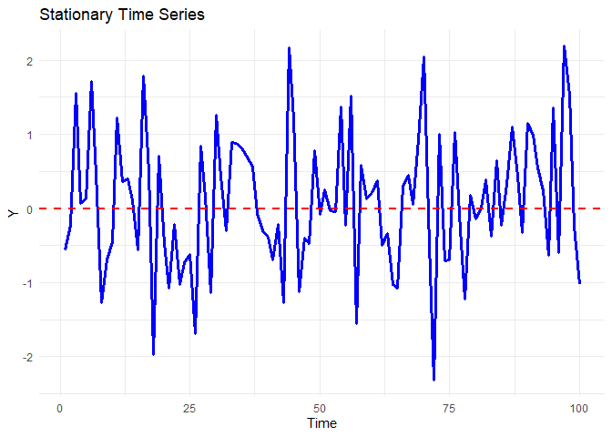
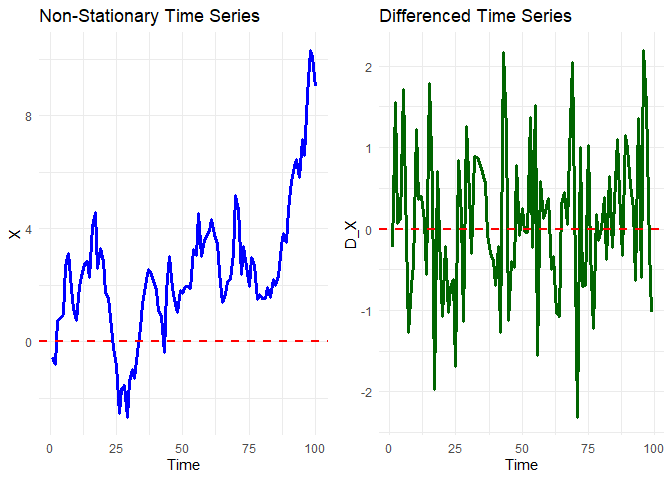
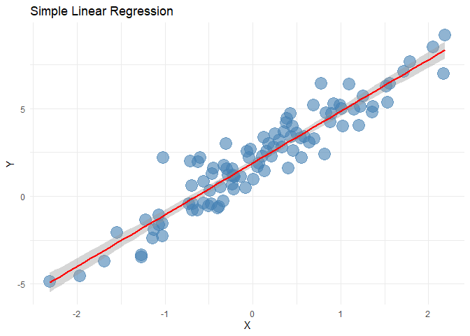
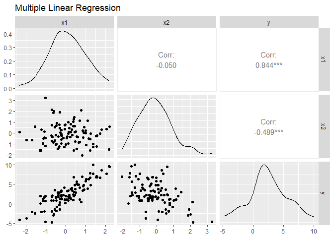
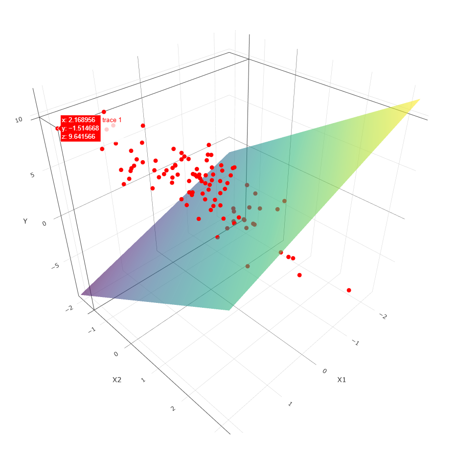

---
author:
- Tiago Afonso
authors:
- Tiago Afonso
date: 2025-09-18
header-includes:
- |
  <link href="Time_Series_Basics_files/libs/htmltools-fill-0.5.8.1/fill.css" rel="stylesheet" />

  

  

  

  

  <link href="Time_Series_Basics_files/libs/crosstalk-1.2.1/css/crosstalk.min.css" rel="stylesheet" />

  

  <link href="Time_Series_Basics_files/libs/plotly-htmlwidgets-css-2.11.1/plotly-htmlwidgets.css" rel="stylesheet" />

  

title: Time Series Basics
toc-title: Table of contents
---

# Time Series

Definition: A time series is a sequence of data points collected or
recorded at specific time intervals, often used to analyze trends,
patterns, and seasonal variations over time.

## Time Series Characteristics

-   **Frequency**: The interval at which data points are recorded (e.g.,
    daily, monthly, yearly).

-   **Seasonality**: Regular patterns that repeat over a specific period
    (e.g., higher sales during holidays).

-   **Trend**: The long-term movement or direction in the data (e.g.,
    increasing sales over several years).

-   **Structural Breaks**: Sudden changes in the data pattern due to
    external factors (e.g., economic shifts, policy changes).

    -   **Types of Structural Breaks**:
        -   Shift: A sudden change in the mean level of the series.
        -   Impulse Change: A one-time shock that affects the series
            temporarily.

-   **Stationarity**: A stationary time series has constant mean,
    variance, and autocovariance over time. Non-stationary series may
    require differencing or transformation to achieve stationarity.

-   I(0): Stationary series in level

-   I(1): Series that becomes stationary after first differencing

-   I(2): Series that becomes stationary after second differencing

### Convencional Unit Root Tests

#### **DF** (Dickey-Fuller) Test: Tests for the presence of a unit root in a time series sample:

$$
\Delta y_t = \alpha + \beta t + \rho y_{t-1} + \epsilon_t
$$

where $\Delta y_t = y_t - y_{t-1}$.

-   $\alpha$: Constant term (drift)
-   $\beta t$: Time trend component
-   $\rho$: Coefficient to be tested
-   $\epsilon_t$: Error term

#### **ADF** (Augmented Dickey-Fuller) Test:

An extension of the DF test that includes lagged differences to account
for higher-order autoregressive processes.

*H0: The series has a unit root (non-stationary)*

#### **PP** (Phillips-Perron) Test

*H0: The series has a unit root (non-stationary)*

#### **KPSS** (Kwiatkowski-Phillips-Schmidt-Shin) Test

*H0: The series is stationary*

### Unit Root Tests with Structural Breaks

#### **Zivot-Andrews Test**:

Tests for a unit root in a time series while allowing for a single
structural break at an unknown point in time.

#### **Perron Test**:

Tests for a unit root in a time series with a known structural break.

### Unit Root Tests for Seasonal Data

#### **HEGY Test**:

Tests for seasonal unit roots in quarterly or monthly data.

#### **Canova-Hansen Test**:

Tests for seasonal unit roots in time series data, allowing for multiple
seasonal frequencies.

------------------------------------------------------------------------

# Seasonality

-   **Additive Seasonality**: The seasonal effect is constant over time
    and can be added to the trend component.

-   **Multiplicative Seasonality**: The seasonal effect varies with the
    level of the series and is multiplied by the trend component.

-   **Identifying Seasonality**:

    -   plotting the data
    -   autocorrelation function (ACF)
    -   auxiliary regressions with seasonal dummies
    -   Unit root tests for seasonal data (e.g., HEGY, Canova-Hansen)

## Decomposition of Time Series

-   **STL Decomposition**: Seasonal-Trend decomposition using Loess,
    which separates a time series into seasonal, trend, and residual
    components.

-   **homologous periods**: Same season each year (e.g., January 2020,
    January 2021). example for industrial production index (monthly
    data):

$$
\Delta IPI_t = IPI_t - IPI_{t-12}
$$

------------------------------------------------------------------------

# Models

## Simple regression models

$$
y_t = \beta_0 + \beta_1x_t + \epsilon_t
$$

where: 
- $y_t$: Dependent variable at time $t$ 
- $x_t$: Independent variable at time $t$ 
- $\beta_0$: Intercept
- $\beta_1$: Coefficient for the independent variable
- $\epsilon_t$: Error term

## Multiple regression model

$$
y_t = \beta_0 + \beta_1x_{1t} + \beta_2x_{2t} + ... + \beta_kx_{kt} + \epsilon_t
$$

## Autoregressive (AR) Models

AR(1):

$$
y_t = \phi_0 + \phi_1y_{t-1} + \epsilon_t
$$

AR(p):

$$
y_t = \phi_0 + \phi_1y_{t-1} + \phi_2y_{t-2} + ... + \phi_py_{t-p} + \epsilon_t
$$

## Moving Average (MA) Models

MA(1):

$$
y_t = \theta_0 + \theta_1\epsilon_{t-1} + \epsilon_t
$$

MA(q):

$$
y_t = \theta_0 + \theta_1\epsilon_{t-1} + \theta_2\epsilon_{t-2} + ... + \theta_q\epsilon_{t-q} + \epsilon_t
$$

## Autoregressive Moving Average (ARMA) Models

ARMA(p, q):

$$
y_t = \phi_0 + \sum_{i=1}^{p}\phi_iy_{t-i} + \sum_{j=1}^{q}\theta_j\epsilon_{t-j} + \epsilon_t
$$

## Autoregressive Integrated Moving Average (ARIMA) Models

ARIMA(p, d, q): 

$$
\Delta^d y_t = \phi_0 + \sum_{i=1}^{p}\phi_iy_{t-i} + \sum_{j=1}^{q}\theta_j\epsilon_{t-j} + \epsilon_t
$$

Where $\Delta`{=tex}\^d$ denotes differencing ( d ) times to achieve
stationarity.

## Seasonal ARIMA (SARIMA) Models

SARIMA(p, d, q)(P, D, Q)s: 

$$
\Delta^d \Delta_s^D y_t = \phi_0 + \sum_{i=1}^{p}\phi_iy_{t-i} + \sum_{j=1}^{q}\theta_j\epsilon_{t-j} + \sum_{I=1}^{P}\Phi_Iy_{t-Is} + \sum_{J=1}^{Q}\Theta_J\epsilon_{t-Js} + \epsilon_t
$$

Where $\Delta_s^D$ denotes seasonal differencing ( D ) times
with seasonality ( s ).

## Vector Autoregression (VAR) Models

VAR(p)

-   Series I(0) or I(1) without cointegration

1.  Estimate model
2.  check optimal lag length (AIC, BIC, HQC)
3.  perform exogeneity blocks
4.  check diagnostics (autocorrelation, heteroscedasticity, normality)
5.  analyze IRF (impulse response function) and FEVD (forecast error
    variance decomposition)

## Vector Error Correction Model (VECM)

-   Series I(1) with cointegration

1.  Test for unit roots (ADF, PP, KPSS)
2.  Test for cointegration (Johansen test)
3.  Estimate VECM
4.  Check diagnostics (autocorrelation, heteroscedasticity, normality)
5.  Analyze IRF and FEVD

## ARDL (Autoregressive Distributed Lag) Models

-   Can be used for both I(0) and I(1) series
-   Allows for different lag lengths for each regressor

1.  Specify the model
2.  Estimate the model using OLS
3.  Check diagnostics (autocorrelation, heteroscedasticity, normality)
4.  Calculate long-run and short-run relationships (elasticities and
    semilasticities)
5.  Perform bounds testing for cointegration

Equation for ECM representation:

$$
\Delta y_t = \alpha_0 + \sum_{i=1}^{p}\alpha_i\Delta y_{t-i} + \sum_{j=0}^{q}\beta_j\Delta x_{t-j} + \phi (y_{t-1} - \theta x_{t-1}) + \epsilon_t
$$

Where $(y_{t-1} - \theta x_{t-1})$ is the error correction
term representing the long-run relationship.

