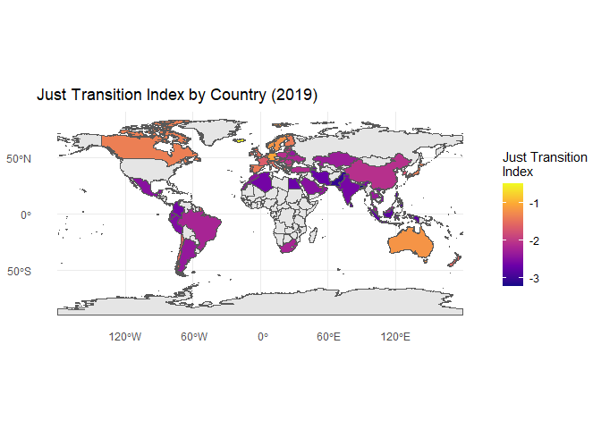
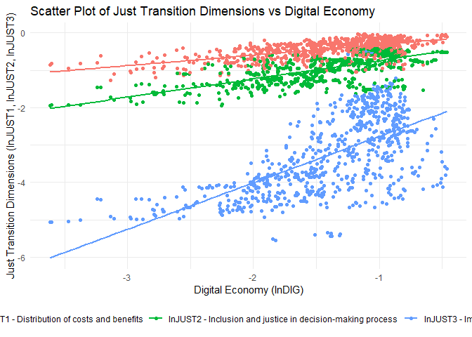
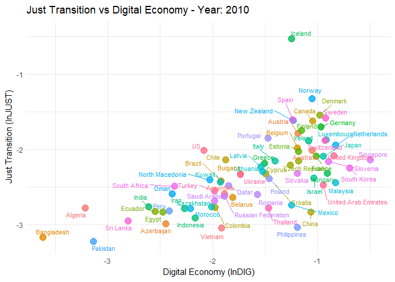
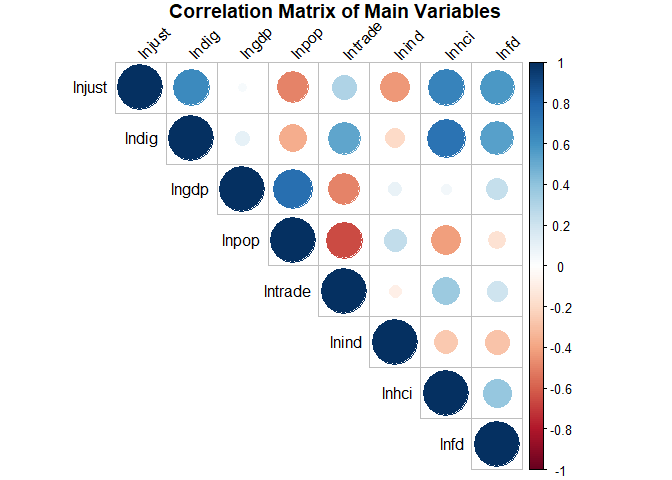

# Econometria System GMM
Tiago Afonso
2025-10-29

# Replicação do paper “How does the digital economy accelerate global energy justice? Mechanism discussion and empirical test” em R

Paper disponível em: https://www.sciencedirect.com/science/article/abs/pii/S0140988322004443

## Objetivo principal do paper

investigar se a economia digital (tudo o que envolve internet, big data,
inteligência artificial e tecnologias de comunicação) pode ajudar o
mundo a fazer uma transição energética justa, ou seja, uma transição que
leve em conta a distribuição equitativa dos benefícios e encargos
associados à mudança para fontes de energia mais sustentáveis.

**O Problema (A Transição Energética)**: O mundo precisa de deixar de
usar energias fósseis (como o carvão e o petróleo) para combater as
alterações climáticas e passar a usar energias limpas (como a solar ou a
eólica)

**A Dificuldade (A Necessidade de ser “Justa”)**: Esta mudança pode
levar ao fecho de minas ou centrais elétricas, o que causa desemprego e
prejudica certas regiões que dependiam dessas indústrias. Uma “transição
justa” significa garantir que esta mudança é feita de forma equitativa,
ajudando os trabalhadores e as comunidades afetadas, e distribuindo os
benefícios e custos de forma justa

------------------------------------------------------------------------

## **Questão central**:

> ### **Será que a digitalização pode ajudar a tornar a transição mais justa?**

------------------------------------------------------------------------

-   **Impacto Indireto** A economia digital promove diretamente uma
    transição justa? Por exemplo, ao ajudar a criar novos “empregos
    verdes” ou ao permitir que as pessoas participem mais nas decisões?

-   **Impacto nas diferentes “justiças**: A “justiça” tem várias
    componentes. A economia digital afeta especificamente a *justiça
    distributiva* (distribuir custos e benefícios de forma justa), a
    *justiça processual* (dar voz a todos no processo) e a *justiça
    restaurativa* (ajudar quem perdeu o emprego a encontrar outro)

-   **Os Mecanismos (O “Como?”)**: os autores testam se a digitalização
    ajuda a transição justa de forma indireta, através de dois canais
    principais:

    1.  Através do aumento do Capital Humano: Ao dar às pessoas mais
        acesso a formação e novas competências
    2.  Através do aumento do Desenvolvimento Financeiro: Ao facilitar o
        investimento e o fluxo de dinheiro para novas indústrias e para
        apoiar as comunidades.

## Dados e Metodologia

-   Painel de 72 países
-   Período: 2010-2019

## Metodologia

Modelo de painel dinâmico estimado através do System GMM. Um modelo de
painel dinâmico é adequado porque a variável dependente (índice de
transição energética justa) depende do seu próprio valor defasado,
refletindo a natureza gradual e cumulativa da transição energética justa
ao longo do tempo.

Esta escolha é justificada pela capacidade do SYS-GMM de lidar com a
endogeneidade (resultante da causalidade dual e da inclusão da variável
dependente desfasada) e melhorar a precisão da estimação em painéis
dinâmicos

*l**n**J**U**S**T*<sub>*i**t*</sub> = *β*<sub>0</sub> + *β*<sub>1</sub>*l**n**J**U**S**T*<sub>*i*, *t* − 1</sub> + *β*<sub>2</sub>*l**n**D**I**G*<sub>*i**t*</sub> + ∑*β*<sub>*k*</sub>*l**n**X*<sub>*i**t*</sub> + *ϵ*<sub>*i**t*</sub>

onde:

-   (*l**n**J**U**S**T*<sub>*i**t*</sub>: Índice de Transição Energética
    Justa para o país (*i*) no tempo (*t*)
-   (*l**n**J**U**S**T*<sub>*i*, *t* − 1</sub>: Valor defasado do índice
    de transição energética justa
-   (*l**n**D**I**G*<sub>*i**t*</sub>: Nível de digitalização do país
    (*i*) no tempo (*t*)
-   (*l**n**X*<sub>*i**t*</sub>: Vetor de variáveis de controle (PIB,
    população, abertura comercial, estrutura industrial)

Para validar o modelo SYS-GMM, os autores recorrem aos testes padrão: o
teste de Arellano-Bond (A-B) para autocorrelação (AR(1) e AR(2)) e o
teste de Sargan para a validade das variáveis instrumentais

Comparação de GMM-Dif e GMM-Sys

<table>
<colgroup>
<col style="width: 17%" />
<col style="width: 39%" />
<col style="width: 42%" />
</colgroup>
<thead>
<tr>
<th>Característica</th>
<th><strong>GMM-Diferenças (GMM-Dif)</strong></th>
<th><strong>GMM-Sistema (GMM-Sys)</strong></th>
</tr>
</thead>
<tbody>
<tr>
<td><strong>Origem</strong></td>
<td>Arellano &amp; Bond (1991)</td>
<td>Blundell &amp; Bond (1998)</td>
</tr>
<tr>
<td><strong>Transformação</strong></td>
<td>Primeiras diferenças para eliminar efeitos fixos</td>
<td>Sistema de equações: primeiras diferenças <strong>+</strong>
níveis</td>
</tr>
<tr>
<td><strong>Instrumentos</strong></td>
<td>Variáveis defasadas em nível como instrumentos para equações em
diferença</td>
<td>Acrescenta variáveis defasadas em diferença como instrumentos para
equações em nível</td>
</tr>
<tr>
<td><strong>Vantagem</strong></td>
<td>Corrige endogeneidade dinâmica; evita viés de Nickell</td>
<td>Mais eficiente quando variáveis são persistentes; reduz viés de
instrumentos fracos</td>
</tr>
<tr>
<td><strong>Limitação</strong></td>
<td>Instrumentos fracos se variáveis forem muito persistentes</td>
<td>Pode gerar excesso de instrumentos; exige hipótese adicional de
ausência de correlação entre diferenças e efeitos fixos</td>
</tr>
<tr>
<td><strong>Consistência</strong></td>
<td>Requer ausência de autocorrelação de 2ª ordem nos erros</td>
<td>Idem, mas também requer validade dos instrumentos adicionais em
nível</td>
</tr>
<tr>
<td><strong>Testes usuais</strong></td>
<td>AR(1), AR(2), Hansen/Sargan</td>
<td>AR(1), AR(2), Hansen/Sargan (atenção ao nº de instrumentos)</td>
</tr>
<tr>
<td><strong>Uso típico</strong></td>
<td>Painéis com T pequeno e N grande, variáveis não muito
persistentes</td>
<td>Painéis com T pequeno e N grande, variáveis altamente
persistentes</td>
</tr>
<tr>
<td><strong>Implementação em R</strong></td>
<td><code>plm::pgmm(..., transformation = "d")</code></td>
<td><code>plm::pgmm(..., transformation = "ld")</code></td>
</tr>
</tbody>
</table>

### Variáveis Instrumentais

-   O que é uma variável instrumental?

<figure class=''>


</figure>

Um variável instrumental é uma variável que está correlacionada com a
variável explicativa endógena (X), mas não está correlacionada com o
erro não observado (U) na equação de regressão. Isto permite isolar a
variação exógena em X para obter estimativas consistentes do efeito de X
sobre Y.

Como funciona:

1.  Utilizamos o instrumento (Z) para prever a variável endógena (X).

2.  Usamos a variação prevista de X (que é exógena) para estimar o
    efeito de X sobre Y.

Este método é amplamente utilizado em econometria para lidar com
problemas de endogeneidade, onde a variável explicativa está
correlacionada com o termo de erro, o que pode levar a estimativas
viesadas e inconsistentes. É conhecido com 2SLS (Two-Stage Least
Squares) quando aplicado em modelos lineares simples.

-   O que é um instrumento fraco? Um instrumento é considerado fraco
    quando está fracamente correlacionado com a variável endógena que se
    pretende instrumentar. Isto pode levar a estimativas viesadas e
    inconsistentes, especialmente em amostras pequenas.

O que é o método dos momentos generalizados (GMM)?

O método dos momentos generalizados (GMM) é uma técnica de estimação
estatística que utiliza momentos (como médias e variâncias) derivados
dos dados para estimar os parâmetros de um modelo. É especialmente útil
quando as suposições tradicionais de modelos lineares, como a
normalidade dos erros, não são verificados.

## Dados

O índice **JUST** baseia-se no quadro de McCauley e Heffron (2018) e
agrega 21 indicadores em três subíndices: justiça distributiva, justiça
processual e justiça restaurativa.

O índice DIG é composto por quatro dimensões: infraestrutura, impacto
social, comércio digital e apoio social.

Para testar as hipóteses de como a economia digital afeta a transição
justa (ou seja, os efeitos indiretos), o estudo aplica um modelo de
efeito de mediação. esta especificamente o capital humano
(*l**n**H**C**I*) e o desenvolvimento financeiro (*l**n**F**D*) como
variáveis mediadoras.

A significância dos efeitos de mediação é confirmada através do teste de
Sobel.

<table>
<colgroup>
<col style="width: 11%" />
<col style="width: 55%" />
<col style="width: 33%" />
</colgroup>
<thead>
<tr>
<th>Variáveis</th>
<th>Definição</th>
<th>Unidades</th>
</tr>
</thead>
<tbody>
<tr>
<td>lnJUST</td>
<td>Just transition</td>
<td>–</td>
</tr>
<tr>
<td>lnDIG</td>
<td>Digital economy</td>
<td>–</td>
</tr>
<tr>
<td>lnGDP</td>
<td>GDP</td>
<td>Constant 2015 US dollar</td>
</tr>
<tr>
<td>lnPOP</td>
<td>Population</td>
<td>people</td>
</tr>
<tr>
<td>lnTRADE</td>
<td>Imports and exports of goods and services</td>
<td>% of GDP</td>
</tr>
<tr>
<td>lnIND</td>
<td>Ratio of value added by secondary industry to GDP</td>
<td>% of GDP</td>
</tr>
<tr>
<td>lnHCI</td>
<td>Years of education and return on education</td>
<td>–</td>
</tr>
<tr>
<td>lnFD</td>
<td>Domestic credit to the private sector</td>
<td>% of GDP</td>
</tr>
</tbody>
</table>

## Resultados principais

Carregar bibliotecas

``` r
library(tidyverse)
library(plm)
library(readxl)
library(haven)
library(gtsummary)
library(modelsummary)
library(sf)
library(rnaturalearth)
library(rnaturalearthdata)
library(corrplot)
library(sandwich)
library(lmtest)
library(plm)
library(mediation)
library(gganimate)
library(ggblend)
library(gifski)
```

Importar ficheiro `.dta`

``` r
data <- read_dta("data.dta")

#converter painel
pdata <- pdata.frame(data, index = c("country", "year"))
```

Ver algumas dimensões dos dados

``` r
pdim(pdata)
```

    Balanced Panel: n = 72, T = 10, N = 720

72 países ao longo de 10 anos (2010-2019), totalizando 720 observações.

Calcular a estatísticas descritivas

``` r
# Calcular estatísticas descritivas Obs, Média, Desvio Padrão, Mínimo, Máximo

pdata %>%
    as.data.frame() %>%
    dplyr::select(lnjust, lndig, lngdp, lnpop, lntrade, lnind, lnhci, lnfd) %>%
    tbl_summary(
        statistic = list(
            all_continuous() ~ c("{mean} ({sd}) [{min}, {max}]")
        ),
        digits = all_continuous() ~ 2,
        label = list(
            lnjust ~ "Just transition",
            lndig ~ "Digital economy",
            lngdp ~ "GDP",
            lnpop ~ "Population",
            lntrade ~ "Trade",
            lnind ~ "Industry",
            lnhci ~ "Human capital",
            lnfd ~ "Financial development"
        )
    ) %>%
    modify_header(label ~ "**Variable**", stat_0 ~ "**Mean (SD) [Min, Max]**") %>%
    as_gt()
```

<div id="wvawpjzpfs" style="padding-left:0px;padding-right:0px;padding-top:10px;padding-bottom:10px;overflow-x:auto;overflow-y:auto;width:auto;height:auto;">
<style>#wvawpjzpfs table {
  font-family: system-ui, 'Segoe UI', Roboto, Helvetica, Arial, sans-serif, 'Apple Color Emoji', 'Segoe UI Emoji', 'Segoe UI Symbol', 'Noto Color Emoji';
  -webkit-font-smoothing: antialiased;
  -moz-osx-font-smoothing: grayscale;
}

#wvawpjzpfs thead, #wvawpjzpfs tbody, #wvawpjzpfs tfoot, #wvawpjzpfs tr, #wvawpjzpfs td, #wvawpjzpfs th {
  border-style: none;
}

#wvawpjzpfs p {
  margin: 0;
  padding: 0;
}

#wvawpjzpfs .gt_table {
  display: table;
  border-collapse: collapse;
  line-height: normal;
  margin-left: auto;
  margin-right: auto;
  color: #333333;
  font-size: 16px;
  font-weight: normal;
  font-style: normal;
  background-color: #FFFFFF;
  width: auto;
  border-top-style: solid;
  border-top-width: 2px;
  border-top-color: #A8A8A8;
  border-right-style: none;
  border-right-width: 2px;
  border-right-color: #D3D3D3;
  border-bottom-style: solid;
  border-bottom-width: 2px;
  border-bottom-color: #A8A8A8;
  border-left-style: none;
  border-left-width: 2px;
  border-left-color: #D3D3D3;
}

#wvawpjzpfs .gt_caption {
  padding-top: 4px;
  padding-bottom: 4px;
}

#wvawpjzpfs .gt_title {
  color: #333333;
  font-size: 125%;
  font-weight: initial;
  padding-top: 4px;
  padding-bottom: 4px;
  padding-left: 5px;
  padding-right: 5px;
  border-bottom-color: #FFFFFF;
  border-bottom-width: 0;
}

#wvawpjzpfs .gt_subtitle {
  color: #333333;
  font-size: 85%;
  font-weight: initial;
  padding-top: 3px;
  padding-bottom: 5px;
  padding-left: 5px;
  padding-right: 5px;
  border-top-color: #FFFFFF;
  border-top-width: 0;
}

#wvawpjzpfs .gt_heading {
  background-color: #FFFFFF;
  text-align: center;
  border-bottom-color: #FFFFFF;
  border-left-style: none;
  border-left-width: 1px;
  border-left-color: #D3D3D3;
  border-right-style: none;
  border-right-width: 1px;
  border-right-color: #D3D3D3;
}

#wvawpjzpfs .gt_bottom_border {
  border-bottom-style: solid;
  border-bottom-width: 2px;
  border-bottom-color: #D3D3D3;
}

#wvawpjzpfs .gt_col_headings {
  border-top-style: solid;
  border-top-width: 2px;
  border-top-color: #D3D3D3;
  border-bottom-style: solid;
  border-bottom-width: 2px;
  border-bottom-color: #D3D3D3;
  border-left-style: none;
  border-left-width: 1px;
  border-left-color: #D3D3D3;
  border-right-style: none;
  border-right-width: 1px;
  border-right-color: #D3D3D3;
}

#wvawpjzpfs .gt_col_heading {
  color: #333333;
  background-color: #FFFFFF;
  font-size: 100%;
  font-weight: normal;
  text-transform: inherit;
  border-left-style: none;
  border-left-width: 1px;
  border-left-color: #D3D3D3;
  border-right-style: none;
  border-right-width: 1px;
  border-right-color: #D3D3D3;
  vertical-align: bottom;
  padding-top: 5px;
  padding-bottom: 6px;
  padding-left: 5px;
  padding-right: 5px;
  overflow-x: hidden;
}

#wvawpjzpfs .gt_column_spanner_outer {
  color: #333333;
  background-color: #FFFFFF;
  font-size: 100%;
  font-weight: normal;
  text-transform: inherit;
  padding-top: 0;
  padding-bottom: 0;
  padding-left: 4px;
  padding-right: 4px;
}

#wvawpjzpfs .gt_column_spanner_outer:first-child {
  padding-left: 0;
}

#wvawpjzpfs .gt_column_spanner_outer:last-child {
  padding-right: 0;
}

#wvawpjzpfs .gt_column_spanner {
  border-bottom-style: solid;
  border-bottom-width: 2px;
  border-bottom-color: #D3D3D3;
  vertical-align: bottom;
  padding-top: 5px;
  padding-bottom: 5px;
  overflow-x: hidden;
  display: inline-block;
  width: 100%;
}

#wvawpjzpfs .gt_spanner_row {
  border-bottom-style: hidden;
}

#wvawpjzpfs .gt_group_heading {
  padding-top: 8px;
  padding-bottom: 8px;
  padding-left: 5px;
  padding-right: 5px;
  color: #333333;
  background-color: #FFFFFF;
  font-size: 100%;
  font-weight: initial;
  text-transform: inherit;
  border-top-style: solid;
  border-top-width: 2px;
  border-top-color: #D3D3D3;
  border-bottom-style: solid;
  border-bottom-width: 2px;
  border-bottom-color: #D3D3D3;
  border-left-style: none;
  border-left-width: 1px;
  border-left-color: #D3D3D3;
  border-right-style: none;
  border-right-width: 1px;
  border-right-color: #D3D3D3;
  vertical-align: middle;
  text-align: left;
}

#wvawpjzpfs .gt_empty_group_heading {
  padding: 0.5px;
  color: #333333;
  background-color: #FFFFFF;
  font-size: 100%;
  font-weight: initial;
  border-top-style: solid;
  border-top-width: 2px;
  border-top-color: #D3D3D3;
  border-bottom-style: solid;
  border-bottom-width: 2px;
  border-bottom-color: #D3D3D3;
  vertical-align: middle;
}

#wvawpjzpfs .gt_from_md > :first-child {
  margin-top: 0;
}

#wvawpjzpfs .gt_from_md > :last-child {
  margin-bottom: 0;
}

#wvawpjzpfs .gt_row {
  padding-top: 8px;
  padding-bottom: 8px;
  padding-left: 5px;
  padding-right: 5px;
  margin: 10px;
  border-top-style: solid;
  border-top-width: 1px;
  border-top-color: #D3D3D3;
  border-left-style: none;
  border-left-width: 1px;
  border-left-color: #D3D3D3;
  border-right-style: none;
  border-right-width: 1px;
  border-right-color: #D3D3D3;
  vertical-align: middle;
  overflow-x: hidden;
}

#wvawpjzpfs .gt_stub {
  color: #333333;
  background-color: #FFFFFF;
  font-size: 100%;
  font-weight: initial;
  text-transform: inherit;
  border-right-style: solid;
  border-right-width: 2px;
  border-right-color: #D3D3D3;
  padding-left: 5px;
  padding-right: 5px;
}

#wvawpjzpfs .gt_stub_row_group {
  color: #333333;
  background-color: #FFFFFF;
  font-size: 100%;
  font-weight: initial;
  text-transform: inherit;
  border-right-style: solid;
  border-right-width: 2px;
  border-right-color: #D3D3D3;
  padding-left: 5px;
  padding-right: 5px;
  vertical-align: top;
}

#wvawpjzpfs .gt_row_group_first td {
  border-top-width: 2px;
}

#wvawpjzpfs .gt_row_group_first th {
  border-top-width: 2px;
}

#wvawpjzpfs .gt_summary_row {
  color: #333333;
  background-color: #FFFFFF;
  text-transform: inherit;
  padding-top: 8px;
  padding-bottom: 8px;
  padding-left: 5px;
  padding-right: 5px;
}

#wvawpjzpfs .gt_first_summary_row {
  border-top-style: solid;
  border-top-color: #D3D3D3;
}

#wvawpjzpfs .gt_first_summary_row.thick {
  border-top-width: 2px;
}

#wvawpjzpfs .gt_last_summary_row {
  padding-top: 8px;
  padding-bottom: 8px;
  padding-left: 5px;
  padding-right: 5px;
  border-bottom-style: solid;
  border-bottom-width: 2px;
  border-bottom-color: #D3D3D3;
}

#wvawpjzpfs .gt_grand_summary_row {
  color: #333333;
  background-color: #FFFFFF;
  text-transform: inherit;
  padding-top: 8px;
  padding-bottom: 8px;
  padding-left: 5px;
  padding-right: 5px;
}

#wvawpjzpfs .gt_first_grand_summary_row {
  padding-top: 8px;
  padding-bottom: 8px;
  padding-left: 5px;
  padding-right: 5px;
  border-top-style: double;
  border-top-width: 6px;
  border-top-color: #D3D3D3;
}

#wvawpjzpfs .gt_last_grand_summary_row_top {
  padding-top: 8px;
  padding-bottom: 8px;
  padding-left: 5px;
  padding-right: 5px;
  border-bottom-style: double;
  border-bottom-width: 6px;
  border-bottom-color: #D3D3D3;
}

#wvawpjzpfs .gt_striped {
  background-color: rgba(128, 128, 128, 0.05);
}

#wvawpjzpfs .gt_table_body {
  border-top-style: solid;
  border-top-width: 2px;
  border-top-color: #D3D3D3;
  border-bottom-style: solid;
  border-bottom-width: 2px;
  border-bottom-color: #D3D3D3;
}

#wvawpjzpfs .gt_footnotes {
  color: #333333;
  background-color: #FFFFFF;
  border-bottom-style: none;
  border-bottom-width: 2px;
  border-bottom-color: #D3D3D3;
  border-left-style: none;
  border-left-width: 2px;
  border-left-color: #D3D3D3;
  border-right-style: none;
  border-right-width: 2px;
  border-right-color: #D3D3D3;
}

#wvawpjzpfs .gt_footnote {
  margin: 0px;
  font-size: 90%;
  padding-top: 4px;
  padding-bottom: 4px;
  padding-left: 5px;
  padding-right: 5px;
}

#wvawpjzpfs .gt_sourcenotes {
  color: #333333;
  background-color: #FFFFFF;
  border-bottom-style: none;
  border-bottom-width: 2px;
  border-bottom-color: #D3D3D3;
  border-left-style: none;
  border-left-width: 2px;
  border-left-color: #D3D3D3;
  border-right-style: none;
  border-right-width: 2px;
  border-right-color: #D3D3D3;
}

#wvawpjzpfs .gt_sourcenote {
  font-size: 90%;
  padding-top: 4px;
  padding-bottom: 4px;
  padding-left: 5px;
  padding-right: 5px;
}

#wvawpjzpfs .gt_left {
  text-align: left;
}

#wvawpjzpfs .gt_center {
  text-align: center;
}

#wvawpjzpfs .gt_right {
  text-align: right;
  font-variant-numeric: tabular-nums;
}

#wvawpjzpfs .gt_font_normal {
  font-weight: normal;
}

#wvawpjzpfs .gt_font_bold {
  font-weight: bold;
}

#wvawpjzpfs .gt_font_italic {
  font-style: italic;
}

#wvawpjzpfs .gt_super {
  font-size: 65%;
}

#wvawpjzpfs .gt_footnote_marks {
  font-size: 75%;
  vertical-align: 0.4em;
  position: initial;
}

#wvawpjzpfs .gt_asterisk {
  font-size: 100%;
  vertical-align: 0;
}

#wvawpjzpfs .gt_indent_1 {
  text-indent: 5px;
}

#wvawpjzpfs .gt_indent_2 {
  text-indent: 10px;
}

#wvawpjzpfs .gt_indent_3 {
  text-indent: 15px;
}

#wvawpjzpfs .gt_indent_4 {
  text-indent: 20px;
}

#wvawpjzpfs .gt_indent_5 {
  text-indent: 25px;
}

#wvawpjzpfs .katex-display {
  display: inline-flex !important;
  margin-bottom: 0.75em !important;
}

#wvawpjzpfs div.Reactable > div.rt-table > div.rt-thead > div.rt-tr.rt-tr-group-header > div.rt-th-group:after {
  height: 0px !important;
}
</style>

<table class="gt_table" data-quarto-postprocess="true"
data-quarto-disable-processing="false" data-quarto-bootstrap="false">
<thead>
<tr class="gt_col_headings">
<th id="label" class="gt_col_heading gt_columns_bottom_border gt_left"
data-quarto-table-cell-role="th"
scope="col"><strong>Variable</strong></th>
<th id="stat_0"
class="gt_col_heading gt_columns_bottom_border gt_center"
data-quarto-table-cell-role="th" scope="col"><strong>Mean (SD) [Min,
Max]</strong><span class="gt_footnote_marks"
style="white-space:nowrap;font-style:italic;font-weight:normal;line-height:0;"><sup>1</sup></span></th>
</tr>
</thead>
<tbody class="gt_table_body">
<tr>
<td class="gt_row gt_left" headers="label">Just transition</td>
<td class="gt_row gt_center" headers="stat_0">-2.15 (0.53) [-3.25,
-0.44]</td>
</tr>
<tr>
<td class="gt_row gt_left" headers="label">Digital economy</td>
<td class="gt_row gt_center" headers="stat_0">-1.41 (0.54) [-3.61,
-0.46]</td>
</tr>
<tr>
<td class="gt_row gt_left" headers="label">GDP</td>
<td class="gt_row gt_center" headers="stat_0">26.40 (1.48) [22.91,
30.63]</td>
</tr>
<tr>
<td class="gt_row gt_left" headers="label">Population</td>
<td class="gt_row gt_center" headers="stat_0">16.81 (1.66) [12.67,
21.07]</td>
</tr>
<tr>
<td class="gt_row gt_left" headers="label">Trade</td>
<td class="gt_row gt_center" headers="stat_0">4.38 (0.56) [3.11,
5.94]</td>
</tr>
<tr>
<td class="gt_row gt_left" headers="label">Industry</td>
<td class="gt_row gt_center" headers="stat_0">3.30 (0.35) [2.30,
4.31]</td>
</tr>
<tr>
<td class="gt_row gt_left" headers="label">Human capital</td>
<td class="gt_row gt_center" headers="stat_0">1.09 (0.18) [0.56,
1.47]</td>
</tr>
<tr>
<td class="gt_row gt_left" headers="label">    Unknown</td>
<td class="gt_row gt_center" headers="stat_0">40</td>
</tr>
<tr>
<td class="gt_row gt_left" headers="label">Financial development</td>
<td class="gt_row gt_center" headers="stat_0">4.22 (0.62) [2.54,
5.54]</td>
</tr>
<tr>
<td class="gt_row gt_left" headers="label">    Unknown</td>
<td class="gt_row gt_center" headers="stat_0">44</td>
</tr>
</tbody><tfoot class="gt_footnotes">
<tr>
<td colspan="2" class="gt_footnote"><span class="gt_footnote_marks"
style="white-space:nowrap;font-style:italic;font-weight:normal;line-height:0;"><sup>1</sup></span>
Mean (SD) [Min, Max]</td>
</tr>
</tfoot>
&#10;</table>

</div>

Criar um mapa com os países `country` e com a variável `lnjust` para o
ano de 2019

``` r
# Filtrar dados para 2019
data_2019 <- pdata %>%
    filter(year == 2019) %>%
    dplyr::select(country, lnjust)

# Obter mapa do mundo
world <- ne_countries(scale = "medium", returnclass = "sf")

# Juntar dados
map_data <- world %>%
    left_join(data_2019, by = c("name" = "country"))

# Criar mapa
ggplot(map_data) +
    geom_sf(aes(fill = lnjust)) +
    scale_fill_viridis_c(option = "plasma", na.value = "grey90") +
    theme_minimal() +
    labs(title = "Just Transition Index by Country (2019)",
         fill = "Just Transition\nIndex")
```



Gráfico de dispersão para as 3 dimensões do índice de transição
energética.

-   `lnjust1` - distribuição de custos e benefícios.

-   `lnjust2` - inclusão e justiça do processo de tomada de decisão

-   `lnjust3` - impacto nas pessoas e na reparação

``` r
# Gráfico de dispersão para as 3 dimens

pdata %>%
    dplyr::select(lnjust1, lnjust2, lnjust3, lndig) %>%
    pivot_longer(cols = starts_with("lnjust"), names_to = "dimension", values_to = "value") %>%
    ggplot(aes(x = lndig, y = value, color = dimension)) +
    geom_point(alpha = 5.5) +
    geom_smooth(method = "lm", se = FALSE) +
    labs(title = "Scatter Plot of Just Transition Dimensions vs Digital Economy",
         x = "Digital Economy (lnDIG)",
         y = "Just Transition Dimensions (lnJUST1, lnJUST2, lnJUST3)") +
    theme_minimal() +
    theme(legend.position = "bottom") +
    scale_color_discrete(name = "Dimension",
                         labels = c("lnJUST1 - Distribution of costs and benefits",
                                    "lnJUST2 - Inclusion and justice in decision-making process",
                                    "lnJUST3 - Impact on people and remediation"))
```

    `geom_smooth()` using formula = 'y ~ x'



Criar um gráfico de dispersão dos países ao longo do tempo entre
`lnjust` e `lndig` com `gganimate` e `ggblend`.

``` r
# Criar gráfico de dispersão animado
animated_scatter <- data %>%
    as.data.frame() %>%
    mutate(year = as.integer(as.character(year))) %>%
    ggplot(aes(x = lndig, y = lnjust, color = country)) +
    geom_point(size = 4, alpha = 0.8) +
    ggrepel::geom_text_repel(aes(label = country),
                             size = 3,
                             show.legend = FALSE,
                             max.overlaps = 80,
                             segment.size = 0.2) +
    labs(title = "Just Transition vs Digital Economy - Year: {frame_time}",
         x = "Digital Economy (lnDIG)",
         y = "Just Transition (lnJUST)") +
    transition_time(year) +
    theme_minimal() +
    theme(legend.position = "none")

animated_scatter
```



Gráfico das correlações entre as variáveis principais

``` r
# Selecionar variáveis principais
main_vars <- pdata %>%
    dplyr::select(lnjust, lndig, lngdp, lnpop, lntrade, lnind, lnhci, lnfd)
# Gráfico de correlação
cor_matrix <- cor(main_vars, use = "complete.obs")
corrplot(cor_matrix, method = "circle", type = "upper",
         tl.col = "black", tl.srt = 45,
         title = "Correlation Matrix of Main Variables",
         mar = c(0,0,1,0))
```



### Testas de Especificação de Modelo

#### Teste de Autocorrelação de painel

``` r
# Estimar modelo preliminar para obter resíduos
prelim_model <- plm(lnjust ~ lag(lnjust, 1) + lndig + lngdp + lnpop + lntrade + lnind,
                    data = pdata, model = "pooling")

# Estimar modelo within para o teste BC-LM
prelim_model_within <- plm(lnjust ~ lag(lnjust, 1) + lndig + lngdp + lnpop + lntrade + lnind,
                           data = pdata, model = "within")
# Teste de Arellano-Bond para autocorrelação
ab_test <- pbgtest(prelim_model)
ab_test
```


        Breusch-Godfrey/Wooldridge test for serial correlation in panel models

    data:  lnjust ~ lag(lnjust, 1) + lndig + lngdp + lnpop + lntrade + lnind
    chisq = 23.311, df = 9, p-value = 0.005534
    alternative hypothesis: serial correlation in idiosyncratic errors

-   H0: Não há autocorrelação nos resíduos do painel

#### Testar heteroscedasticidade

``` r
# Teste de Breusch-Pagan para heteroscedasticidade
bp_test <- bptest(prelim_model)
bp_test
```


        studentized Breusch-Pagan test

    data:  prelim_model
    BP = 6.8161, df = 6, p-value = 0.3382

-   H0: Homoscedasticidade (variância constante dos erros)

#### Testar a existência de cross-sectional dependence às variáveis

# Comparação dos Testes de Dependência Cross-Section

<table>
<colgroup>
<col style="width: 15%" />
<col style="width: 14%" />
<col style="width: 22%" />
<col style="width: 20%" />
<col style="width: 22%" />
<col style="width: 6%" />
</colgroup>
<thead>
<tr>
<th>Teste</th>
<th>Autores / Ano</th>
<th>Hipótese Nula (H0)</th>
<th>Contexto típico de uso</th>
<th>Vantagens</th>
<th>Limitações</th>
</tr>
</thead>
<tbody>
<tr>
<td><strong>LM de Breusch–Pagan</strong></td>
<td>Breusch &amp; Pagan (1980)</td>
<td>Não há dependência cross-section</td>
<td>Painéis com <strong>T grande</strong> e <strong>N fixo</strong></td>
<td>Simples de calcular; baseado em resíduos</td>
<td>Pode inflar tamanho do teste quando N cresce</td>
</tr>
<tr>
<td><strong>LM ajustado (Pesaran CDLM)</strong></td>
<td>Pesaran (2004)</td>
<td>Não há dependência cross-section</td>
<td>Painéis com <strong>N grande</strong> e <strong>T
pequeno</strong></td>
<td>Corrige viés do LM clássico</td>
<td>Menos eficiente se T for grande</td>
</tr>
<tr>
<td><strong>CD de Pesaran</strong></td>
<td>Pesaran (2004)</td>
<td>Não há dependência cross-section</td>
<td>Painéis com <strong>N grande, T pequeno</strong></td>
<td>Muito usado em economia aplicada; robusto</td>
<td>Pode perder potência se T for muito pequeno</td>
</tr>
</tbody>
</table>

# Teste de Pesaran para dependência cross-sectional

``` r
cd_test_BP <- pcdtest(prelim_model, test = "lm")
cd_test_LM_adj <- pcdtest(prelim_model, test = "sclm")
cd_test_CD <- pcdtest(prelim_model, test = "cd")

#creat a table with the results
data.frame(
    Test = c("Breusch-Pagan LM", "Pesaran CDLM Adjusted", "Pesaran CD"),
    Statistic = c(cd_test_BP$statistic, cd_test_LM_adj$statistic, cd_test_CD$statistic),
    p_value = c(cd_test_BP$p.value, cd_test_LM_adj$p.value, cd_test_CD$p.value)
)
```

                       Test   Statistic      p_value
    1      Breusch-Pagan LM 3214.656480 7.245456e-18
    2 Pesaran CDLM Adjusted    9.212204 3.194962e-20
    3            Pesaran CD    4.474668 7.653027e-06

### Estimar o modelo de Benchmark

Ols pooled

``` r
ols_pooled <- plm(lnjust ~ lag(lnjust, 1) + lndig + lngdp + lnpop + lntrade + lnind,
                  data = pdata, model = "pooling")


# Estimar FGLS
ols_fgls <- plm(lnjust ~ lag(lnjust, 1) + lndig + lngdp + lnpop + lntrade + lnind,
                  data = pdata, model = "random", random.method = "swar")

#Estimar o SYS-GMM

# Estimar o modelo SYS-GMM
sys_gmm <- pgmm(lnjust ~ lag(lnjust, 1) + lndig + lngdp + lnpop + lntrade + lnind | lag(lnjust, 2:99),
                data = pdata, effect = "individual", model = "twosteps")

# Resumo de todos os modelos

library(modelsummary)
# Resumo de todos os modelos
modelsummary(list("OLS Pooled" = ols_pooled, 
                  "FGLS" = ols_fgls, 
                  "SYS-GMM" = sys_gmm),
            stars = TRUE,
            gof_map = c("nobs", "r.squared", "adj.r.squared"),
            add_rows = data.frame(
                term = c("Sargan test (p-value)", "AR(1) test (p-value)", "AR(2) test (p-value)"),
                "OLS Pooled" = c("", "", ""),
                "FGLS" = c("", "", ""),
                "SYS-GMM" = c(
                    sprintf("%.3f", summary(sys_gmm)$sargan$p.value),
                    sprintf("%.3f", summary(sys_gmm)$m1$p.value),
                    sprintf("%.3f", summary(sys_gmm)$m2$p.value)
                )
            ))
```


<table style="width:82%;">
<colgroup>
<col style="width: 33%" />
<col style="width: 18%" />
<col style="width: 15%" />
<col style="width: 15%" />
</colgroup>
<thead>
<tr>
<th></th>
<th>OLS Pooled</th>
<th>FGLS</th>
<th>SYS-GMM</th>
</tr>
</thead>
<tbody>
<tr>
<td>(Intercept)</td>
<td>-0.185+</td>
<td>-0.185+</td>
<td></td>
</tr>
<tr>
<td></td>
<td>(0.100)</td>
<td>(0.100)</td>
<td></td>
</tr>
<tr>
<td>lag(lnjust, 1)</td>
<td>0.972***</td>
<td>0.972***</td>
<td>0.814***</td>
</tr>
<tr>
<td></td>
<td>(0.010)</td>
<td>(0.010)</td>
<td>(0.029)</td>
</tr>
<tr>
<td>lndig</td>
<td>0.014+</td>
<td>0.014+</td>
<td>-0.047+</td>
</tr>
<tr>
<td></td>
<td>(0.008)</td>
<td>(0.008)</td>
<td>(0.024)</td>
</tr>
<tr>
<td>lngdp</td>
<td>0.016***</td>
<td>0.016***</td>
<td>0.213***</td>
</tr>
<tr>
<td></td>
<td>(0.005)</td>
<td>(0.005)</td>
<td>(0.055)</td>
</tr>
<tr>
<td>lnpop</td>
<td>-0.011*</td>
<td>-0.011*</td>
<td>0.221**</td>
</tr>
<tr>
<td></td>
<td>(0.005)</td>
<td>(0.005)</td>
<td>(0.081)</td>
</tr>
<tr>
<td>lntrade</td>
<td>0.000</td>
<td>0.000</td>
<td>0.098***</td>
</tr>
<tr>
<td></td>
<td>(0.007)</td>
<td>(0.007)</td>
<td>(0.025)</td>
</tr>
<tr>
<td>lnind</td>
<td>-0.017+</td>
<td>-0.017+</td>
<td>-0.048+</td>
</tr>
<tr>
<td></td>
<td>(0.009)</td>
<td>(0.009)</td>
<td>(0.028)</td>
</tr>
<tr>
<td>Num.Obs.</td>
<td>648</td>
<td>648</td>
<td></td>
</tr>
<tr>
<td>R2</td>
<td>0.985</td>
<td>0.985</td>
<td></td>
</tr>
<tr>
<td>R2 Adj.</td>
<td>0.985</td>
<td>0.985</td>
<td></td>
</tr>
<tr>
<td>Sargan test (p-value)</td>
<td></td>
<td></td>
<td>0.066</td>
</tr>
<tr>
<td>AR(1) test (p-value)</td>
<td></td>
<td></td>
<td>0.000</td>
</tr>
<tr>
<td>AR(2) test (p-value)</td>
<td></td>
<td></td>
<td>0.324</td>
</tr>
</tbody><tfoot>
<tr>
<td colspan="4"><ul>
<li>p &lt; 0.1, * p &lt; 0.05, ** p &lt; 0.01, *** p &lt; 0.001</li>
</ul></td>
</tr>
</tfoot>
&#10;</table>

-   H0 do teste de Sargan: As variáveis instrumentais são válidas.

-   H0 do teste AR(1): Existe autocorrelação de primeira ordem nos
    resíduos.

-   H0 do teste AR(2): Existe autocorrelação de segunda ordem nos
    resíduos.

``` r
# Estimar o modelo SYS-GMM para cada dimensão de transição justa
sys_gmm_just1 <- pgmm(lnjust1 ~ lag(lnjust1, 1) + lndig + lngdp + lnpop + lntrade + lnind | 
                     lag(lnjust1, 2:4),
                     data = pdata, 
                     effect = "twoways", 
                     model = "twosteps",
                     transformation = "ld")

sys_gmm_just2 <- pgmm(lnjust2 ~ lag(lnjust2, 1) + lndig + lngdp + lnpop + lntrade + lnind | 
                     lag(lnjust2, 2:4),
                     data = pdata, 
                     effect = "twoways", 
                     model = "twosteps",
                     transformation = "ld")

sys_gmm_just3 <- pgmm(lnjust3 ~ lag(lnjust3, 1) + lndig + lngdp + lnpop + lntrade + lnind | 
                     lag(lnjust3, 2:4),
                     data = pdata, 
                     effect = "twoways", 
                     model = "twosteps",
                     transformation = "ld")

# Criar tabela comparativa com todos os modelos

modelsummary(list("Distributive Justice" = sys_gmm_just1, 
                  "Procedural Justice" = sys_gmm_just2, 
                  "Restorative Justice" = sys_gmm_just3),
            stars = TRUE,
            gof_map = c("nobs"),
            add_rows = data.frame(
                term = c("Sargan test (p-value)", "AR(1) test (p-value)", "AR(2) test (p-value)"),
                "Distributive Justice" = c(
                    sprintf("%.3f", summary(sys_gmm_just1)$sargan$p.value),
                    sprintf("%.3f", summary(sys_gmm_just1)$m1$p.value),
                    sprintf("%.3f", summary(sys_gmm_just1)$m2$p.value)
                ),
                "Procedural Justice" = c(
                    sprintf("%.3f", summary(sys_gmm_just2)$sargan$p.value),
                    sprintf("%.3f", summary(sys_gmm_just2)$m1$p.value),
                    sprintf("%.3f", summary(sys_gmm_just2)$m2$p.value)
                ),
                "Restorative Justice" = c(
                    sprintf("%.3f", summary(sys_gmm_just3)$sargan$p.value),
                    sprintf("%.3f", summary(sys_gmm_just3)$m1$p.value),
                    sprintf("%.3f", summary(sys_gmm_just3)$m2$p.value)
                )
            ))
```

<table style="width:98%;">
<colgroup>
<col style="width: 26%" />
<col style="width: 25%" />
<col style="width: 22%" />
<col style="width: 23%" />
</colgroup>
<thead>
<tr>
<th></th>
<th>Distributive Justice</th>
<th>Procedural Justice</th>
<th>Restorative Justice</th>
</tr>
</thead>
<tbody>
<tr>
<td>lag(lnjust1, 1)</td>
<td>0.007</td>
<td></td>
<td></td>
</tr>
<tr>
<td></td>
<td>(0.038)</td>
<td></td>
<td></td>
</tr>
<tr>
<td>lndig</td>
<td>0.133***</td>
<td>0.010**</td>
<td>0.053***</td>
</tr>
<tr>
<td></td>
<td>(0.027)</td>
<td>(0.003)</td>
<td>(0.014)</td>
</tr>
<tr>
<td>lngdp</td>
<td>0.046**</td>
<td>0.003</td>
<td>-0.029***</td>
</tr>
<tr>
<td></td>
<td>(0.014)</td>
<td>(0.003)</td>
<td>(0.006)</td>
</tr>
<tr>
<td>lnpop</td>
<td>-0.101***</td>
<td>-0.005</td>
<td>0.044***</td>
</tr>
<tr>
<td></td>
<td>(0.014)</td>
<td>(0.003)</td>
<td>(0.007)</td>
</tr>
<tr>
<td>lntrade</td>
<td>0.012</td>
<td>-0.004</td>
<td>0.021</td>
</tr>
<tr>
<td></td>
<td>(0.013)</td>
<td>(0.003)</td>
<td>(0.013)</td>
</tr>
<tr>
<td>lnind</td>
<td>-0.009</td>
<td>0.006</td>
<td>0.006</td>
</tr>
<tr>
<td></td>
<td>(0.022)</td>
<td>(0.005)</td>
<td>(0.017)</td>
</tr>
<tr>
<td>lag(lnjust2, 1)</td>
<td></td>
<td>0.966***</td>
<td></td>
</tr>
<tr>
<td></td>
<td></td>
<td>(0.016)</td>
<td></td>
</tr>
<tr>
<td>lag(lnjust3, 1)</td>
<td></td>
<td></td>
<td>1.040***</td>
</tr>
<tr>
<td></td>
<td></td>
<td></td>
<td>(0.011)</td>
</tr>
<tr>
<td>Sargan test (p-value)</td>
<td>0.179</td>
<td>0.176</td>
<td>0.042</td>
</tr>
<tr>
<td>AR(1) test (p-value)</td>
<td>0.000</td>
<td>0.000</td>
<td>0.000</td>
</tr>
<tr>
<td>AR(2) test (p-value)</td>
<td>0.835</td>
<td>0.854</td>
<td>0.262</td>
</tr>
</tbody><tfoot>
<tr>
<td colspan="4"><ul>
<li>p &lt; 0.1, * p &lt; 0.05, ** p &lt; 0.01, *** p &lt; 0.001</li>
</ul></td>
</tr>
</tfoot>
&#10;</table>
