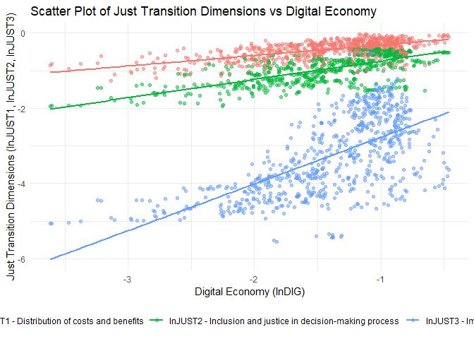

# Econometrics System GMM
Tiago Afonso
2025-10-29

# Replication of the paper “How does the digital economy accelerate global energy justice? Mechanism discussion and empirical test” in R

Paper:
https://www.sciencedirect.com/science/article/abs/pii/S0140988322004443

## Main objective of the paper

To investigate whether the digital economy (everything involving the
internet, big data, artificial intelligence, and communication
technologies) can help the world achieve a just energy transition, that
is, a transition that takes into account the equitable distribution of
benefits and burdens associated with the shift to more sustainable
energy sources.

**The Problem (The Energy Transition)**: The world needs to stop using
fossil fuels (such as coal and oil) to combat climate change and switch
to clean energy (such as solar or wind)

**The Difficulty (The Need to be “Just”)**: This change can lead to the
closure of mines or power plants, which causes unemployment and harms
certain regions that depended on these industries. A “just transition”
means ensuring that this change is made equitably, helping affected
workers and communities, and distributing benefits and costs fairly

------------------------------------------------------------------------

## **Central Question**:

> ### **Can digitalization help make the transition more just?**

------------------------------------------------------------------------

-   **Indirect Impact** Does the digital economy directly promote a just
    transition? For example, by helping to create new “green jobs” or by
    allowing people to participate more in decisions?

-   **Impact on different “justices”**: “Justice” has several
    components. The digital economy specifically affects *distributive
    justice* (distributing costs and benefits fairly), *procedural
    justice* (giving everyone a voice in the process), and *restorative
    justice* (helping those who lost their jobs find another)

-   **The Mechanisms (The “How?”)**: the authors test whether
    digitalization helps the just transition indirectly, through two
    main channels:

    1.  Through increased Human Capital: By giving people more access to
        training and new skills
    2.  Through increased Financial Development: By facilitating
        investment and the flow of money to new industries and to
        support communities.

## Data and Methodology

-   Panel of 72 countries
-   Period: 2010-2019

## Methodology

Dynamic panel model estimated through System GMM. A dynamic panel model
is appropriate because the dependent variable (just energy transition
index) depends on its own lagged value, reflecting the gradual and
cumulative nature of the just energy transition over time.

This choice is justified by the ability of SYS-GMM to deal with
endogeneity (resulting from dual causality and the inclusion of the
lagged dependent variable) and improve estimation accuracy in dynamic
panels

*l**n**J**U**S**T*<sub>*i**t*</sub> = *β*<sub>0</sub> + *β*<sub>1</sub>*l**n**J**U**S**T*<sub>*i*, *t* − 1</sub> + *β*<sub>2</sub>*l**n**D**I**G*<sub>*i**t*</sub> + ∑*β*<sub>*k*</sub>*l**n**X*<sub>*i**t*</sub> + *ϵ*<sub>*i**t*</sub>

where:

-   *l**n**J**U**S**T*<sub>*i**t*</sub>: Just Energy Transition Index
    for country *i* at time *t*
-   *l**n**J**U**S**T*<sub>*i*, *t* − 1</sub>: Lagged value of the just
    energy transition index
-   *l**n**D**I**G*<sub>*i**t*</sub>: Digitalization level of country
    *i* at time *t*
-   *l**n**X*<sub>*i**t*</sub>: Vector of control variables (GDP,
    population, trade openness, industrial structure)

To validate the SYS-GMM model, the authors use standard tests: the
Arellano-Bond (A-B) test for autocorrelation (AR(1) and AR(2)) and the
Sargan test for the validity of instrumental variables

Comparison of GMM-Dif and GMM-Sys

<table>
<colgroup>
<col style="width: 17%" />
<col style="width: 39%" />
<col style="width: 42%" />
</colgroup>
<thead>
<tr>
<th>Characteristic</th>
<th><strong>GMM-Difference (GMM-Dif)</strong></th>
<th><strong>GMM-System (GMM-Sys)</strong></th>
</tr>
</thead>
<tbody>
<tr>
<td><strong>Origin</strong></td>
<td>Arellano &amp; Bond (1991)</td>
<td>Blundell &amp; Bond (1998)</td>
</tr>
<tr>
<td><strong>Transformation</strong></td>
<td>First differences to eliminate fixed effects</td>
<td>System of equations: first differences <strong>+</strong>
levels</td>
</tr>
<tr>
<td><strong>Instruments</strong></td>
<td>Lagged variables in levels as instruments for difference
equations</td>
<td>Adds lagged variables in differences as instruments for level
equations</td>
</tr>
<tr>
<td><strong>Advantage</strong></td>
<td>Corrects dynamic endogeneity; avoids Nickell bias</td>
<td>More efficient when variables are persistent; reduces weak
instruments bias</td>
</tr>
<tr>
<td><strong>Limitation</strong></td>
<td>Weak instruments if variables are very persistent</td>
<td>Can generate excess instruments; requires additional hypothesis of
no correlation between differences and fixed effects</td>
</tr>
<tr>
<td><strong>Consistency</strong></td>
<td>Requires absence of 2nd order autocorrelation in errors</td>
<td>Same, but also requires validity of additional instruments in
levels</td>
</tr>
<tr>
<td><strong>Usual tests</strong></td>
<td>AR(1), AR(2), Hansen/Sargan</td>
<td>AR(1), AR(2), Hansen/Sargan (attention to number of
instruments)</td>
</tr>
<tr>
<td><strong>Typical use</strong></td>
<td>Panels with small T and large N, not very persistent variables</td>
<td>Panels with small T and large N, highly persistent variables</td>
</tr>
<tr>
<td><strong>R Implementation</strong></td>
<td><code>plm::pgmm(..., transformation = "d")</code></td>
<td><code>plm::pgmm(..., transformation = "ld")</code></td>
</tr>
</tbody>
</table>

### Instrumental Variables

-   What is an instrumental variable?

<figure class=''>


</figure>

An instrumental variable is a variable that is correlated with the
endogenous explanatory variable (X), but is not correlated with the
unobserved error (U) in the regression equation. This allows us to
isolate the exogenous variation in X to obtain consistent estimates of
the effect of X on Y.

How it works:

1.  We use the instrument (Z) to predict the endogenous variable (X).

2.  We use the predicted variation of X (which is exogenous) to estimate
    the effect of X on Y.

This method is widely used in econometrics to deal with endogeneity
problems, where the explanatory variable is correlated with the error
term, which can lead to biased and inconsistent estimates. It is known
as 2SLS (Two-Stage Least Squares) when applied to simple linear models.

-   What is a weak instrument? An instrument is considered weak when it
    is weakly correlated with the endogenous variable to be
    instrumented. This can lead to biased and inconsistent estimates,
    especially in small samples.

What is the generalized method of moments (GMM)?

The generalized method of moments (GMM) is a statistical estimation
technique that uses moments (such as means and variances) derived from
the data to estimate the parameters of a model. It is especially useful
when traditional assumptions of linear models, such as normality of
errors, are not verified.

## Data

The **JUST** index is based on the McCauley and Heffron (2018) framework
and aggregates 21 indicators into three sub-indices: distributive
justice, procedural justice, and restorative justice.

The DIG index is composed of four dimensions: infrastructure, social
impact, digital commerce, and social support.

To test the hypotheses of how the digital economy affects the just
transition (i.e., indirect effects), the study applies a mediation
effect model. It specifically uses human capital (*l**n**H**C**I*) and
financial development (*l**n**F**D*) as mediating variables.

The significance of mediation effects is confirmed through the Sobel
test.

<table>
<colgroup>
<col style="width: 11%" />
<col style="width: 55%" />
<col style="width: 33%" />
</colgroup>
<thead>
<tr>
<th>Variables</th>
<th>Definition</th>
<th>Units</th>
</tr>
</thead>
<tbody>
<tr>
<td>lnJUST</td>
<td>Just transition</td>
<td>–</td>
</tr>
<tr>
<td>lnDIG</td>
<td>Digital economy</td>
<td>–</td>
</tr>
<tr>
<td>lnGDP</td>
<td>GDP</td>
<td>Constant 2015 US dollar</td>
</tr>
<tr>
<td>lnPOP</td>
<td>Population</td>
<td>people</td>
</tr>
<tr>
<td>lnTRADE</td>
<td>Imports and exports of goods and services</td>
<td>% of GDP</td>
</tr>
<tr>
<td>lnIND</td>
<td>Ratio of value added by secondary industry to GDP</td>
<td>% of GDP</td>
</tr>
<tr>
<td>lnHCI</td>
<td>Years of education and return on education</td>
<td>–</td>
</tr>
<tr>
<td>lnFD</td>
<td>Domestic credit to the private sector</td>
<td>% of GDP</td>
</tr>
</tbody>
</table>

## Main Results

Load libraries

``` r
library(tidyverse)
library(plm)
library(readxl)
library(haven)
library(gtsummary)
library(modelsummary)
library(sf)
library(rnaturalearth)
library(rnaturalearthdata)
library(corrplot)
library(sandwich)
library(lmtest)
library(plm)
library(mediation)
library(gganimate)
library(ggblend)
library(gifski)
```

Import `.dta` file

``` r
data <- read_dta("data.dta")

# Convert to panel
pdata <- pdata.frame(data, index = c("country", "year"))
```

View data dimensions

``` r
pdim(pdata)
```

    Balanced Panel: n = 72, T = 10, N = 720

72 countries over 10 years (2010-2019), totaling 720 observations.

Calculate descriptive statistics

``` r
# Calculate descriptive statistics: Obs, Mean, Standard Deviation, Minimum, Maximum

pdata %>%
    as.data.frame() %>%
    dplyr::select(lnjust, lndig, lngdp, lnpop, lntrade, lnind, lnhci, lnfd) %>%
    tbl_summary(
        statistic = list(
            all_continuous() ~ c("{mean} ({sd}) [{min}, {max}]")
        ),
        digits = all_continuous() ~ 2,
        label = list(
            lnjust ~ "Just transition",
            lndig ~ "Digital economy",
            lngdp ~ "GDP",
            lnpop ~ "Population",
            lntrade ~ "Trade",
            lnind ~ "Industry",
            lnhci ~ "Human capital",
            lnfd ~ "Financial development"
        )
    ) %>%
    modify_header(label ~ "**Variable**", stat_0 ~ "**Mean (SD) [Min, Max]**") %>%
    as_gt()
```

<div id="bfgmsezalq" style="padding-left:0px;padding-right:0px;padding-top:10px;padding-bottom:10px;overflow-x:auto;overflow-y:auto;width:auto;height:auto;">
<style>#bfgmsezalq table {
  font-family: system-ui, 'Segoe UI', Roboto, Helvetica, Arial, sans-serif, 'Apple Color Emoji', 'Segoe UI Emoji', 'Segoe UI Symbol', 'Noto Color Emoji';
  -webkit-font-smoothing: antialiased;
  -moz-osx-font-smoothing: grayscale;
}

#bfgmsezalq thead, #bfgmsezalq tbody, #bfgmsezalq tfoot, #bfgmsezalq tr, #bfgmsezalq td, #bfgmsezalq th {
  border-style: none;
}

#bfgmsezalq p {
  margin: 0;
  padding: 0;
}

#bfgmsezalq .gt_table {
  display: table;
  border-collapse: collapse;
  line-height: normal;
  margin-left: auto;
  margin-right: auto;
  color: #333333;
  font-size: 16px;
  font-weight: normal;
  font-style: normal;
  background-color: #FFFFFF;
  width: auto;
  border-top-style: solid;
  border-top-width: 2px;
  border-top-color: #A8A8A8;
  border-right-style: none;
  border-right-width: 2px;
  border-right-color: #D3D3D3;
  border-bottom-style: solid;
  border-bottom-width: 2px;
  border-bottom-color: #A8A8A8;
  border-left-style: none;
  border-left-width: 2px;
  border-left-color: #D3D3D3;
}

#bfgmsezalq .gt_caption {
  padding-top: 4px;
  padding-bottom: 4px;
}

#bfgmsezalq .gt_title {
  color: #333333;
  font-size: 125%;
  font-weight: initial;
  padding-top: 4px;
  padding-bottom: 4px;
  padding-left: 5px;
  padding-right: 5px;
  border-bottom-color: #FFFFFF;
  border-bottom-width: 0;
}

#bfgmsezalq .gt_subtitle {
  color: #333333;
  font-size: 85%;
  font-weight: initial;
  padding-top: 3px;
  padding-bottom: 5px;
  padding-left: 5px;
  padding-right: 5px;
  border-top-color: #FFFFFF;
  border-top-width: 0;
}

#bfgmsezalq .gt_heading {
  background-color: #FFFFFF;
  text-align: center;
  border-bottom-color: #FFFFFF;
  border-left-style: none;
  border-left-width: 1px;
  border-left-color: #D3D3D3;
  border-right-style: none;
  border-right-width: 1px;
  border-right-color: #D3D3D3;
}

#bfgmsezalq .gt_bottom_border {
  border-bottom-style: solid;
  border-bottom-width: 2px;
  border-bottom-color: #D3D3D3;
}

#bfgmsezalq .gt_col_headings {
  border-top-style: solid;
  border-top-width: 2px;
  border-top-color: #D3D3D3;
  border-bottom-style: solid;
  border-bottom-width: 2px;
  border-bottom-color: #D3D3D3;
  border-left-style: none;
  border-left-width: 1px;
  border-left-color: #D3D3D3;
  border-right-style: none;
  border-right-width: 1px;
  border-right-color: #D3D3D3;
}

#bfgmsezalq .gt_col_heading {
  color: #333333;
  background-color: #FFFFFF;
  font-size: 100%;
  font-weight: normal;
  text-transform: inherit;
  border-left-style: none;
  border-left-width: 1px;
  border-left-color: #D3D3D3;
  border-right-style: none;
  border-right-width: 1px;
  border-right-color: #D3D3D3;
  vertical-align: bottom;
  padding-top: 5px;
  padding-bottom: 6px;
  padding-left: 5px;
  padding-right: 5px;
  overflow-x: hidden;
}

#bfgmsezalq .gt_column_spanner_outer {
  color: #333333;
  background-color: #FFFFFF;
  font-size: 100%;
  font-weight: normal;
  text-transform: inherit;
  padding-top: 0;
  padding-bottom: 0;
  padding-left: 4px;
  padding-right: 4px;
}

#bfgmsezalq .gt_column_spanner_outer:first-child {
  padding-left: 0;
}

#bfgmsezalq .gt_column_spanner_outer:last-child {
  padding-right: 0;
}

#bfgmsezalq .gt_column_spanner {
  border-bottom-style: solid;
  border-bottom-width: 2px;
  border-bottom-color: #D3D3D3;
  vertical-align: bottom;
  padding-top: 5px;
  padding-bottom: 5px;
  overflow-x: hidden;
  display: inline-block;
  width: 100%;
}

#bfgmsezalq .gt_spanner_row {
  border-bottom-style: hidden;
}

#bfgmsezalq .gt_group_heading {
  padding-top: 8px;
  padding-bottom: 8px;
  padding-left: 5px;
  padding-right: 5px;
  color: #333333;
  background-color: #FFFFFF;
  font-size: 100%;
  font-weight: initial;
  text-transform: inherit;
  border-top-style: solid;
  border-top-width: 2px;
  border-top-color: #D3D3D3;
  border-bottom-style: solid;
  border-bottom-width: 2px;
  border-bottom-color: #D3D3D3;
  border-left-style: none;
  border-left-width: 1px;
  border-left-color: #D3D3D3;
  border-right-style: none;
  border-right-width: 1px;
  border-right-color: #D3D3D3;
  vertical-align: middle;
  text-align: left;
}

#bfgmsezalq .gt_empty_group_heading {
  padding: 0.5px;
  color: #333333;
  background-color: #FFFFFF;
  font-size: 100%;
  font-weight: initial;
  border-top-style: solid;
  border-top-width: 2px;
  border-top-color: #D3D3D3;
  border-bottom-style: solid;
  border-bottom-width: 2px;
  border-bottom-color: #D3D3D3;
  vertical-align: middle;
}

#bfgmsezalq .gt_from_md > :first-child {
  margin-top: 0;
}

#bfgmsezalq .gt_from_md > :last-child {
  margin-bottom: 0;
}

#bfgmsezalq .gt_row {
  padding-top: 8px;
  padding-bottom: 8px;
  padding-left: 5px;
  padding-right: 5px;
  margin: 10px;
  border-top-style: solid;
  border-top-width: 1px;
  border-top-color: #D3D3D3;
  border-left-style: none;
  border-left-width: 1px;
  border-left-color: #D3D3D3;
  border-right-style: none;
  border-right-width: 1px;
  border-right-color: #D3D3D3;
  vertical-align: middle;
  overflow-x: hidden;
}

#bfgmsezalq .gt_stub {
  color: #333333;
  background-color: #FFFFFF;
  font-size: 100%;
  font-weight: initial;
  text-transform: inherit;
  border-right-style: solid;
  border-right-width: 2px;
  border-right-color: #D3D3D3;
  padding-left: 5px;
  padding-right: 5px;
}

#bfgmsezalq .gt_stub_row_group {
  color: #333333;
  background-color: #FFFFFF;
  font-size: 100%;
  font-weight: initial;
  text-transform: inherit;
  border-right-style: solid;
  border-right-width: 2px;
  border-right-color: #D3D3D3;
  padding-left: 5px;
  padding-right: 5px;
  vertical-align: top;
}

#bfgmsezalq .gt_row_group_first td {
  border-top-width: 2px;
}

#bfgmsezalq .gt_row_group_first th {
  border-top-width: 2px;
}

#bfgmsezalq .gt_summary_row {
  color: #333333;
  background-color: #FFFFFF;
  text-transform: inherit;
  padding-top: 8px;
  padding-bottom: 8px;
  padding-left: 5px;
  padding-right: 5px;
}

#bfgmsezalq .gt_first_summary_row {
  border-top-style: solid;
  border-top-color: #D3D3D3;
}

#bfgmsezalq .gt_first_summary_row.thick {
  border-top-width: 2px;
}

#bfgmsezalq .gt_last_summary_row {
  padding-top: 8px;
  padding-bottom: 8px;
  padding-left: 5px;
  padding-right: 5px;
  border-bottom-style: solid;
  border-bottom-width: 2px;
  border-bottom-color: #D3D3D3;
}

#bfgmsezalq .gt_grand_summary_row {
  color: #333333;
  background-color: #FFFFFF;
  text-transform: inherit;
  padding-top: 8px;
  padding-bottom: 8px;
  padding-left: 5px;
  padding-right: 5px;
}

#bfgmsezalq .gt_first_grand_summary_row {
  padding-top: 8px;
  padding-bottom: 8px;
  padding-left: 5px;
  padding-right: 5px;
  border-top-style: double;
  border-top-width: 6px;
  border-top-color: #D3D3D3;
}

#bfgmsezalq .gt_last_grand_summary_row_top {
  padding-top: 8px;
  padding-bottom: 8px;
  padding-left: 5px;
  padding-right: 5px;
  border-bottom-style: double;
  border-bottom-width: 6px;
  border-bottom-color: #D3D3D3;
}

#bfgmsezalq .gt_striped {
  background-color: rgba(128, 128, 128, 0.05);
}

#bfgmsezalq .gt_table_body {
  border-top-style: solid;
  border-top-width: 2px;
  border-top-color: #D3D3D3;
  border-bottom-style: solid;
  border-bottom-width: 2px;
  border-bottom-color: #D3D3D3;
}

#bfgmsezalq .gt_footnotes {
  color: #333333;
  background-color: #FFFFFF;
  border-bottom-style: none;
  border-bottom-width: 2px;
  border-bottom-color: #D3D3D3;
  border-left-style: none;
  border-left-width: 2px;
  border-left-color: #D3D3D3;
  border-right-style: none;
  border-right-width: 2px;
  border-right-color: #D3D3D3;
}

#bfgmsezalq .gt_footnote {
  margin: 0px;
  font-size: 90%;
  padding-top: 4px;
  padding-bottom: 4px;
  padding-left: 5px;
  padding-right: 5px;
}

#bfgmsezalq .gt_sourcenotes {
  color: #333333;
  background-color: #FFFFFF;
  border-bottom-style: none;
  border-bottom-width: 2px;
  border-bottom-color: #D3D3D3;
  border-left-style: none;
  border-left-width: 2px;
  border-left-color: #D3D3D3;
  border-right-style: none;
  border-right-width: 2px;
  border-right-color: #D3D3D3;
}

#bfgmsezalq .gt_sourcenote {
  font-size: 90%;
  padding-top: 4px;
  padding-bottom: 4px;
  padding-left: 5px;
  padding-right: 5px;
}

#bfgmsezalq .gt_left {
  text-align: left;
}

#bfgmsezalq .gt_center {
  text-align: center;
}

#bfgmsezalq .gt_right {
  text-align: right;
  font-variant-numeric: tabular-nums;
}

#bfgmsezalq .gt_font_normal {
  font-weight: normal;
}

#bfgmsezalq .gt_font_bold {
  font-weight: bold;
}

#bfgmsezalq .gt_font_italic {
  font-style: italic;
}

#bfgmsezalq .gt_super {
  font-size: 65%;
}

#bfgmsezalq .gt_footnote_marks {
  font-size: 75%;
  vertical-align: 0.4em;
  position: initial;
}

#bfgmsezalq .gt_asterisk {
  font-size: 100%;
  vertical-align: 0;
}

#bfgmsezalq .gt_indent_1 {
  text-indent: 5px;
}

#bfgmsezalq .gt_indent_2 {
  text-indent: 10px;
}

#bfgmsezalq .gt_indent_3 {
  text-indent: 15px;
}

#bfgmsezalq .gt_indent_4 {
  text-indent: 20px;
}

#bfgmsezalq .gt_indent_5 {
  text-indent: 25px;
}

#bfgmsezalq .katex-display {
  display: inline-flex !important;
  margin-bottom: 0.75em !important;
}

#bfgmsezalq div.Reactable > div.rt-table > div.rt-thead > div.rt-tr.rt-tr-group-header > div.rt-th-group:after {
  height: 0px !important;
}
</style>

<table class="gt_table" data-quarto-postprocess="true"
data-quarto-disable-processing="false" data-quarto-bootstrap="false">
<thead>
<tr class="gt_col_headings">
<th id="label" class="gt_col_heading gt_columns_bottom_border gt_left"
data-quarto-table-cell-role="th"
scope="col"><strong>Variable</strong></th>
<th id="stat_0"
class="gt_col_heading gt_columns_bottom_border gt_center"
data-quarto-table-cell-role="th" scope="col"><strong>Mean (SD) [Min,
Max]</strong><span class="gt_footnote_marks"
style="white-space:nowrap;font-style:italic;font-weight:normal;line-height:0;"><sup>1</sup></span></th>
</tr>
</thead>
<tbody class="gt_table_body">
<tr>
<td class="gt_row gt_left" headers="label">Just transition</td>
<td class="gt_row gt_center" headers="stat_0">-2.15 (0.53) [-3.25,
-0.44]</td>
</tr>
<tr>
<td class="gt_row gt_left" headers="label">Digital economy</td>
<td class="gt_row gt_center" headers="stat_0">-1.41 (0.54) [-3.61,
-0.46]</td>
</tr>
<tr>
<td class="gt_row gt_left" headers="label">GDP</td>
<td class="gt_row gt_center" headers="stat_0">26.40 (1.48) [22.91,
30.63]</td>
</tr>
<tr>
<td class="gt_row gt_left" headers="label">Population</td>
<td class="gt_row gt_center" headers="stat_0">16.81 (1.66) [12.67,
21.07]</td>
</tr>
<tr>
<td class="gt_row gt_left" headers="label">Trade</td>
<td class="gt_row gt_center" headers="stat_0">4.38 (0.56) [3.11,
5.94]</td>
</tr>
<tr>
<td class="gt_row gt_left" headers="label">Industry</td>
<td class="gt_row gt_center" headers="stat_0">3.30 (0.35) [2.30,
4.31]</td>
</tr>
<tr>
<td class="gt_row gt_left" headers="label">Human capital</td>
<td class="gt_row gt_center" headers="stat_0">1.09 (0.18) [0.56,
1.47]</td>
</tr>
<tr>
<td class="gt_row gt_left" headers="label">    Unknown</td>
<td class="gt_row gt_center" headers="stat_0">40</td>
</tr>
<tr>
<td class="gt_row gt_left" headers="label">Financial development</td>
<td class="gt_row gt_center" headers="stat_0">4.22 (0.62) [2.54,
5.54]</td>
</tr>
<tr>
<td class="gt_row gt_left" headers="label">    Unknown</td>
<td class="gt_row gt_center" headers="stat_0">44</td>
</tr>
</tbody><tfoot class="gt_footnotes">
<tr>
<td colspan="2" class="gt_footnote"><span class="gt_footnote_marks"
style="white-space:nowrap;font-style:italic;font-weight:normal;line-height:0;"><sup>1</sup></span>
Mean (SD) [Min, Max]</td>
</tr>
</tfoot>
&#10;</table>

</div>

Create a map with countries and the `lnjust` variable for the year 2019

``` r
# Filter data for 2019
data_2019 <- pdata %>%
    filter(year == 2019) %>%
    dplyr::select(country, lnjust)

# Get world map
world <- ne_countries(scale = "medium", returnclass = "sf")

# Join data
map_data <- world %>%
    left_join(data_2019, by = c("name" = "country"))

# Create map
ggplot(map_data) +
    geom_sf(aes(fill = lnjust)) +
    scale_fill_viridis_c(option = "plasma", na.value = "grey90") +
    theme_minimal() +
    labs(title = "Just Transition Index by Country (2019)",
         fill = "Just Transition\nIndex")
```


Scatter plot for the 3 dimensions of the energy transition index.

-   `lnjust1` - distribution of costs and benefits.

-   `lnjust2` - inclusion and fairness of the decision-making process

-   `lnjust3` - impact on people and remediation

``` r
# Scatter plot for the 3 dimensions

pdata %>%
    dplyr::select(lnjust1, lnjust2, lnjust3, lndig) %>%
    pivot_longer(cols = starts_with("lnjust"), names_to = "dimension", values_to = "value") %>%
    ggplot(aes(x = lndig, y = value, color = dimension)) +
    geom_point(alpha = 0.5) +
    geom_smooth(method = "lm", se = FALSE) +
    labs(title = "Scatter Plot of Just Transition Dimensions vs Digital Economy",
         x = "Digital Economy (lnDIG)",
         y = "Just Transition Dimensions (lnJUST1, lnJUST2, lnJUST3)") +
    theme_minimal() +
    theme(legend.position = "bottom") +
    scale_color_discrete(name = "Dimension",
                         labels = c("lnJUST1 - Distribution of costs and benefits",
                                    "lnJUST2 - Inclusion and justice in decision-making process",
                                    "lnJUST3 - Impact on people and remediation"))
```

    `geom_smooth()` using formula = 'y ~ x'



Create an animated scatter plot of countries over time between `lnjust`
and `lndig` with `gganimate` and `ggblend`.

``` r
# Create animated scatter plot
animated_scatter <- data %>%
    as.data.frame() %>%
    mutate(year = as.integer(as.character(year))) %>%
    ggplot(aes(x = lndig, y = lnjust, color = country)) +
    geom_point(size = 4, alpha = 0.8) +
    ggrepel::geom_text_repel(aes(label = country),
                             size = 3,
                             show.legend = FALSE,
                             max.overlaps = 80,
                             segment.size = 0.2) +
    labs(title = "Just Transition vs Digital Economy - Year: {frame_time}",
         x = "Digital Economy (lnDIG)",
         y = "Just Transition (lnJUST)") +
    transition_time(year) +
    theme_minimal() +
    theme(legend.position = "none")

animated_scatter
```


Correlation plot between main variables

``` r
# Select main variables
main_vars <- pdata %>%
    dplyr::select(lnjust, lndig, lngdp, lnpop, lntrade, lnind, lnhci, lnfd)
# Correlation plot
cor_matrix <- cor(main_vars, use = "complete.obs")
corrplot(cor_matrix, method = "circle", type = "upper",
         tl.col = "black", tl.srt = 45,
         title = "Correlation Matrix of Main Variables",
         mar = c(0,0,1,0))
```


### Model Specification Tests

#### Panel Autocorrelation Test

``` r
# Estimate preliminary model to obtain residuals
prelim_model <- plm(lnjust ~ lag(lnjust, 1) + lndig + lngdp + lnpop + lntrade + lnind,
                    data = pdata, model = "pooling")

# Estimate within model for BC-LM test
prelim_model_within <- plm(lnjust ~ lag(lnjust, 1) + lndig + lngdp + lnpop + lntrade + lnind,
                           data = pdata, model = "within")
# Arellano-Bond test for autocorrelation
ab_test <- pbgtest(prelim_model)
ab_test
```


        Breusch-Godfrey/Wooldridge test for serial correlation in panel models

    data:  lnjust ~ lag(lnjust, 1) + lndig + lngdp + lnpop + lntrade + lnind
    chisq = 23.311, df = 9, p-value = 0.005534
    alternative hypothesis: serial correlation in idiosyncratic errors

-   H0: No autocorrelation in panel residuals

#### Test for heteroscedasticity

``` r
# Breusch-Pagan test for heteroscedasticity
bp_test <- bptest(prelim_model)
bp_test
```


        studentized Breusch-Pagan test

    data:  prelim_model
    BP = 6.8161, df = 6, p-value = 0.3382

-   H0: Homoscedasticity (constant variance of errors)

#### Test for cross-sectional dependence in variables

# Comparison of Cross-Section Dependence Tests

<table>
<colgroup>
<col style="width: 15%" />
<col style="width: 14%" />
<col style="width: 22%" />
<col style="width: 20%" />
<col style="width: 22%" />
<col style="width: 6%" />
</colgroup>
<thead>
<tr>
<th>Test</th>
<th>Authors / Year</th>
<th>Null Hypothesis (H0)</th>
<th>Typical use context</th>
<th>Advantages</th>
<th>Limitations</th>
</tr>
</thead>
<tbody>
<tr>
<td><strong>Breusch–Pagan LM</strong></td>
<td>Breusch &amp; Pagan (1980)</td>
<td>No cross-section dependence</td>
<td>Panels with <strong>large T</strong> and <strong>fixed
N</strong></td>
<td>Simple to calculate; based on residuals</td>
<td>Can inflate test size when N grows</td>
</tr>
<tr>
<td><strong>Adjusted LM (Pesaran CDLM)</strong></td>
<td>Pesaran (2004)</td>
<td>No cross-section dependence</td>
<td>Panels with <strong>large N</strong> and <strong>small
T</strong></td>
<td>Corrects bias of classical LM</td>
<td>Less efficient if T is large</td>
</tr>
<tr>
<td><strong>Pesaran CD</strong></td>
<td>Pesaran (2004)</td>
<td>No cross-section dependence</td>
<td>Panels with <strong>large N, small T</strong></td>
<td>Widely used in applied economics; robust</td>
<td>May lose power if T is very small</td>
</tr>
</tbody>
</table>

# Pesaran test for cross-sectional dependence

``` r
cd_test_BP <- pcdtest(prelim_model, test = "lm")
cd_test_LM_adj <- pcdtest(prelim_model, test = "sclm")
cd_test_CD <- pcdtest(prelim_model, test = "cd")

# Create a table with the results
data.frame(
    Test = c("Breusch-Pagan LM", "Pesaran CDLM Adjusted", "Pesaran CD"),
    Statistic = c(cd_test_BP$statistic, cd_test_LM_adj$statistic, cd_test_CD$statistic),
    p_value = c(cd_test_BP$p.value, cd_test_LM_adj$p.value, cd_test_CD$p.value)
)
```

                       Test   Statistic      p_value
    1      Breusch-Pagan LM 3214.656480 7.245456e-18
    2 Pesaran CDLM Adjusted    9.212204 3.194962e-20
    3            Pesaran CD    4.474668 7.653027e-06

### Estimate Benchmark Models

OLS pooled

``` r
ols_pooled <- plm(lnjust ~ lag(lnjust, 1) + lndig + lngdp + lnpop + lntrade + lnind,
                  data = pdata, model = "pooling")


# Estimate FGLS
ols_fgls <- plm(lnjust ~ lag(lnjust, 1) + lndig + lngdp + lnpop + lntrade + lnind,
                  data = pdata, model = "random", random.method = "swar")

# Estimate SYS-GMM

# Estimate the SYS-GMM model
sys_gmm <- pgmm(lnjust ~ lag(lnjust, 1) + lndig + lngdp + lnpop + lntrade + lnind | lag(lnjust, 2:99),
                data = pdata, effect = "individual", model = "twosteps")

# Summary of all models

library(modelsummary)
# Summary of all models
modelsummary(list("OLS Pooled" = ols_pooled, 
                  "FGLS" = ols_fgls, 
                  "SYS-GMM" = sys_gmm),
            stars = TRUE,
            gof_map = c("nobs", "r.squared", "adj.r.squared"),
            add_rows = data.frame(
                term = c("Sargan test (p-value)", "AR(1) test (p-value)", "AR(2) test (p-value)"),
                "OLS Pooled" = c("", "", ""),
                "FGLS" = c("", "", ""),
                "SYS-GMM" = c(
                    sprintf("%.3f", summary(sys_gmm)$sargan$p.value),
                    sprintf("%.3f", summary(sys_gmm)$m1$p.value),
                    sprintf("%.3f", summary(sys_gmm)$m2$p.value)
                )
            ))
```

    Warning: `modelsummary could not extract goodness-of-fit statistics from a model
    of class "pgmm". The package tried a sequence of 2 helper functions:

    performance::model_performance(model)
    broom::glance(model)

    One of these functions must return a one-row `data.frame`. The `modelsummary` website explains how to summarize unsupported models or add support for new models yourself:

    https://modelsummary.com/articles/modelsummary.html

<table style="width:82%;">
<colgroup>
<col style="width: 33%" />
<col style="width: 18%" />
<col style="width: 15%" />
<col style="width: 15%" />
</colgroup>
<thead>
<tr>
<th></th>
<th>OLS Pooled</th>
<th>FGLS</th>
<th>SYS-GMM</th>
</tr>
</thead>
<tbody>
<tr>
<td>(Intercept)</td>
<td>-0.185+</td>
<td>-0.185+</td>
<td></td>
</tr>
<tr>
<td></td>
<td>(0.100)</td>
<td>(0.100)</td>
<td></td>
</tr>
<tr>
<td>lag(lnjust, 1)</td>
<td>0.972***</td>
<td>0.972***</td>
<td>0.814***</td>
</tr>
<tr>
<td></td>
<td>(0.010)</td>
<td>(0.010)</td>
<td>(0.029)</td>
</tr>
<tr>
<td>lndig</td>
<td>0.014+</td>
<td>0.014+</td>
<td>-0.047+</td>
</tr>
<tr>
<td></td>
<td>(0.008)</td>
<td>(0.008)</td>
<td>(0.024)</td>
</tr>
<tr>
<td>lngdp</td>
<td>0.016***</td>
<td>0.016***</td>
<td>0.213***</td>
</tr>
<tr>
<td></td>
<td>(0.005)</td>
<td>(0.005)</td>
<td>(0.055)</td>
</tr>
<tr>
<td>lnpop</td>
<td>-0.011*</td>
<td>-0.011*</td>
<td>0.221**</td>
</tr>
<tr>
<td></td>
<td>(0.005)</td>
<td>(0.005)</td>
<td>(0.081)</td>
</tr>
<tr>
<td>lntrade</td>
<td>0.000</td>
<td>0.000</td>
<td>0.098***</td>
</tr>
<tr>
<td></td>
<td>(0.007)</td>
<td>(0.007)</td>
<td>(0.025)</td>
</tr>
<tr>
<td>lnind</td>
<td>-0.017+</td>
<td>-0.017+</td>
<td>-0.048+</td>
</tr>
<tr>
<td></td>
<td>(0.009)</td>
<td>(0.009)</td>
<td>(0.028)</td>
</tr>
<tr>
<td>Num.Obs.</td>
<td>648</td>
<td>648</td>
<td></td>
</tr>
<tr>
<td>R2</td>
<td>0.985</td>
<td>0.985</td>
<td></td>
</tr>
<tr>
<td>R2 Adj.</td>
<td>0.985</td>
<td>0.985</td>
<td></td>
</tr>
<tr>
<td>Sargan test (p-value)</td>
<td></td>
<td></td>
<td>0.066</td>
</tr>
<tr>
<td>AR(1) test (p-value)</td>
<td></td>
<td></td>
<td>0.000</td>
</tr>
<tr>
<td>AR(2) test (p-value)</td>
<td></td>
<td></td>
<td>0.324</td>
</tr>
</tbody><tfoot>
<tr>
<td colspan="4"><ul>
<li>p &lt; 0.1, * p &lt; 0.05, ** p &lt; 0.01, *** p &lt; 0.001</li>
</ul></td>
</tr>
</tfoot>
&#10;</table>

-   H0 of Sargan test: Instrumental variables are valid.

-   H0 of AR(1) test: There is first-order autocorrelation in the
    residuals.

-   H0 of AR(2) test: There is second-order autocorrelation in the
    residuals.

``` r
# Estimate the SYS-GMM model for each just transition dimension
sys_gmm_just1 <- pgmm(lnjust1 ~ lag(lnjust1, 1) + lndig + lngdp + lnpop + lntrade + lnind | 
                     lag(lnjust1, 2:4),
                     data = pdata, 
                     effect = "twoways", 
                     model = "twosteps",
                     transformation = "ld")

sys_gmm_just2 <- pgmm(lnjust2 ~ lag(lnjust2, 1) + lndig + lngdp + lnpop + lntrade + lnind | 
                     lag(lnjust2, 2:4),
                     data = pdata, 
                     effect = "twoways", 
                     model = "twosteps",
                     transformation = "ld")

sys_gmm_just3 <- pgmm(lnjust3 ~ lag(lnjust3, 1) + lndig + lngdp + lnpop + lntrade + lnind | 
                     lag(lnjust3, 2:4),
                     data = pdata, 
                     effect = "twoways", 
                     model = "twosteps",
                     transformation = "ld")

# Create comparative table with all models

modelsummary(list("Distributive Justice" = sys_gmm_just1, 
                  "Procedural Justice" = sys_gmm_just2, 
                  "Restorative Justice" = sys_gmm_just3),
            stars = TRUE,
            gof_map = c("nobs"),
            add_rows = data.frame(
                term = c("Sargan test (p-value)", "AR(1) test (p-value)", "AR(2) test (p-value)"),
                "Distributive Justice" = c(
                    sprintf("%.3f", summary(sys_gmm_just1)$sargan$p.value),
                    sprintf("%.3f", summary(sys_gmm_just1)$m1$p.value),
                    sprintf("%.3f", summary(sys_gmm_just1)$m2$p.value)
                ),
                "Procedural Justice" = c(
                    sprintf("%.3f", summary(sys_gmm_just2)$sargan$p.value),
                    sprintf("%.3f", summary(sys_gmm_just2)$m1$p.value),
                    sprintf("%.3f", summary(sys_gmm_just2)$m2$p.value)
                ),
                "Restorative Justice" = c(
                    sprintf("%.3f", summary(sys_gmm_just3)$sargan$p.value),
                    sprintf("%.3f", summary(sys_gmm_just3)$m1$p.value),
                    sprintf("%.3f", summary(sys_gmm_just3)$m2$p.value)
                )
            ))
```

    Warning: `modelsummary could not extract goodness-of-fit statistics from a model
    of class "pgmm". The package tried a sequence of 2 helper functions:

    performance::model_performance(model)
    broom::glance(model)

    One of these functions must return a one-row `data.frame`. The `modelsummary` website explains how to summarize unsupported models or add support for new models yourself:

    https://modelsummary.com/articles/modelsummary.html
    Warning: `modelsummary could not extract goodness-of-fit statistics from a model
    of class "pgmm". The package tried a sequence of 2 helper functions:

    performance::model_performance(model)
    broom::glance(model)

    One of these functions must return a one-row `data.frame`. The `modelsummary` website explains how to summarize unsupported models or add support for new models yourself:

    https://modelsummary.com/articles/modelsummary.html
    Warning: `modelsummary could not extract goodness-of-fit statistics from a model
    of class "pgmm". The package tried a sequence of 2 helper functions:

    performance::model_performance(model)
    broom::glance(model)

    One of these functions must return a one-row `data.frame`. The `modelsummary` website explains how to summarize unsupported models or add support for new models yourself:

    https://modelsummary.com/articles/modelsummary.html

<table style="width:98%;">
<colgroup>
<col style="width: 26%" />
<col style="width: 25%" />
<col style="width: 22%" />
<col style="width: 23%" />
</colgroup>
<thead>
<tr>
<th></th>
<th>Distributive Justice</th>
<th>Procedural Justice</th>
<th>Restorative Justice</th>
</tr>
</thead>
<tbody>
<tr>
<td>lag(lnjust1, 1)</td>
<td>0.007</td>
<td></td>
<td></td>
</tr>
<tr>
<td></td>
<td>(0.038)</td>
<td></td>
<td></td>
</tr>
<tr>
<td>lndig</td>
<td>0.133***</td>
<td>0.010**</td>
<td>0.053***</td>
</tr>
<tr>
<td></td>
<td>(0.027)</td>
<td>(0.003)</td>
<td>(0.014)</td>
</tr>
<tr>
<td>lngdp</td>
<td>0.046**</td>
<td>0.003</td>
<td>-0.029***</td>
</tr>
<tr>
<td></td>
<td>(0.014)</td>
<td>(0.003)</td>
<td>(0.006)</td>
</tr>
<tr>
<td>lnpop</td>
<td>-0.101***</td>
<td>-0.005</td>
<td>0.044***</td>
</tr>
<tr>
<td></td>
<td>(0.014)</td>
<td>(0.003)</td>
<td>(0.007)</td>
</tr>
<tr>
<td>lntrade</td>
<td>0.012</td>
<td>-0.004</td>
<td>0.021</td>
</tr>
<tr>
<td></td>
<td>(0.013)</td>
<td>(0.003)</td>
<td>(0.013)</td>
</tr>
<tr>
<td>lnind</td>
<td>-0.009</td>
<td>0.006</td>
<td>0.006</td>
</tr>
<tr>
<td></td>
<td>(0.022)</td>
<td>(0.005)</td>
<td>(0.017)</td>
</tr>
<tr>
<td>lag(lnjust2, 1)</td>
<td></td>
<td>0.966***</td>
<td></td>
</tr>
<tr>
<td></td>
<td></td>
<td>(0.016)</td>
<td></td>
</tr>
<tr>
<td>lag(lnjust3, 1)</td>
<td></td>
<td></td>
<td>1.040***</td>
</tr>
<tr>
<td></td>
<td></td>
<td></td>
<td>(0.011)</td>
</tr>
<tr>
<td>Sargan test (p-value)</td>
<td>0.179</td>
<td>0.176</td>
<td>0.042</td>
</tr>
<tr>
<td>AR(1) test (p-value)</td>
<td>0.000</td>
<td>0.000</td>
<td>0.000</td>
</tr>
<tr>
<td>AR(2) test (p-value)</td>
<td>0.835</td>
<td>0.854</td>
<td>0.262</td>
</tr>
</tbody><tfoot>
<tr>
<td colspan="4"><ul>
<li>p &lt; 0.1, * p &lt; 0.05, ** p &lt; 0.01, *** p &lt; 0.001</li>
</ul></td>
</tr>
</tfoot>
&#10;</table>

``` r
# Mediation analysis: Digital Economy -> Human Capital -> Just Transition

# Create a complete dataset for mediation analysis
pdata_mediation <- pdata %>%
    mutate(lnjust_lag = lag(lnjust, 1)) %>%
    as.data.frame() %>%
    dplyr::select(country, lnjust, lnjust_lag, lndig, lnhci, lngdp, lnpop, lntrade, lnind) %>%
    na.omit()

# Step 1: Effect of Digital Economy on Human Capital
model_mediator_hci <- lm(lnhci ~ lndig + lngdp + lnpop + lntrade + lnind,
                         data = pdata_mediation)

# Step 2: Effect of Human Capital on Just Transition (controlling for Digital Economy)
model_outcome_hci <- lm(lnjust ~ lnjust_lag + lndig + lnhci + lngdp + lnpop + lntrade + lnind,
                        data = pdata_mediation)

# Mediation analysis
mediation_hci <- mediation::mediate(model_mediator_hci, model_outcome_hci,
                         treat = "lndig", mediator = "lnhci",
                         boot = TRUE, sims = 500)
summary(mediation_hci)
```


    Causal Mediation Analysis 

    Nonparametric Bootstrap Confidence Intervals with the Percentile Method

                      Estimate 95% CI Lower 95% CI Upper p-value
    ACME            0.0000e+00  -1.2594e-16   1.0310e-16   1.000
    ADE            -1.6327e-18  -8.9471e-17   8.9144e-17   0.412
    Total Effect   -1.6327e-18  -1.3598e-16   1.1752e-16   0.752
    Prop. Mediated  0.0000e+00  -1.0000e+00   1.9933e+00   1.000

    Sample Size Used: 680 


    Simulations: 500 
