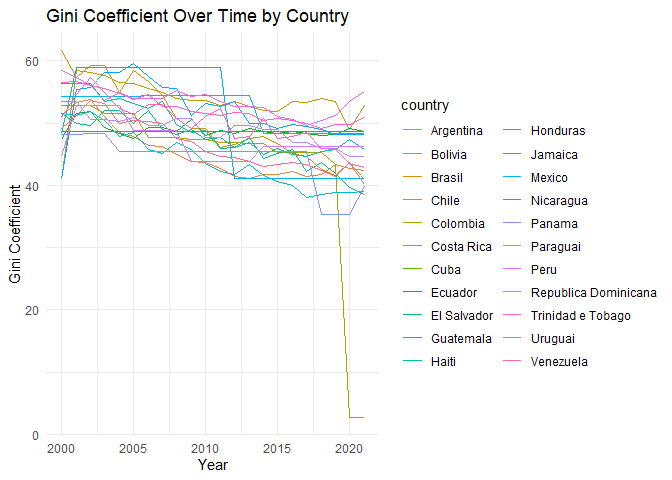
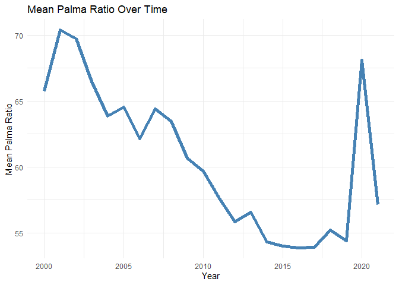
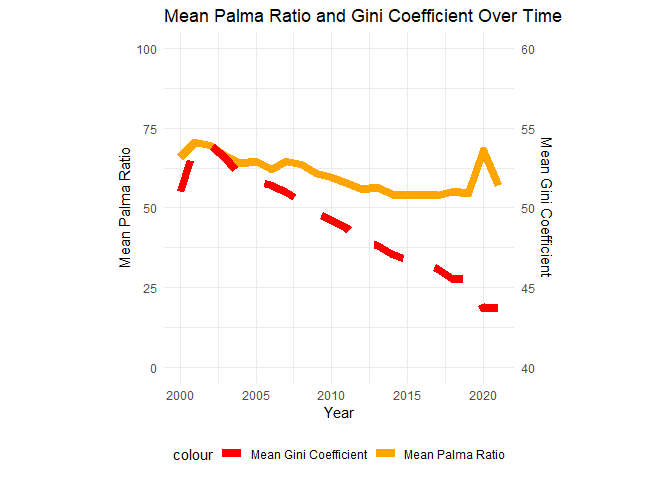
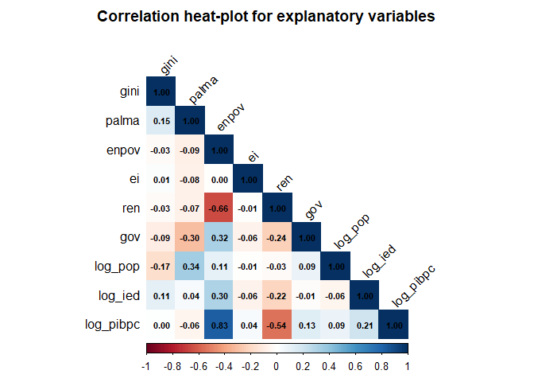

# PCSE no R
Tiago Afonso
2025-11-12

# Energy poverty and the green energy transition’s impact upon income inequality in Latin America

-   Goal: xamine the relationships arising from the transition process
    to green economies and energy poverty in relation to income
    inequality across 22 Latin American countries during the period from
    2000 to 2021

## Load Libraries

``` r
library(readxl)
library(tidyverse)
library(plm)
library(pcse)
library(lmtest)
library(sandwich)
library(stargazer)
library(broom)
library(lme4)
```

## Load Data

``` r
data <- read_xlsx("dados.xlsx")

#gen log variables
data <- data %>%
  mutate(
    pop = as.numeric(pop),
    ied = as.numeric(ied),
    pibpc = as.numeric(pibpc),
    log_pop = log(pop),
    log_ied = log(ied + abs(min(ied, na.rm = TRUE)) + 1), # Adjusting for negative values
    log_pibpc = log(pibpc)
  )

#rename columsn
data <- data %>%
  rename(
    country = id,
    year = time)

#convertendo para painel
pdata <- pdata.frame(data, index = c("country", "year"))
```

Ver a dimensão do painel

``` r
pdim(pdata)
```

    Balanced Panel: n = 22, T = 22, N = 484

## Variables description

-   Dependent variable: `gini` (Gini coefficient) : measures income
    inequality within a country, ranging from 0 (perfect equality) to
    100 (perfect inequality).

-   Dependent variable: `palma` (Palma ratio) : ratio of the income
    share of the top 10% to that of the bottom 40%, highlighting
    disparities between the richest and poorest segments of the
    population. varies from 0 to infinity, with higher values indicating
    greater inequality.

-   Independent variable: `enpov` (Energy poverty) : percentage of the
    population lacking access to modern energy services.

-   Independent variable: `ei` (Energy intensity) : measures the energy
    efficiency of a nation’s economy, calculated as units of energy per
    unit of GDP.

-   Independent variable: `ren`: (Renewable energy consumption) :
    percentage of total energy consumption derived from renewable
    sources.

-   `pop` (Population) : total population of the country.

-   `gov`: (Governmenr expenditure) : total government expenditure as a
    percentage of GDP.

-   `ied` (Foreign direct investment) : net inflows of foreign direct
    investment as a percentage of GDP.

-   `pibpc` (GDP per capita) : gross domestic product divided by midyear
    population, indicating the average economic output per person.

## Plot data

Plot the `gini` variable over `year` for each `country`

``` r
ggplot(data, aes(x = year, y = gini, color = country)) +
  geom_line() +
  labs(title = "Gini Coefficient Over Time by Country",
       x = "Year",
       y = "Gini Coefficient") +
  theme_minimal()
```



Plot the mean of `palma` variable over `year`

``` r
# palma as numeric
data$palma <- as.numeric(data$palma)

data %>%
  group_by(year) %>%
  summarize(mean_palma = mean(palma, na.rm = TRUE)) %>%
  ggplot(aes(x = year, y = mean_palma)) +
  geom_line(colour = "steelblue", size = 2) +
  labs(title = "Mean Palma Ratio Over Time",
       x = "Year",
       y = "Mean Palma Ratio") +
  theme_minimal()
```

    Warning: Using `size` aesthetic for lines was deprecated in ggplot2 3.4.0.
    ℹ Please use `linewidth` instead.



Plotting the mean of `palma` in `yy`axis; `year` in `x`axis; and `gini`
on the secondary `y` axis

``` r
data_summary <- data %>%
  group_by(year) %>%
  summarize(mean_palma = mean(palma, na.rm = TRUE),
            mean_gini = mean(gini, na.rm = TRUE))
ggplot(data_summary, aes(x = year)) +
    geom_line(aes(y = mean_palma, color = "Mean Palma Ratio"), size = 3, linetype = "solid") +
    geom_line(aes(y = (mean_gini - 40) * 5, color = "Mean Gini Coefficient"), size = 3, linetype = "dashed") +
    scale_y_continuous(
        name = "Mean Palma Ratio",
        limits = c(0, 100),
        sec.axis = sec_axis(~./5 + 40, name = "Mean Gini Coefficient")
    ) +
    labs(title = "Mean Palma Ratio and Gini Coefficient Over Time",
             x = "Year") +
    scale_color_manual(values = c("Mean Palma Ratio" = "orange", "Mean Gini Coefficient" = "red")) +
    theme_minimal() +
    theme(legend.position = "bottom",
          aspect.ratio = 1)
```



## Plot correlation matrix

``` r
# Adicione este chunk após os plots existentes

# Instalar pacote se necessário
# install.packages("corrplot")
library(corrplot)
```

    corrplot 0.95 loaded

``` r
# Selecionar variáveis numéricas para correlação
vars_corr <- pdata %>%
  select(gini, palma, enpov, ei, ren, pop, gov, ied, pibpc) %>%
  mutate(across(everything(), as.numeric)) %>%
  na.omit()

#log variables for correlation
vars_corr <- vars_corr %>%
  mutate(
    log_pop = log(pop),
    log_ied = log(ied + abs(min(ied, na.rm = TRUE)) + 1), # Adjusting for negative values
    log_pibpc = log(pibpc)
  ) %>%
  select(-pop, -ied, -pibpc)

# Calcular matriz de correlação
cor_matrix <- cor(vars_corr)

# Plotar matriz de correlação
corrplot(cor_matrix, 
         method = "color",           # células coloridas
         type = "lower",             # apenas triângulo inferior
         addCoef.col = "black",      # adiciona coeficientes
         number.cex = 0.7,           # tamanho dos números
         tl.col = "black",           # cor dos labels
         tl.srt = 45,                # ângulo dos labels
         col = colorRampPalette(c("#67001F", "#B2182B", "#D6604D", 
                                  "#F4A582", "#FDDBC7", "#FFFFFF", 
                                  "#D1E5F0", "#92C5DE", "#4393C3", 
                                  "#2166AC", "#053061"))(200),
         title = "Correlation heat-plot for explanatory variables",
         mar = c(0,0,2,0))
```



## Descriptive statistics

``` r
# Estatísticas descritivas
summary(pdata)
```

           country         year         palma             gini      
     Argentina : 22   2000   : 22   Min.   : 24.73   Min.   : 2.77  
     Bolivia   : 22   2001   : 22   1st Qu.: 51.38   1st Qu.:45.77  
     Brasil    : 22   2002   : 22   Median : 59.26   Median :48.70  
     Chile     : 22   2003   : 22   Mean   : 60.56   Mean   :48.93  
     Colombia  : 22   2004   : 22   3rd Qu.: 65.49   3rd Qu.:52.80  
     Costa Rica: 22   2005   : 22   Max.   :125.18   Max.   :61.60  
     (Other)   :352   (Other):352                                   
         enpov              ei                ren             pop           
     Min.   : 14.47   Min.   :-33.8368   Min.   : 0.35   Min.   :  1294494  
     1st Qu.: 77.37   1st Qu.: -3.3124   1st Qu.:15.02   1st Qu.:  5411185  
     Median : 91.05   Median : -0.7048   Median :28.78   Median : 10519524  
     Mean   : 83.09   Mean   : -0.6460   Mean   :32.24   Mean   : 26460052  
     3rd Qu.: 96.31   3rd Qu.:  1.9304   3rd Qu.:47.30   3rd Qu.: 27597708  
     Max.   :100.00   Max.   : 25.3661   Max.   :81.37   Max.   :209550294  
                                                                            
          gov              ied             pibpc          log_pop     
     Min.   : 6.552   Min.   :-5.088   Min.   : 1287   Min.   :14.07  
     1st Qu.:11.219   1st Qu.: 1.891   1st Qu.: 3716   1st Qu.:15.50  
     Median :13.750   Median : 3.341   Median : 6069   Median :16.17  
     Mean   :14.123   Mean   : 4.131   Mean   : 7484   Mean   :16.30  
     3rd Qu.:15.531   3rd Qu.: 5.230   3rd Qu.:10298   3rd Qu.:17.13  
     Max.   :39.881   Max.   :27.531   Max.   :20064   Max.   :19.16  
                                                                      
        log_ied        log_pibpc    
     Min.   :0.000   Min.   :7.160  
     1st Qu.:2.077   1st Qu.:8.221  
     Median :2.244   Median :8.711  
     Mean   :2.262   Mean   :8.686  
     3rd Qu.:2.426   3rd Qu.:9.240  
     Max.   :3.515   Max.   :9.907  
                                    

## Cross-sectional dependence test for each variable

``` r
# Teste de dependência cross-sectional para cada variável
variables_to_test <- c("gini", "palma", "enpov", "ei", "ren", "pop", "gov", "ied", "pibpc", "log_pop", "log_ied", "log_pibpc")

# Convert variables to numeric before testing
pdata_numeric <- pdata
for (var in variables_to_test) {
  pdata_numeric[[var]] <- as.numeric(pdata_numeric[[var]])
}

for (var in variables_to_test) {
  test_result <- pcdtest(as.formula(paste(var, "~ 1")), data = pdata_numeric, test = "cd")
  print(paste("Cross-sectional dependence test for", var))
  print(test_result)
}
```

    [1] "Cross-sectional dependence test for gini"

        Pesaran CD test for cross-sectional dependence in panels

    data:  gini ~ 1
    z = 36.808, p-value < 2.2e-16
    alternative hypothesis: cross-sectional dependence

    [1] "Cross-sectional dependence test for palma"

        Pesaran CD test for cross-sectional dependence in panels

    data:  palma ~ 1
    z = 36.09, p-value < 2.2e-16
    alternative hypothesis: cross-sectional dependence

    [1] "Cross-sectional dependence test for enpov"

        Pesaran CD test for cross-sectional dependence in panels

    data:  enpov ~ 1
    z = 56.909, p-value < 2.2e-16
    alternative hypothesis: cross-sectional dependence

    [1] "Cross-sectional dependence test for ei"

        Pesaran CD test for cross-sectional dependence in panels

    data:  ei ~ 1
    z = 0.85063, p-value = 0.395
    alternative hypothesis: cross-sectional dependence

    [1] "Cross-sectional dependence test for ren"

        Pesaran CD test for cross-sectional dependence in panels

    data:  ren ~ 1
    z = 6.5328, p-value = 6.457e-11
    alternative hypothesis: cross-sectional dependence

    [1] "Cross-sectional dependence test for pop"

        Pesaran CD test for cross-sectional dependence in panels

    data:  pop ~ 1
    z = 62.171, p-value < 2.2e-16
    alternative hypothesis: cross-sectional dependence

    [1] "Cross-sectional dependence test for gov"

        Pesaran CD test for cross-sectional dependence in panels

    data:  gov ~ 1
    z = 19.115, p-value < 2.2e-16
    alternative hypothesis: cross-sectional dependence

    [1] "Cross-sectional dependence test for ied"

        Pesaran CD test for cross-sectional dependence in panels

    data:  ied ~ 1
    z = 7.7821, p-value = 7.132e-15
    alternative hypothesis: cross-sectional dependence

    [1] "Cross-sectional dependence test for pibpc"

        Pesaran CD test for cross-sectional dependence in panels

    data:  pibpc ~ 1
    z = 51.875, p-value < 2.2e-16
    alternative hypothesis: cross-sectional dependence

    [1] "Cross-sectional dependence test for log_pop"

        Pesaran CD test for cross-sectional dependence in panels

    data:  log_pop ~ 1
    z = 62.369, p-value < 2.2e-16
    alternative hypothesis: cross-sectional dependence

    [1] "Cross-sectional dependence test for log_ied"

        Pesaran CD test for cross-sectional dependence in panels

    data:  log_ied ~ 1
    z = 8.2554, p-value < 2.2e-16
    alternative hypothesis: cross-sectional dependence

    Warning in cor(wideres, use = "pairwise.complete.obs"): the standard deviation
    is zero

    [1] "Cross-sectional dependence test for log_pibpc"

        Pesaran CD test for cross-sectional dependence in panels

    data:  log_pibpc ~ 1
    z = NA, p-value = NA
    alternative hypothesis: cross-sectional dependence

``` r
# Criar tabela com resultados dos testes de dependência cross-sectional
cd_results <- data.frame(
    Variable = character(),
    Statistic = numeric(),
    P_value = numeric(),
    Significance = character(),
    stringsAsFactors = FALSE
)

for (var in variables_to_test) {
    test_result <- pcdtest(as.formula(paste(var, "~ 1")), data = pdata_numeric, test = "cd")
    
    # Extrair estatística e p-valor
    statistic <- test_result$statistic
    p_value <- test_result$p.value
    
    # Determinar significância
    sig <- ifelse(p_value < 0.01, "***",
                                ifelse(p_value < 0.05, "**",
                                             ifelse(p_value < 0.1, "*", "")))
    
    # Adicionar à tabela
    cd_results <- rbind(cd_results, data.frame(
        Variable = var,
        Statistic = round(statistic, 4),
        P_value = round(p_value, 4),
        Significance = sig
    ))
}
```

    Warning in cor(wideres, use = "pairwise.complete.obs"): the standard deviation
    is zero

``` r
# Exibir tabela
print(cd_results)
```

         Variable Statistic P_value Significance
    z        gini   36.8081   0.000          ***
    z1      palma   36.0897   0.000          ***
    z2      enpov   56.9091   0.000          ***
    z3         ei    0.8506   0.395             
    z4        ren    6.5328   0.000          ***
    z5        pop   62.1712   0.000          ***
    z6        gov   19.1150   0.000          ***
    z7        ied    7.7821   0.000          ***
    z8      pibpc   51.8750   0.000          ***
    z9    log_pop   62.3694   0.000          ***
    z10   log_ied    8.2554   0.000          ***
    z11 log_pibpc        NA      NA         <NA>

``` r
# Criar tabela formatada com kable
library(knitr)
kable(cd_results, 
            col.names = c("Variable", "CD Statistic", "P-value", "Sig."),
            caption = "Cross-Sectional Dependence Test Results",
            align = c('l', 'r', 'r', 'c'))
```

<table>
<caption>Cross-Sectional Dependence Test Results</caption>
<thead>
<tr>
<th style="text-align: left;"></th>
<th style="text-align: left;">Variable</th>
<th style="text-align: right;">CD Statistic</th>
<th style="text-align: right;">P-value</th>
<th style="text-align: center;">Sig.</th>
</tr>
</thead>
<tbody>
<tr>
<td style="text-align: left;">z</td>
<td style="text-align: left;">gini</td>
<td style="text-align: right;">36.8081</td>
<td style="text-align: right;">0.000</td>
<td style="text-align: center;">***</td>
</tr>
<tr>
<td style="text-align: left;">z1</td>
<td style="text-align: left;">palma</td>
<td style="text-align: right;">36.0897</td>
<td style="text-align: right;">0.000</td>
<td style="text-align: center;">***</td>
</tr>
<tr>
<td style="text-align: left;">z2</td>
<td style="text-align: left;">enpov</td>
<td style="text-align: right;">56.9091</td>
<td style="text-align: right;">0.000</td>
<td style="text-align: center;">***</td>
</tr>
<tr>
<td style="text-align: left;">z3</td>
<td style="text-align: left;">ei</td>
<td style="text-align: right;">0.8506</td>
<td style="text-align: right;">0.395</td>
<td style="text-align: center;"></td>
</tr>
<tr>
<td style="text-align: left;">z4</td>
<td style="text-align: left;">ren</td>
<td style="text-align: right;">6.5328</td>
<td style="text-align: right;">0.000</td>
<td style="text-align: center;">***</td>
</tr>
<tr>
<td style="text-align: left;">z5</td>
<td style="text-align: left;">pop</td>
<td style="text-align: right;">62.1712</td>
<td style="text-align: right;">0.000</td>
<td style="text-align: center;">***</td>
</tr>
<tr>
<td style="text-align: left;">z6</td>
<td style="text-align: left;">gov</td>
<td style="text-align: right;">19.1150</td>
<td style="text-align: right;">0.000</td>
<td style="text-align: center;">***</td>
</tr>
<tr>
<td style="text-align: left;">z7</td>
<td style="text-align: left;">ied</td>
<td style="text-align: right;">7.7821</td>
<td style="text-align: right;">0.000</td>
<td style="text-align: center;">***</td>
</tr>
<tr>
<td style="text-align: left;">z8</td>
<td style="text-align: left;">pibpc</td>
<td style="text-align: right;">51.8750</td>
<td style="text-align: right;">0.000</td>
<td style="text-align: center;">***</td>
</tr>
<tr>
<td style="text-align: left;">z9</td>
<td style="text-align: left;">log_pop</td>
<td style="text-align: right;">62.3694</td>
<td style="text-align: right;">0.000</td>
<td style="text-align: center;">***</td>
</tr>
<tr>
<td style="text-align: left;">z10</td>
<td style="text-align: left;">log_ied</td>
<td style="text-align: right;">8.2554</td>
<td style="text-align: right;">0.000</td>
<td style="text-align: center;">***</td>
</tr>
<tr>
<td style="text-align: left;">z11</td>
<td style="text-align: left;">log_pibpc</td>
<td style="text-align: right;">NA</td>
<td style="text-align: right;">NA</td>
<td style="text-align: center;">NA</td>
</tr>
</tbody>
</table>

``` r
#Exports table to docx

#install.packages("officer")
#install.packages("flextable")
#library(officer)
#library(flextable)
#cd_table <- flextable(cd_results)
#cd_table <- autofit(cd_table)
#doc <- read_docx()
#doc <- body_add_flextable(doc, cd_table)
#print(doc, target = "cd_test_results.docx")
```

## Unit root tests

Run CIPS

``` r
library(plm)
cips_test <- function(var_name) {
  result <- tryCatch({
    # Get the pseries directly from pdata
    var_data <- pdata[[var_name]]
    # Run test only if sufficient data exists
    if(sum(!is.na(var_data)) > 30) {
      cipstest(var_data, model = "trend", lags = 1, model="dmg")
    } else {
      list(statistic = NA, p.value = NA, 
           method = "Insufficient data for CIPS test")
    }
  }, error = function(e) {
    list(statistic = NA, p.value = NA, 
         method = paste("Error:", e$message))
  })
  return(result)
}

variables_to_test <- c("gini", "palma", "enpov", "ei", "ren", "pop", "gov", "ied", "pibpc",
                       "log_pop", "log_ied", "log_pibpc")
cips_results <- lapply(variables_to_test, cips_test)
names(cips_results) <- variables_to_test
# Display results
for (var in variables_to_test) {
  cat("CIPS Test for", var, ":\n")
  print(cips_results[[var]])
  cat("\n")
}
```

    CIPS Test for gini :
    $statistic
    [1] NA

    $p.value
    [1] NA

    $method
    [1] "Error: formal argument \"model\" matched by multiple actual arguments"


    CIPS Test for palma :
    $statistic
    [1] NA

    $p.value
    [1] NA

    $method
    [1] "Error: formal argument \"model\" matched by multiple actual arguments"


    CIPS Test for enpov :
    $statistic
    [1] NA

    $p.value
    [1] NA

    $method
    [1] "Error: formal argument \"model\" matched by multiple actual arguments"


    CIPS Test for ei :
    $statistic
    [1] NA

    $p.value
    [1] NA

    $method
    [1] "Error: formal argument \"model\" matched by multiple actual arguments"


    CIPS Test for ren :
    $statistic
    [1] NA

    $p.value
    [1] NA

    $method
    [1] "Error: formal argument \"model\" matched by multiple actual arguments"


    CIPS Test for pop :
    $statistic
    [1] NA

    $p.value
    [1] NA

    $method
    [1] "Error: formal argument \"model\" matched by multiple actual arguments"


    CIPS Test for gov :
    $statistic
    [1] NA

    $p.value
    [1] NA

    $method
    [1] "Error: formal argument \"model\" matched by multiple actual arguments"


    CIPS Test for ied :
    $statistic
    [1] NA

    $p.value
    [1] NA

    $method
    [1] "Error: formal argument \"model\" matched by multiple actual arguments"


    CIPS Test for pibpc :
    $statistic
    [1] NA

    $p.value
    [1] NA

    $method
    [1] "Error: formal argument \"model\" matched by multiple actual arguments"


    CIPS Test for log_pop :
    $statistic
    [1] NA

    $p.value
    [1] NA

    $method
    [1] "Error: formal argument \"model\" matched by multiple actual arguments"


    CIPS Test for log_ied :
    $statistic
    [1] NA

    $p.value
    [1] NA

    $method
    [1] "Error: formal argument \"model\" matched by multiple actual arguments"


    CIPS Test for log_pibpc :
    $statistic
    [1] NA

    $p.value
    [1] NA

    $method
    [1] "Error: formal argument \"model\" matched by multiple actual arguments"

``` r
cipstest(pdata$gini, lags = 1, model = "dmg")
```

    Warning in cipstest(pdata$gini, lags = 1, model = "dmg"): p-value greater than
    printed p-value


        Pesaran's CIPS test for unit roots

    data:  pdata$gini
    CIPS test = -1.4051, lag order = 1, p-value = 0.1
    alternative hypothesis: Stationarity

``` r
cipstest(pdata$palma, lags = 1, model = "dmg")
```

    Warning in cipstest(pdata$palma, lags = 1, model = "dmg"): p-value greater than
    printed p-value


        Pesaran's CIPS test for unit roots

    data:  pdata$palma
    CIPS test = -0.92322, lag order = 1, p-value = 0.1
    alternative hypothesis: Stationarity

``` r
cipstest(pdata$enpov, lags = 1, model = "dmg")
```

    Warning in cipstest(pdata$enpov, lags = 1, model = "dmg"): p-value greater than
    printed p-value


        Pesaran's CIPS test for unit roots

    data:  pdata$enpov
    CIPS test = -0.96104, lag order = 1, p-value = 0.1
    alternative hypothesis: Stationarity

``` r
cipstest(pdata$ei, lags = 1, model = "dmg")
```

    Warning in cipstest(pdata$ei, lags = 1, model = "dmg"): p-value smaller than
    printed p-value


        Pesaran's CIPS test for unit roots

    data:  pdata$ei
    CIPS test = -3.269, lag order = 1, p-value = 0.01
    alternative hypothesis: Stationarity

``` r
cipstest(pdata$ren, lags = 1, model = "dmg")
```

    Warning in cipstest(pdata$ren, lags = 1, model = "dmg"): p-value greater than
    printed p-value


        Pesaran's CIPS test for unit roots

    data:  pdata$ren
    CIPS test = -1.4113, lag order = 1, p-value = 0.1
    alternative hypothesis: Stationarity

``` r
cipstest(pdata$pop, lags = 1, model = "dmg")
```

    Warning in cipstest(pdata$pop, lags = 1, model = "dmg"): p-value greater than
    printed p-value


        Pesaran's CIPS test for unit roots

    data:  pdata$pop
    CIPS test = -0.32278, lag order = 1, p-value = 0.1
    alternative hypothesis: Stationarity

``` r
cipstest(pdata$gov, lags = 1, model = "dmg")
```

    Warning in cipstest(pdata$gov, lags = 1, model = "dmg"): p-value greater than
    printed p-value


        Pesaran's CIPS test for unit roots

    data:  pdata$gov
    CIPS test = -1.7069, lag order = 1, p-value = 0.1
    alternative hypothesis: Stationarity

``` r
cipstest(pdata$ied, lags = 1, model = "dmg")
```

    Warning in cipstest(pdata$ied, lags = 1, model = "dmg"): p-value greater than
    printed p-value


        Pesaran's CIPS test for unit roots

    data:  pdata$ied
    CIPS test = -2.398, lag order = 1, p-value = 0.1
    alternative hypothesis: Stationarity

``` r
cipstest(pdata$pibpc, lags = 1, model = "dmg")
```

    Warning in cipstest(pdata$pibpc, lags = 1, model = "dmg"): p-value greater than
    printed p-value


        Pesaran's CIPS test for unit roots

    data:  pdata$pibpc
    CIPS test = -1.2789, lag order = 1, p-value = 0.1
    alternative hypothesis: Stationarity

``` r
cipstest(pdata$log_pop, lags = 1, model = "dmg")
```

    Warning in cipstest(pdata$log_pop, lags = 1, model = "dmg"): p-value greater
    than printed p-value


        Pesaran's CIPS test for unit roots

    data:  pdata$log_pop
    CIPS test = -1.2525, lag order = 1, p-value = 0.1
    alternative hypothesis: Stationarity

``` r
cipstest(pdata$log_ied, lags = 1, model = "dmg")
```

    Warning in cipstest(pdata$log_ied, lags = 1, model = "dmg"): p-value greater
    than printed p-value


        Pesaran's CIPS test for unit roots

    data:  pdata$log_ied
    CIPS test = -2.5333, lag order = 1, p-value = 0.1
    alternative hypothesis: Stationarity

``` r
cipstest(pdata$log_pibpc, lags = 1, model = "dmg")
```

    Warning in cipstest(pdata$log_pibpc, lags = 1, model = "dmg"): p-value greater
    than printed p-value


        Pesaran's CIPS test for unit roots

    data:  pdata$log_pibpc
    CIPS test = -1.2567, lag order = 1, p-value = 0.1
    alternative hypothesis: Stationarity

``` r
cipstest(diff(pdata$gini), lags = 1, model = "dmg")
```

    Warning in cipstest(diff(pdata$gini), lags = 1, model = "dmg"): p-value smaller
    than printed p-value


        Pesaran's CIPS test for unit roots

    data:  diff(pdata$gini)
    CIPS test = -3.9084, lag order = 1, p-value = 0.01
    alternative hypothesis: Stationarity

``` r
cipstest(diff(pdata$palma), lags = 1, model = "dmg")
```

    Warning in cipstest(diff(pdata$palma), lags = 1, model = "dmg"): p-value
    smaller than printed p-value


        Pesaran's CIPS test for unit roots

    data:  diff(pdata$palma)
    CIPS test = -3.4345, lag order = 1, p-value = 0.01
    alternative hypothesis: Stationarity

``` r
cipstest(diff(pdata$enpov), lags = 1, model = "dmg")
```

    Warning in cipstest(diff(pdata$enpov), lags = 1, model = "dmg"): p-value
    smaller than printed p-value


        Pesaran's CIPS test for unit roots

    data:  diff(pdata$enpov)
    CIPS test = -4.2515, lag order = 1, p-value = 0.01
    alternative hypothesis: Stationarity

``` r
cipstest(diff(pdata$ei), lags = 1, model = "dmg")
```

    Warning in cipstest(diff(pdata$ei), lags = 1, model = "dmg"): p-value smaller
    than printed p-value


        Pesaran's CIPS test for unit roots

    data:  diff(pdata$ei)
    CIPS test = -5.0318, lag order = 1, p-value = 0.01
    alternative hypothesis: Stationarity

``` r
cipstest(diff(pdata$ren), lags = 1, model = "dmg")
```

    Warning in cipstest(diff(pdata$ren), lags = 1, model = "dmg"): p-value smaller
    than printed p-value


        Pesaran's CIPS test for unit roots

    data:  diff(pdata$ren)
    CIPS test = -3.272, lag order = 1, p-value = 0.01
    alternative hypothesis: Stationarity

``` r
cipstest(diff(pdata$pop), lags = 1, model = "dmg")
```

    Warning in cipstest(diff(pdata$pop), lags = 1, model = "dmg"): p-value greater
    than printed p-value


        Pesaran's CIPS test for unit roots

    data:  diff(pdata$pop)
    CIPS test = 0.23101, lag order = 1, p-value = 0.1
    alternative hypothesis: Stationarity

``` r
cipstest(diff(pdata$gov), lags = 1, model = "dmg")
```

    Warning in cipstest(diff(pdata$gov), lags = 1, model = "dmg"): p-value smaller
    than printed p-value


        Pesaran's CIPS test for unit roots

    data:  diff(pdata$gov)
    CIPS test = -2.9683, lag order = 1, p-value = 0.01
    alternative hypothesis: Stationarity

``` r
cipstest(diff(pdata$ied), lags = 1, model = "dmg")
```

    Warning in cipstest(diff(pdata$ied), lags = 1, model = "dmg"): p-value smaller
    than printed p-value


        Pesaran's CIPS test for unit roots

    data:  diff(pdata$ied)
    CIPS test = -4.2817, lag order = 1, p-value = 0.01
    alternative hypothesis: Stationarity

``` r
cipstest(diff(pdata$pibpc), lags = 1, model = "dmg")
```

    Warning in cipstest(diff(pdata$pibpc), lags = 1, model = "dmg"): p-value
    greater than printed p-value


        Pesaran's CIPS test for unit roots

    data:  diff(pdata$pibpc)
    CIPS test = -2.3235, lag order = 1, p-value = 0.1
    alternative hypothesis: Stationarity

``` r
cipstest(diff(pdata$log_pop), lags = 1, model = "dmg")
```

    Warning in cipstest(diff(pdata$log_pop), lags = 1, model = "dmg"): p-value
    greater than printed p-value


        Pesaran's CIPS test for unit roots

    data:  diff(pdata$log_pop)
    CIPS test = -1.9209, lag order = 1, p-value = 0.1
    alternative hypothesis: Stationarity

``` r
cipstest(diff(pdata$log_ied), lags = 1, model = "dmg")
```

    Warning in cipstest(diff(pdata$log_ied), lags = 1, model = "dmg"): p-value
    smaller than printed p-value


        Pesaran's CIPS test for unit roots

    data:  diff(pdata$log_ied)
    CIPS test = -4.4776, lag order = 1, p-value = 0.01
    alternative hypothesis: Stationarity

``` r
cipstest(diff(pdata$log_pibpc), lags = 1, model = "dmg")
```

    Warning in cipstest(diff(pdata$log_pibpc), lags = 1, model = "dmg"): p-value
    greater than printed p-value


        Pesaran's CIPS test for unit roots

    data:  diff(pdata$log_pibpc)
    CIPS test = -2.5686, lag order = 1, p-value = 0.1
    alternative hypothesis: Stationarity

## Heteroskedasticity test

``` r
# Teste de heterocedasticidade de Breusch-Pagan
model_bp <- plm(gini ~ enpov + ei + ren + pop + gov + ied + pibpc, data = pdata, model = "within")
bptest(model_bp)
```


        studentized Breusch-Pagan test

    data:  model_bp
    BP = 8.7132, df = 7, p-value = 0.2739

``` r
model_bp_palma <- plm(palma ~ enpov + ei + ren + pop + gov + ied + pibpc, data = pdata, model = "within")
bptest(model_bp_palma)
```


        studentized Breusch-Pagan test

    data:  model_bp_palma
    BP = 34.71, df = 7, p-value = 1.268e-05

``` r
#for log variables
model_bp_log <- plm(gini ~ enpov + ei + ren + log_pop + gov + log_ied + log_pibpc, data = pdata, model = "within")
bptest(model_bp_log)
```


        studentized Breusch-Pagan test

    data:  model_bp_log
    BP = 13.18, df = 7, p-value = 0.06785

``` r
model_bp_palma_log <- plm(palma ~ enpov + ei + ren + log_pop + gov + log_ied + log_pibpc, data = pdata, model = "within")
bptest(model_bp_palma_log)
```


        studentized Breusch-Pagan test

    data:  model_bp_palma_log
    BP = 66.709, df = 7, p-value = 6.813e-12

## Serial correlation test

``` r
# Teste de correlação serial de Wooldridge

model_wc <- plm(gini ~ enpov + ei + ren + pop + gov + ied + pibpc, data = pdata, model = "within")
pbgtest(model_wc)
```


        Breusch-Godfrey/Wooldridge test for serial correlation in panel models

    data:  gini ~ enpov + ei + ren + pop + gov + ied + pibpc
    chisq = 138.62, df = 22, p-value < 2.2e-16
    alternative hypothesis: serial correlation in idiosyncratic errors

``` r
model_wc_palma <- plm(palma ~ enpov + ei + ren + pop + gov + ied + pibpc, data = pdata, model = "within")
pbgtest(model_wc_palma)
```


        Breusch-Godfrey/Wooldridge test for serial correlation in panel models

    data:  palma ~ enpov + ei + ren + pop + gov + ied + pibpc
    chisq = 164.96, df = 22, p-value < 2.2e-16
    alternative hypothesis: serial correlation in idiosyncratic errors

``` r
# for logs
model_wc_log <- plm(gini ~ enpov + ei + ren + log_pop + gov + log_ied + log_pibpc, data = pdata, model = "within")
pbgtest(model_wc_log)
```


        Breusch-Godfrey/Wooldridge test for serial correlation in panel models

    data:  gini ~ enpov + ei + ren + log_pop + gov + log_ied + log_pibpc
    chisq = 193.24, df = 22, p-value < 2.2e-16
    alternative hypothesis: serial correlation in idiosyncratic errors

## PCSE estimation

``` r
# Estimativa PCSE

model_pooled_gini <- lm(gini ~ enpov + ei + ren + gov + ied + pibpc, data = data)
model_pooled_palma <- lm(palma ~ enpov + ei + ren + gov + ied + pibpc, data = data)

#for logs
model_pooled_gini_log <- lm(gini ~ enpov + ei + ren + gov + log_ied + log_pibpc, data = data)
model_pooled_palma_log <- lm(palma ~ enpov + ei + ren + gov + log_ied + log_pibpc, data = data)

library(lmtest)

#PCSE for gini
pcse_errors_gini <- pcse::vcovPC(model_pooled_gini, groupN = pdata$country, groupT = pdata$year)
summary(model_pooled_gini)
```


    Call:
    lm(formula = gini ~ enpov + ei + ren + gov + ied + pibpc, data = data)

    Residuals:
        Min      1Q  Median      3Q     Max 
    -45.719  -3.128   0.297   3.349  13.166 

    Coefficients:
                  Estimate Std. Error t value Pr(>|t|)    
    (Intercept)  5.203e+01  1.890e+00  27.528   <2e-16 ***
    enpov       -2.942e-02  2.202e-02  -1.337   0.1820    
    ei           1.397e-02  4.336e-02   0.322   0.7474    
    ren         -2.067e-02  1.645e-02  -1.257   0.2095    
    gov         -7.178e-02  5.479e-02  -1.310   0.1908    
    ied          2.091e-01  6.790e-02   3.079   0.0022 ** 
    pibpc        2.337e-05  7.378e-05   0.317   0.7516    
    ---
    Signif. codes:  0 '***' 0.001 '**' 0.01 '*' 0.05 '.' 0.1 ' ' 1

    Residual standard error: 5.61 on 477 degrees of freedom
    Multiple R-squared:  0.03225,   Adjusted R-squared:  0.02008 
    F-statistic: 2.649 on 6 and 477 DF,  p-value: 0.01545

``` r
pcse_gini<-coeftest(model_pooled_gini, vcov = pcse_errors_gini)

# PCSE for palma
pcse_errors_palma <- pcse::vcovPC(model_pooled_palma, groupN = pdata$country, groupT = pdata$year)
summary(model_pooled_palma)
```


    Call:
    lm(formula = palma ~ enpov + ei + ren + gov + ied + pibpc, data = data)

    Residuals:
        Min      1Q  Median      3Q     Max 
    -34.461  -9.591  -1.986   7.052  67.953 

    Coefficients:
                  Estimate Std. Error t value Pr(>|t|)    
    (Intercept) 91.7969192  5.6319181  16.299  < 2e-16 ***
    enpov        0.0051197  0.0656051   0.078 0.937830    
    ei          -0.2759653  0.1292198  -2.136 0.033218 *  
    ren         -0.2253054  0.0490125  -4.597 5.50e-06 ***
    gov         -1.2795035  0.1632593  -7.837 3.03e-14 ***
    ied         -0.2011598  0.2023480  -0.994 0.320665    
    pibpc       -0.0007579  0.0002199  -3.447 0.000617 ***
    ---
    Signif. codes:  0 '***' 0.001 '**' 0.01 '*' 0.05 '.' 0.1 ' ' 1

    Residual standard error: 16.72 on 477 degrees of freedom
    Multiple R-squared:  0.1575,    Adjusted R-squared:  0.1469 
    F-statistic: 14.86 on 6 and 477 DF,  p-value: 1.324e-15

``` r
pcse_palma<-coeftest(model_pooled_palma, vcov = pcse_errors_palma)
pcse_palma
```


    t test of coefficients:

             Estimate  Std. Error  t value  Pr(>|t|)    
    enpov  5.1197e-03  4.8153e-02   0.1063   0.91537    
    ei    -2.7597e-01  1.0767e-01  -2.5631   0.01068 *  
    ren   -2.2531e-01  2.7630e-02  -8.1544 3.126e-15 ***
    gov   -1.2795e+00  8.2826e-02 -15.4481 < 2.2e-16 ***
    ied   -2.0116e-01  1.2331e-01  -1.6314   0.10347    
    pibpc -7.5792e-04  9.4986e-05  -7.9793 1.103e-14 ***
    ---
    Signif. codes:  0 '***' 0.001 '**' 0.01 '*' 0.05 '.' 0.1 ' ' 1

``` r
#logs
#PCSE for gini log
pcse_errors_gini_log <- pcse::vcovPC(model_pooled_gini_log, groupN = pdata$country, groupT = pdata$year)
summary(model_pooled_gini_log)
```


    Call:
    lm(formula = gini ~ enpov + ei + ren + gov + log_ied + log_pibpc, 
        data = data)

    Residuals:
        Min      1Q  Median      3Q     Max 
    -45.697  -3.050   0.419   3.276  13.017 

    Coefficients:
                Estimate Std. Error t value Pr(>|t|)    
    (Intercept) 44.72548    4.93737   9.059   <2e-16 ***
    enpov       -0.04481    0.02751  -1.629   0.1040    
    ei           0.01053    0.04342   0.243   0.8084    
    ren         -0.02175    0.01646  -1.322   0.1868    
    gov         -0.07491    0.05436  -1.378   0.1688    
    log_ied      2.06665    0.77350   2.672   0.0078 ** 
    log_pibpc    0.57782    0.65219   0.886   0.3761    
    ---
    Signif. codes:  0 '***' 0.001 '**' 0.01 '*' 0.05 '.' 0.1 ' ' 1

    Residual standard error: 5.623 on 477 degrees of freedom
    Multiple R-squared:  0.02804,   Adjusted R-squared:  0.01581 
    F-statistic: 2.294 on 6 and 477 DF,  p-value: 0.03414

``` r
pcse_gini_log<-coeftest(model_pooled_gini_log, vcov = pcse_errors_gini_log)
pcse_gini_log
```


    t test of coefficients:

               Estimate Std. Error t value Pr(>|t|)   
    enpov     -0.044807   0.025622 -1.7487 0.080980 . 
    ei         0.010531   0.034982  0.3010 0.763521   
    ren       -0.021754   0.012228 -1.7791 0.075862 . 
    gov       -0.074908   0.026671 -2.8086 0.005180 **
    log_ied    2.066647   0.686668  3.0097 0.002754 **
    log_pibpc  0.577824   0.406126  1.4228 0.155457   
    ---
    Signif. codes:  0 '***' 0.001 '**' 0.01 '*' 0.05 '.' 0.1 ' ' 1

``` r
# PCSE for palma log
pcse_errors_palma_log <- pcse::vcovPC(model_pooled_palma_log, groupN = pdata$country, groupT = pdata$year)
summary(model_pooled_palma_log)
```


    Call:
    lm(formula = palma ~ enpov + ei + ren + gov + log_ied + log_pibpc, 
        data = data)

    Residuals:
        Min      1Q  Median      3Q     Max 
    -32.247 -10.279  -1.989   7.159  66.789 

    Coefficients:
                 Estimate Std. Error t value Pr(>|t|)    
    (Intercept) 104.44588   14.84561   7.035 6.94e-12 ***
    enpov        -0.07825    0.08270  -0.946   0.3445    
    ei           -0.28850    0.13054  -2.210   0.0276 *  
    ren          -0.21636    0.04948  -4.373 1.51e-05 ***
    gov          -1.15388    0.16344  -7.060 5.91e-12 ***
    log_ied       0.91386    2.32576   0.393   0.6945    
    log_pibpc    -1.88380    1.96099  -0.961   0.3372    
    ---
    Signif. codes:  0 '***' 0.001 '**' 0.01 '*' 0.05 '.' 0.1 ' ' 1

    Residual standard error: 16.91 on 477 degrees of freedom
    Multiple R-squared:  0.1385,    Adjusted R-squared:  0.1277 
    F-statistic: 12.78 on 6 and 477 DF,  p-value: 2.095e-13

``` r
pcse_palma_log<-coeftest(model_pooled_palma_log, vcov = pcse_errors_palma_log)
pcse_palma_log
```


    t test of coefficients:

               Estimate Std. Error  t value  Pr(>|t|)    
    enpov     -0.078253   0.054347  -1.4399  0.150560    
    ei        -0.288504   0.108760  -2.6527  0.008252 ** 
    ren       -0.216357   0.026298  -8.2271 1.841e-15 ***
    gov       -1.153884   0.079883 -14.4447 < 2.2e-16 ***
    log_ied    0.913862   1.759043   0.5195  0.603637    
    log_pibpc -1.883800   0.785252  -2.3990  0.016824 *  
    ---
    Signif. codes:  0 '***' 0.001 '**' 0.01 '*' 0.05 '.' 0.1 ' ' 1

``` r
#gen log pibpc^2 - square the log, not log the square
data <- data %>%
  mutate(log_pibpc_sq = log_pibpc^2)

## PCSE for gini with pibpc square - logs
model_pooled_gini_sq <- lm(gini ~ enpov + ei + ren + gov + log_ied + log_pibpc + log_pibpc_sq, data = data)
pcse_errors_gini_sq <- pcse::vcovPC(model_pooled_gini_sq, groupN = pdata$country, groupT = pdata$year)
summary(model_pooled_gini_sq)
```


    Call:
    lm(formula = gini ~ enpov + ei + ren + gov + log_ied + log_pibpc + 
        log_pibpc_sq, data = data)

    Residuals:
        Min      1Q  Median      3Q     Max 
    -45.723  -3.148   0.374   3.322  12.783 

    Coefficients:
                 Estimate Std. Error t value Pr(>|t|)  
    (Intercept)  -1.18949   50.04578  -0.024   0.9810  
    enpov        -0.06378    0.03435  -1.856   0.0640 .
    ei            0.01195    0.04345   0.275   0.7834  
    ren          -0.02291    0.01651  -1.388   0.1658  
    gov          -0.07651    0.05439  -1.407   0.1602  
    log_ied       1.83409    0.81371   2.254   0.0247 *
    log_pibpc    11.41564   11.77329   0.970   0.3327  
    log_pibpc_sq -0.60631    0.65763  -0.922   0.3570  
    ---
    Signif. codes:  0 '***' 0.001 '**' 0.01 '*' 0.05 '.' 0.1 ' ' 1

    Residual standard error: 5.623 on 476 degrees of freedom
    Multiple R-squared:  0.02977,   Adjusted R-squared:  0.01551 
    F-statistic: 2.087 on 7 and 476 DF,  p-value: 0.04354

``` r
pcse_gini_sq<-coeftest(model_pooled_gini_sq, vcov = pcse_errors_gini_sq)

## PCSE for palma with pibp squared
model_pooled_palma_sq <- lm(palma ~ enpov + ei + ren + gov + log_ied + log_pibpc + log_pibpc_sq, data = data)
pcse_errors_palma_sq <- pcse::vcovPC(model_pooled_palma_sq, groupN = pdata$country, groupT = pdata$year)
summary(model_pooled_palma_sq)
```


    Call:
    lm(formula = palma ~ enpov + ei + ren + gov + log_ied + log_pibpc + 
        log_pibpc_sq, data = data)

    Residuals:
        Min      1Q  Median      3Q     Max 
    -33.655  -9.462  -2.151   6.978  68.263 

    Coefficients:
                   Estimate Std. Error t value Pr(>|t|)    
    (Intercept)  -794.53201  144.80741  -5.487 6.66e-08 ***
    enpov          -0.44969    0.09940  -4.524 7.68e-06 ***
    ei             -0.26076    0.12572  -2.074   0.0386 *  
    ren            -0.23896    0.04776  -5.003 7.94e-07 ***
    gov            -1.18523    0.15739  -7.531 2.55e-13 ***
    log_ied        -3.63948    2.35447  -1.546   0.1228    
    log_pibpc     210.31186   34.06601   6.174 1.43e-09 ***
    log_pibpc_sq  -11.87097    1.90284  -6.239 9.77e-10 ***
    ---
    Signif. codes:  0 '***' 0.001 '**' 0.01 '*' 0.05 '.' 0.1 ' ' 1

    Residual standard error: 16.27 on 476 degrees of freedom
    Multiple R-squared:  0.2036,    Adjusted R-squared:  0.1919 
    F-statistic: 17.39 on 7 and 476 DF,  p-value: < 2.2e-16

``` r
pcse_palma_sq<-coeftest(model_pooled_palma_sq, vcov = pcse_errors_palma_sq)
```

Comaparing results

``` r
library(modelsummary)

models <- list("PCSE Gini" = model_pooled_gini,
               "PCSE Palma" = model_pooled_palma,
               "PCSE Gini Log" = model_pooled_gini_log,
               "PCSE Palma Log" = model_pooled_palma_log,
               "PCSE Gini Log Sq" = model_pooled_gini_sq,
               "PCSE Palma Log Sq" = model_pooled_palma_sq)

modelsummary(models,
             vcov = list(pcse_errors_gini, pcse_errors_palma, pcse_errors_gini_log, 
                        pcse_errors_palma_log, pcse_errors_gini_sq, pcse_errors_palma_sq),
              statistic = "std.error",
              stars = c('*' = 0.1, '**' = 0.05, '***' = 0.01),
              gof_omit = 'AIC|BIC|Log.Lik|F|Adj.R2')
```

<table style="width:96%;">
<colgroup>
<col style="width: 12%" />
<col style="width: 10%" />
<col style="width: 11%" />
<col style="width: 13%" />
<col style="width: 14%" />
<col style="width: 16%" />
<col style="width: 17%" />
</colgroup>
<thead>
<tr>
<th></th>
<th>PCSE Gini</th>
<th>PCSE Palma</th>
<th>PCSE Gini Log</th>
<th>PCSE Palma Log</th>
<th>PCSE Gini Log Sq</th>
<th>PCSE Palma Log Sq</th>
</tr>
</thead>
<tbody>
<tr>
<td>enpov</td>
<td>-0.029</td>
<td>0.005</td>
<td>-0.045*</td>
<td>-0.078</td>
<td>-0.064*</td>
<td>-0.450***</td>
</tr>
<tr>
<td></td>
<td>(0.020)</td>
<td>(0.048)</td>
<td>(0.026)</td>
<td>(0.054)</td>
<td>(0.037)</td>
<td>(0.071)</td>
</tr>
<tr>
<td>ei</td>
<td>0.014</td>
<td>-0.276**</td>
<td>0.011</td>
<td>-0.289***</td>
<td>0.012</td>
<td>-0.261**</td>
</tr>
<tr>
<td></td>
<td>(0.035)</td>
<td>(0.108)</td>
<td>(0.035)</td>
<td>(0.109)</td>
<td>(0.035)</td>
<td>(0.103)</td>
</tr>
<tr>
<td>ren</td>
<td>-0.021*</td>
<td>-0.225***</td>
<td>-0.022*</td>
<td>-0.216***</td>
<td>-0.023*</td>
<td>-0.239***</td>
</tr>
<tr>
<td></td>
<td>(0.012)</td>
<td>(0.028)</td>
<td>(0.012)</td>
<td>(0.026)</td>
<td>(0.013)</td>
<td>(0.027)</td>
</tr>
<tr>
<td>gov</td>
<td>-0.072**</td>
<td>-1.280***</td>
<td>-0.075***</td>
<td>-1.154***</td>
<td>-0.077***</td>
<td>-1.185***</td>
</tr>
<tr>
<td></td>
<td>(0.031)</td>
<td>(0.083)</td>
<td>(0.027)</td>
<td>(0.080)</td>
<td>(0.027)</td>
<td>(0.076)</td>
</tr>
<tr>
<td>ied</td>
<td>0.209***</td>
<td>-0.201</td>
<td></td>
<td></td>
<td></td>
<td></td>
</tr>
<tr>
<td></td>
<td>(0.053)</td>
<td>(0.123)</td>
<td></td>
<td></td>
<td></td>
<td></td>
</tr>
<tr>
<td>pibpc</td>
<td>0.000</td>
<td>-0.001***</td>
<td></td>
<td></td>
<td></td>
<td></td>
</tr>
<tr>
<td></td>
<td>(0.000)</td>
<td>(0.000)</td>
<td></td>
<td></td>
<td></td>
<td></td>
</tr>
<tr>
<td>log_ied</td>
<td></td>
<td></td>
<td>2.067***</td>
<td>0.914</td>
<td>1.834**</td>
<td>-3.639**</td>
</tr>
<tr>
<td></td>
<td></td>
<td></td>
<td>(0.687)</td>
<td>(1.759)</td>
<td>(0.771)</td>
<td>(1.700)</td>
</tr>
<tr>
<td>log_pibpc</td>
<td></td>
<td></td>
<td>0.578</td>
<td>-1.884**</td>
<td>11.416</td>
<td>210.312***</td>
</tr>
<tr>
<td></td>
<td></td>
<td></td>
<td>(0.406)</td>
<td>(0.785)</td>
<td>(10.355)</td>
<td>(22.837)</td>
</tr>
<tr>
<td>log_pibpc_sq</td>
<td></td>
<td></td>
<td></td>
<td></td>
<td>-0.606</td>
<td>-11.871***</td>
</tr>
<tr>
<td></td>
<td></td>
<td></td>
<td></td>
<td></td>
<td>(0.580)</td>
<td>(1.269)</td>
</tr>
<tr>
<td>Num.Obs.</td>
<td>484</td>
<td>484</td>
<td>484</td>
<td>484</td>
<td>484</td>
<td>484</td>
</tr>
<tr>
<td>R2</td>
<td>0.032</td>
<td>0.157</td>
<td>0.028</td>
<td>0.139</td>
<td>0.030</td>
<td>0.204</td>
</tr>
<tr>
<td>R2 Adj.</td>
<td>0.020</td>
<td>0.147</td>
<td>0.016</td>
<td>0.128</td>
<td>0.016</td>
<td>0.192</td>
</tr>
<tr>
<td>RMSE</td>
<td>5.57</td>
<td>16.60</td>
<td>5.58</td>
<td>16.78</td>
<td>5.58</td>
<td>16.14</td>
</tr>
<tr>
<td>Std.Errors</td>
<td>Custom</td>
<td>Custom</td>
<td>Custom</td>
<td>Custom</td>
<td>Custom</td>
<td>Custom</td>
</tr>
</tbody><tfoot>
<tr>
<td colspan="7"><ul>
<li>p &lt; 0.1, ** p &lt; 0.05, *** p &lt; 0.01</li>
</ul></td>
</tr>
</tfoot>
&#10;</table>
