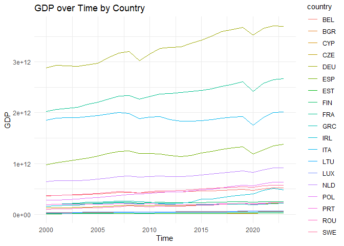
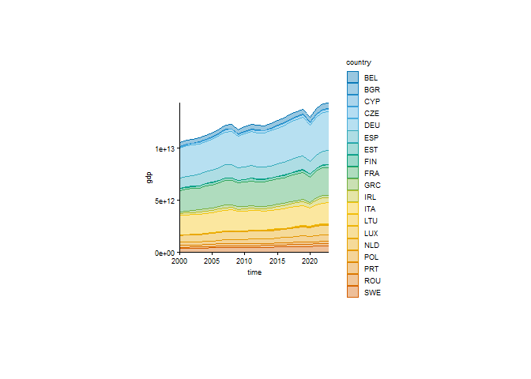
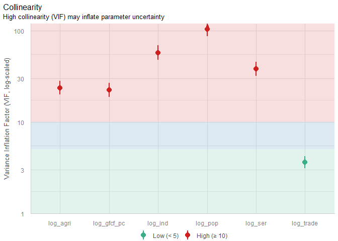
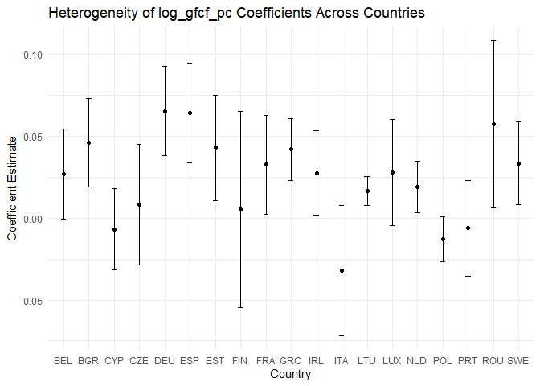

# Class 11 - GLS & PMG
Tiago Afonso
2025-11-20

# Generalized Least Squares (GLS) and Panel Mean Group (PMG) Estimators

## Load Libraries

``` r
library(tidyverse)
library(plm)
library(nlme)
library(pgmm)
library(readxl)
library(lmtest)
library(sandwich)
library(car)
library(performance)
```

## Load Data

``` r
# load xlsx
data <- read_excel("wdi_class5.xlsx")

# set as panel data
pdata <- pdata.frame(data, index = c("country", "time"))

head(pdata)
```

             country time          gdp        gfcf      pop    trade       agri
    BEL-2000     BEL 2000 367797580320 81227904268 10251250 142.2301 2320903375
    BEL-2001     BEL 2001 371841895843 82548779703 10286570 139.5768 2155794872
    BEL-2002     BEL 2002 378188843981 79139193217 10332785 136.0851 2379532225
    BEL-2003     BEL 2003 382114274684 79034840239 10376133 132.7156 2301205568
    BEL-2004     BEL 2004 395760365337 86171510502 10421137 136.9184 2466592814
    BEL-2005     BEL 2005 404948883847 91115839259 10478617 144.5291 2399508774
                      ser         ind
    BEL-2000 244956084054 79218219649
    BEL-2001 249783299070 79558719810
    BEL-2002 254961912341 79580349943
    BEL-2003 258540832716 79857355197
    BEL-2004 265240336780 83758853087
    BEL-2005 271896311092 85779825207

Two onjects should be created: `data` (a regular data frame) and `pdata`
(a panel data frame). Some functions only work with one of the two
types.

## Exploratory Analysis

See all variables in the dataset.

``` r
names(data)
```

    [1] "country" "time"    "gdp"     "gfcf"    "pop"     "trade"   "agri"   
    [8] "ser"     "ind"    

Plot `gdp` over time for each country.

``` r
ggplot(data, aes(x = time, y = gdp, color = country)) +
    geom_line() +
    labs(
        title = "GDP over Time by Country",
        x = "Time",
        y = "GDP"
    ) +
    theme_minimal()
```



Or with tidyplots

``` r
# with tidyplot
library(tidyplots)

data |>
    tidyplot(x = time, y = gdp, color = country) |>
    add_areastack_absolute()
```



## Prepare Data

Gennerate per capita variables:

``` r
data <- data |>
    mutate(
        gdp_pc = gdp / pop,
        gfcf_pc = gfcf / pop
    )

pdata <- pdata |>
    mutate(
        gdp_pc = gdp / pop,
        gfcf_pc = gfcf / pop
    )

# Generate log variables for better interpretation:

# for data

data <- data |>
    mutate(
        log_gdp = log(gdp),
        log_gfcf = log(gfcf),
        log_pop = log(pop),
        log_trade = log(trade),
        log_agri = log(agri),
        log_ser = log(ser),
        log_ind = log(ind),
        log_gdp_pc = log(gdp_pc),
        log_gfcf_pc = log(gfcf_pc)
    )

# fopr panel data
pdata <- pdata |>
    mutate(
        log_gdp = log(gdp),
        log_gfcf = log(gfcf),
        log_pop = log(pop),
        log_trade = log(trade),
        log_agri = log(agri),
        log_ser = log(ser),
        log_ind = log(ind),
        log_gdp_pc = log(gdp_pc),
        log_gfcf_pc = log(gfcf_pc)
    )
head(pdata)
```

             country time          gdp        gfcf      pop    trade       agri
    BEL-2000     BEL 2000 367797580320 81227904268 10251250 142.2301 2320903375
    BEL-2001     BEL 2001 371841895843 82548779703 10286570 139.5768 2155794872
    BEL-2002     BEL 2002 378188843981 79139193217 10332785 136.0851 2379532225
    BEL-2003     BEL 2003 382114274684 79034840239 10376133 132.7156 2301205568
    BEL-2004     BEL 2004 395760365337 86171510502 10421137 136.9184 2466592814
    BEL-2005     BEL 2005 404948883847 91115839259 10478617 144.5291 2399508774
                      ser         ind   gdp_pc  gfcf_pc  log_gdp log_gfcf  log_pop
    BEL-2000 244956084054 79218219649 35878.32 7923.707 26.63080 25.12052 16.14291
    BEL-2001 249783299070 79558719810 36148.29 8024.908 26.64173 25.13666 16.14635
    BEL-2002 254961912341 79580349943 36600.86 7659.038 26.65866 25.09447 16.15083
    BEL-2003 258540832716 79857355197 36826.27 7616.984 26.66899 25.09315 16.15502
    BEL-2004 265240336780 83758853087 37976.70 8268.916 26.70407 25.17961 16.15935
    BEL-2005 271896311092 85779825207 38645.26 8695.407 26.72703 25.23540 16.16485
             log_trade log_agri  log_ser  log_ind log_gdp_pc log_gfcf_pc
    BEL-2000  4.957446 21.56522 26.22434 25.09547   10.48789    8.977614
    BEL-2001  4.938615 21.49143 26.24386 25.09976   10.49538    8.990306
    BEL-2002  4.913281 21.59017 26.26438 25.10003   10.50783    8.943642
    BEL-2003  4.888208 21.55670 26.27832 25.10351   10.51397    8.938136
    BEL-2004  4.919385 21.62610 26.30390 25.15121   10.54473    9.020259
    BEL-2005  4.973481 21.59853 26.32869 25.17505   10.56218    9.070550

## Testing Multicollinearity

``` r
model_mc <- lm(log_gdp_pc ~ log_gfcf_pc + log_pop + log_trade + log_agri + log_ser + log_ind, data = data)
vif(model_mc)
```

``` r
library(performance)

plot(check_collinearity(model_mc))
```



## Estimate pooled OLS model

Pooled model with `plm()` function

*l**o**g*<sub>*g*</sub>*d**p*<sub>*p*</sub>*c*<sub>*i**t*</sub> = *β*<sub>0</sub> + *β*<sub>1</sub>*l**o**g*<sub>*g*</sub>*f**c**f*<sub>*p*</sub>*c*<sub>*i**t*</sub> + *β*<sub>2</sub>*l**o**g*<sub>*p*</sub>*o**p*<sub>*i**t*</sub> + *β*<sub>3</sub>*l**o**g*<sub>*t*</sub>*r**a**d**e*<sub>*i**t*</sub> + *β*<sub>4</sub>*l**o**g*<sub>*a*</sub>*g**r**i*<sub>*i**t*</sub> + *β*<sub>5</sub>*l**o**g*<sub>*s*</sub>*e**r*<sub>*i**t*</sub> + *β*<sub>6</sub>*l**o**g*<sub>*i*</sub>*n**d*<sub>*i**t*</sub> + *u*<sub>*i**t*</sub>

in `R`:

``` r
pooled_model <- plm(log_gdp_pc ~ log_gfcf_pc + log_pop + log_trade + log_agri + log_ser + log_ind, data = pdata, model = "pooling")
summary(pooled_model)
```

    Pooling Model

    Call:
    plm(formula = log_gdp_pc ~ log_gfcf_pc + log_pop + log_trade + 
        log_agri + log_ser + log_ind, data = pdata, model = "pooling")

    Balanced Panel: n = 19, T = 24, N = 456

    Residuals:
          Min.    1st Qu.     Median    3rd Qu.       Max. 
    -0.0706390 -0.0144883 -0.0002935  0.0096099  0.1012061 

    Coefficients:
                  Estimate Std. Error   t-value  Pr(>|t|)    
    (Intercept)  1.2236551  0.0429388   28.4977 < 2.2e-16 ***
    log_gfcf_pc  0.0271243  0.0067003    4.0482 6.077e-05 ***
    log_pop     -0.9485278  0.0078130 -121.4036 < 2.2e-16 ***
    log_trade   -0.0130651  0.0041843   -3.1224   0.00191 ** 
    log_agri     0.0032372  0.0034242    0.9454   0.34496    
    log_ser      0.7240940  0.0043326  167.1279 < 2.2e-16 ***
    log_ind      0.2133069  0.0051250   41.6205 < 2.2e-16 ***
    ---
    Signif. codes:  0 '***' 0.001 '**' 0.01 '*' 0.05 '.' 0.1 ' ' 1

    Total Sum of Squares:    235.08
    Residual Sum of Squares: 0.22787
    R-Squared:      0.99903
    Adj. R-Squared: 0.99902
    F-statistic: 77127.1 on 6 and 449 DF, p-value: < 2.22e-16

## Estimate Fixed Effects model

Fixed Effects model with `plm()` function

*l**o**g*<sub>*g*</sub>*d**p*<sub>*p*</sub>*c*<sub>*i**t*</sub> = *α*<sub>*i*</sub> + *β*<sub>1</sub>*l**o**g*<sub>*g*</sub>*f**c**f*<sub>*p*</sub>*c*<sub>*i**t*</sub> + *β*<sub>2</sub>*l**o**g*<sub>*p*</sub>*o**p*<sub>*i**t*</sub> + *β*<sub>3</sub>*l**o**g*<sub>*t*</sub>*r**a**d**e*<sub>*i**t*</sub> + *β*<sub>4</sub>*l**o**g*<sub>*a*</sub>*g**r**i*<sub>*i**t*</sub> + *β*<sub>5</sub>*l**o**g*<sub>*s*</sub>*e**r*<sub>*i**t*</sub> + *β*<sub>6</sub>*l**o**g*<sub>*i*</sub>*n**d*<sub>*i**t*</sub> + *u*<sub>*i**t*</sub>

in `R`:

``` r
fe_model <- plm(log_gdp_pc ~ log_gfcf_pc + log_pop + log_trade + log_agri + log_ser + log_ind, data = pdata, model = "within")
summary(fe_model)
```

    Oneway (individual) effect Within Model

    Call:
    plm(formula = log_gdp_pc ~ log_gfcf_pc + log_pop + log_trade + 
        log_agri + log_ser + log_ind, data = pdata, model = "within")

    Balanced Panel: n = 19, T = 24, N = 456

    Residuals:
           Min.     1st Qu.      Median     3rd Qu.        Max. 
    -0.04064371 -0.00610593 -0.00029373  0.00671919  0.03755451 

    Coefficients:
                  Estimate Std. Error  t-value  Pr(>|t|)    
    log_gfcf_pc  0.0080881  0.0053006   1.5259   0.12777    
    log_pop     -0.8208460  0.0113398 -72.3864 < 2.2e-16 ***
    log_trade    0.0123994  0.0058050   2.1360   0.03324 *  
    log_agri     0.0176554  0.0044457   3.9713 8.375e-05 ***
    log_ser      0.6714460  0.0071628  93.7402 < 2.2e-16 ***
    log_ind      0.2845460  0.0070570  40.3211 < 2.2e-16 ***
    ---
    Signif. codes:  0 '***' 0.001 '**' 0.01 '*' 0.05 '.' 0.1 ' ' 1

    Total Sum of Squares:    12.307
    Residual Sum of Squares: 0.06093
    R-Squared:      0.99505
    Adj. R-Squared: 0.99477
    F-statistic: 14437.7 on 6 and 431 DF, p-value: < 2.22e-16

## Estimate Random Effects model

Random Effects model with `plm()` function

*l**o**g*<sub>*g*</sub>*d**p*<sub>*p*</sub>*c*<sub>*i**t*</sub> = *β*<sub>0</sub> + *β*<sub>1</sub>*l**o**g*<sub>*g*</sub>*f**c**f*<sub>*p*</sub>*c*<sub>*i**t*</sub> + *β*<sub>2</sub>*l**o**g*<sub>*p*</sub>*o**p*<sub>*i**t*</sub> + *β*<sub>3</sub>*l**o**g*<sub>*t*</sub>*r**a**d**e*<sub>*i**t*</sub> + *β*<sub>4</sub>*l**o**g*<sub>*a*</sub>*g**r**i*<sub>*i**t*</sub> + *β*<sub>5</sub>*l**o**g*<sub>*s*</sub>*e**r*<sub>*i**t*</sub> + *β*<sub>6</sub>*l**o**g*<sub>*i*</sub>*n**d*<sub>*i**t*</sub> + *u*<sub>*i*</sub> + *ϵ*<sub>*i**t*</sub>

in `R`:

``` r
re_model <- plm(log_gdp_pc ~ log_gfcf_pc + log_pop + log_trade + log_agri + log_ser + log_ind, data = pdata, model = "random")
summary(re_model)
```

    Oneway (individual) effect Random Effect Model 
       (Swamy-Arora's transformation)

    Call:
    plm(formula = log_gdp_pc ~ log_gfcf_pc + log_pop + log_trade + 
        log_agri + log_ser + log_ind, data = pdata, model = "random")

    Balanced Panel: n = 19, T = 24, N = 456

    Effects:
                        var   std.dev share
    idiosyncratic 0.0001414 0.0118899 0.254
    individual    0.0004148 0.0203661 0.746
    theta: 0.8817

    Residuals:
           Min.     1st Qu.      Median     3rd Qu.        Max. 
    -0.05108903 -0.00600016 -0.00046959  0.00474787  0.06330971 

    Coefficients:
                  Estimate Std. Error  z-value  Pr(>|z|)    
    (Intercept)  0.9320035  0.0788467  11.8204 < 2.2e-16 ***
    log_gfcf_pc  0.0251571  0.0058179   4.3241 1.532e-05 ***
    log_pop     -0.9206424  0.0096850 -95.0582 < 2.2e-16 ***
    log_trade    0.0240235  0.0057787   4.1573 3.221e-05 ***
    log_agri     0.0021458  0.0047985   0.4472    0.6547    
    log_ser      0.6773732  0.0070609  95.9333 < 2.2e-16 ***
    log_ind      0.2503718  0.0074825  33.4612 < 2.2e-16 ***
    ---
    Signif. codes:  0 '***' 0.001 '**' 0.01 '*' 0.05 '.' 0.1 ' ' 1

    Total Sum of Squares:    15.427
    Residual Sum of Squares: 0.089009
    R-Squared:      0.99423
    Adj. R-Squared: 0.99415
    Chisq: 77370 on 6 DF, p-value: < 2.22e-16

## Compare all models

<table style="width:83%;">
<colgroup>
<col style="width: 19%" />
<col style="width: 18%" />
<col style="width: 22%" />
<col style="width: 23%" />
</colgroup>
<thead>
<tr>
<th></th>
<th>Pooled OLS</th>
<th>Fixed Effects</th>
<th>Random Effects</th>
</tr>
</thead>
<tbody>
<tr>
<td>(Intercept)</td>
<td>1.224***</td>
<td></td>
<td>0.932***</td>
</tr>
<tr>
<td></td>
<td>(0.043)</td>
<td></td>
<td>(0.079)</td>
</tr>
<tr>
<td>log_gfcf_pc</td>
<td>0.027***</td>
<td>0.008</td>
<td>0.025***</td>
</tr>
<tr>
<td></td>
<td>(0.007)</td>
<td>(0.005)</td>
<td>(0.006)</td>
</tr>
<tr>
<td>log_pop</td>
<td>-0.949***</td>
<td>-0.821***</td>
<td>-0.921***</td>
</tr>
<tr>
<td></td>
<td>(0.008)</td>
<td>(0.011)</td>
<td>(0.010)</td>
</tr>
<tr>
<td>log_trade</td>
<td>-0.013**</td>
<td>0.012*</td>
<td>0.024***</td>
</tr>
<tr>
<td></td>
<td>(0.004)</td>
<td>(0.006)</td>
<td>(0.006)</td>
</tr>
<tr>
<td>log_agri</td>
<td>0.003</td>
<td>0.018***</td>
<td>0.002</td>
</tr>
<tr>
<td></td>
<td>(0.003)</td>
<td>(0.004)</td>
<td>(0.005)</td>
</tr>
<tr>
<td>log_ser</td>
<td>0.724***</td>
<td>0.671***</td>
<td>0.677***</td>
</tr>
<tr>
<td></td>
<td>(0.004)</td>
<td>(0.007)</td>
<td>(0.007)</td>
</tr>
<tr>
<td>log_ind</td>
<td>0.213***</td>
<td>0.285***</td>
<td>0.250***</td>
</tr>
<tr>
<td></td>
<td>(0.005)</td>
<td>(0.007)</td>
<td>(0.007)</td>
</tr>
<tr>
<td>Num.Obs.</td>
<td>456</td>
<td>456</td>
<td>456</td>
</tr>
<tr>
<td>R2</td>
<td>0.999</td>
<td>0.995</td>
<td>0.994</td>
</tr>
<tr>
<td>R2 Adj.</td>
<td>0.999</td>
<td>0.995</td>
<td>0.994</td>
</tr>
<tr>
<td>AIC</td>
<td>-2156.2</td>
<td>-2759.7</td>
<td>-2584.9</td>
</tr>
<tr>
<td>BIC</td>
<td>-2123.2</td>
<td>-2730.8</td>
<td>-2551.9</td>
</tr>
<tr>
<td>RMSE</td>
<td>0.02</td>
<td>0.01</td>
<td>0.01</td>
</tr>
</tbody><tfoot>
<tr>
<td colspan="4"><ul>
<li>p &lt; 0.1, * p &lt; 0.05, ** p &lt; 0.01, *** p &lt; 0.001</li>
</ul></td>
</tr>
</tfoot>
&#10;</table>

## LM test for Random Effects vs OLS

*H*<sub>0</sub> : Pooled OLS is preferred

*H*<sub>*a*</sub> : Random Effects is preferred

``` r
plmtest(pooled_model, type = "bp")
```


        Lagrange Multiplier Test - (Breusch-Pagan)

    data:  log_gdp_pc ~ log_gfcf_pc + log_pop + log_trade + log_agri + log_ser +  ...
    chisq = 1443.6, df = 1, p-value < 2.2e-16
    alternative hypothesis: significant effects

The null hypothesis is rejected, so Random Effects is preferred over
Pooled OLS.

## Hausman test for Fixed Effects vs Random Effects

*H*<sub>0</sub> : Random Effects is preferred

*H*<sub>*a*</sub> : Fixed Effects is preferred

``` r
phtest(fe_model, re_model)
```


        Hausman Test

    data:  log_gdp_pc ~ log_gfcf_pc + log_pop + log_trade + log_agri + log_ser +  ...
    chisq = 223.25, df = 6, p-value < 2.2e-16
    alternative hypothesis: one model is inconsistent

The null hypothesis is rejected, so Fixed Effects is preferred over
Random Effects.

## Serial Correlation Test

Wooldridge test for serial correlation in panel models:

``` r
# for fixed effects model
pbgtest(fe_model)
```


        Breusch-Godfrey/Wooldridge test for serial correlation in panel models

    data:  log_gdp_pc ~ log_gfcf_pc + log_pop + log_trade + log_agri + log_ser +  ...
    chisq = 258.52, df = 24, p-value < 2.2e-16
    alternative hypothesis: serial correlation in idiosyncratic errors

The null hypothesis of no serial correlation is rejected.

## Heteroskedasticity Test

``` r
bptest(fe_model)
```


        studentized Breusch-Pagan test

    data:  fe_model
    BP = 61.031, df = 6, p-value = 2.778e-11

The null hypothesis of homoskedasticity is rejected.

## Correcting for Serial Correlation and Heteroskedasticity

``` r
coeftest(fe_model, vcov = function(x) vcovHC(x, method = "arellano", type = "HC1"))
```


    t test of coefficients:

                  Estimate Std. Error  t value Pr(>|t|)    
    log_gfcf_pc  0.0080881  0.0091136   0.8875  0.37532    
    log_pop     -0.8208460  0.0298243 -27.5227  < 2e-16 ***
    log_trade    0.0123994  0.0081266   1.5258  0.12779    
    log_agri     0.0176554  0.0097446   1.8118  0.07071 .  
    log_ser      0.6714460  0.0192720  34.8405  < 2e-16 ***
    log_ind      0.2845460  0.0218733  13.0089  < 2e-16 ***
    ---
    Signif. codes:  0 '***' 0.001 '**' 0.01 '*' 0.05 '.' 0.1 ' ' 1

Compare with the original summary of the Fixed Effects model:

<table style="width:69%;">
<colgroup>
<col style="width: 19%" />
<col style="width: 26%" />
<col style="width: 23%" />
</colgroup>
<thead>
<tr>
<th></th>
<th>FE (Standard SE)</th>
<th>FE (Robust SE)</th>
</tr>
</thead>
<tbody>
<tr>
<td>log_gfcf_pc</td>
<td>0.008</td>
<td>0.008</td>
</tr>
<tr>
<td></td>
<td>(0.005)</td>
<td>(0.009)</td>
</tr>
<tr>
<td>log_pop</td>
<td>-0.821***</td>
<td>-0.821***</td>
</tr>
<tr>
<td></td>
<td>(0.011)</td>
<td>(0.030)</td>
</tr>
<tr>
<td>log_trade</td>
<td>0.012*</td>
<td>0.012</td>
</tr>
<tr>
<td></td>
<td>(0.006)</td>
<td>(0.008)</td>
</tr>
<tr>
<td>log_agri</td>
<td>0.018***</td>
<td>0.018+</td>
</tr>
<tr>
<td></td>
<td>(0.004)</td>
<td>(0.010)</td>
</tr>
<tr>
<td>log_ser</td>
<td>0.671***</td>
<td>0.671***</td>
</tr>
<tr>
<td></td>
<td>(0.007)</td>
<td>(0.019)</td>
</tr>
<tr>
<td>log_ind</td>
<td>0.285***</td>
<td>0.285***</td>
</tr>
<tr>
<td></td>
<td>(0.007)</td>
<td>(0.022)</td>
</tr>
<tr>
<td>Num.Obs.</td>
<td>456</td>
<td>456</td>
</tr>
<tr>
<td>R2</td>
<td>0.995</td>
<td>0.995</td>
</tr>
<tr>
<td>R2 Adj.</td>
<td>0.995</td>
<td>0.995</td>
</tr>
<tr>
<td>AIC</td>
<td>-2759.7</td>
<td>-2759.7</td>
</tr>
<tr>
<td>BIC</td>
<td>-2730.8</td>
<td>-2730.8</td>
</tr>
<tr>
<td>RMSE</td>
<td>0.01</td>
<td>0.01</td>
</tr>
<tr>
<td>Std.Errors</td>
<td></td>
<td>Custom</td>
</tr>
</tbody><tfoot>
<tr>
<td colspan="3"><ul>
<li>p &lt; 0.1, * p &lt; 0.05, ** p &lt; 0.01, *** p &lt; 0.001</li>
</ul></td>
</tr>
</tfoot>
&#10;</table>

Compare with the original summary:

``` r
summary(fe_model)
```

    Oneway (individual) effect Within Model

    Call:
    plm(formula = log_gdp_pc ~ log_gfcf_pc + log_pop + log_trade + 
        log_agri + log_ser + log_ind, data = pdata, model = "within")

    Balanced Panel: n = 19, T = 24, N = 456

    Residuals:
           Min.     1st Qu.      Median     3rd Qu.        Max. 
    -0.04064371 -0.00610593 -0.00029373  0.00671919  0.03755451 

    Coefficients:
                  Estimate Std. Error  t-value  Pr(>|t|)    
    log_gfcf_pc  0.0080881  0.0053006   1.5259   0.12777    
    log_pop     -0.8208460  0.0113398 -72.3864 < 2.2e-16 ***
    log_trade    0.0123994  0.0058050   2.1360   0.03324 *  
    log_agri     0.0176554  0.0044457   3.9713 8.375e-05 ***
    log_ser      0.6714460  0.0071628  93.7402 < 2.2e-16 ***
    log_ind      0.2845460  0.0070570  40.3211 < 2.2e-16 ***
    ---
    Signif. codes:  0 '***' 0.001 '**' 0.01 '*' 0.05 '.' 0.1 ' ' 1

    Total Sum of Squares:    12.307
    Residual Sum of Squares: 0.06093
    R-Squared:      0.99505
    Adj. R-Squared: 0.99477
    F-statistic: 14437.7 on 6 and 431 DF, p-value: < 2.22e-16

## Cross section Dependence Test for each variable

Example for `log_gdp_pc`:

``` r
pcdtest(log_gdp_pc ~ 1, data = pdata, test = "cd")
```


        Pesaran CD test for cross-sectional dependence in panels

    data:  log_gdp_pc ~ 1
    z = 41.851, p-value < 2.2e-16
    alternative hypothesis: cross-sectional dependence

### Summary of CD tests

All results


<table class="gt_table" data-quarto-postprocess="true"
data-quarto-disable-processing="false" data-quarto-bootstrap="false">
<thead>
<tr class="gt_heading">
<th colspan="3"
class="gt_heading gt_title gt_font_normal gt_bottom_border">Cross-Section
Dependence Test Results</th>
</tr>
<tr class="gt_col_headings">
<th id="Variable"
class="gt_col_heading gt_columns_bottom_border gt_left"
data-quarto-table-cell-role="th" scope="col">Variable</th>
<th id="Statistic"
class="gt_col_heading gt_columns_bottom_border gt_right"
data-quarto-table-cell-role="th" scope="col">CD Statistic</th>
<th id="P_Value"
class="gt_col_heading gt_columns_bottom_border gt_right"
data-quarto-table-cell-role="th" scope="col">P-Value</th>
</tr>
</thead>
<tbody class="gt_table_body">
<tr>
<td class="gt_row gt_left" headers="Variable">log_gdp_pc</td>
<td class="gt_row gt_right" headers="Statistic">41.8509</td>
<td class="gt_row gt_right" headers="P_Value">0.0000</td>
</tr>
<tr>
<td class="gt_row gt_left" headers="Variable">log_gfcf_pc</td>
<td class="gt_row gt_right" headers="Statistic">24.1528</td>
<td class="gt_row gt_right" headers="P_Value">0.0000</td>
</tr>
<tr>
<td class="gt_row gt_left" headers="Variable">log_pop</td>
<td class="gt_row gt_right" headers="Statistic">2.7976</td>
<td class="gt_row gt_right" headers="P_Value">0.0051</td>
</tr>
<tr>
<td class="gt_row gt_left" headers="Variable">log_trade</td>
<td class="gt_row gt_right" headers="Statistic">49.7750</td>
<td class="gt_row gt_right" headers="P_Value">0.0000</td>
</tr>
<tr>
<td class="gt_row gt_left" headers="Variable">log_agri</td>
<td class="gt_row gt_right" headers="Statistic">4.1179</td>
<td class="gt_row gt_right" headers="P_Value">0.0000</td>
</tr>
<tr>
<td class="gt_row gt_left" headers="Variable">log_ser</td>
<td class="gt_row gt_right" headers="Statistic">55.4429</td>
<td class="gt_row gt_right" headers="P_Value">0.0000</td>
</tr>
<tr>
<td class="gt_row gt_left" headers="Variable">log_ind</td>
<td class="gt_row gt_right" headers="Statistic">19.1646</td>
<td class="gt_row gt_right" headers="P_Value">0.0000</td>
</tr>
</tbody>
</table>

</div>

The null hypothesis is rejected for all variables, for all statistical
significance levels.

## Testing cross-sectional dependence in residuals of FE model

``` r
# testing for all tests
pcdtest(fe_model, test = "cd")
pcdtest(fe_model, test = "lm")
pcdtest(fe_model, test = "sclm")
pcdtest(fe_model, test = "bcsclm")
```

Resume table of tests:

<div id="avsxbamrnr" style="padding-left:0px;padding-right:0px;padding-top:10px;padding-bottom:10px;overflow-x:auto;overflow-y:auto;width:auto;height:auto;">
<style>#avsxbamrnr table {
  font-family: system-ui, 'Segoe UI', Roboto, Helvetica, Arial, sans-serif, 'Apple Color Emoji', 'Segoe UI Emoji', 'Segoe UI Symbol', 'Noto Color Emoji';
  -webkit-font-smoothing: antialiased;
  -moz-osx-font-smoothing: grayscale;
}

#avsxbamrnr thead, #avsxbamrnr tbody, #avsxbamrnr tfoot, #avsxbamrnr tr, #avsxbamrnr td, #avsxbamrnr th {
  border-style: none;
}

#avsxbamrnr p {
  margin: 0;
  padding: 0;
}

#avsxbamrnr .gt_table {
  display: table;
  border-collapse: collapse;
  line-height: normal;
  margin-left: auto;
  margin-right: auto;
  color: #333333;
  font-size: 16px;
  font-weight: normal;
  font-style: normal;
  background-color: #FFFFFF;
  width: auto;
  border-top-style: solid;
  border-top-width: 2px;
  border-top-color: #A8A8A8;
  border-right-style: none;
  border-right-width: 2px;
  border-right-color: #D3D3D3;
  border-bottom-style: solid;
  border-bottom-width: 2px;
  border-bottom-color: #A8A8A8;
  border-left-style: none;
  border-left-width: 2px;
  border-left-color: #D3D3D3;
}

#avsxbamrnr .gt_caption {
  padding-top: 4px;
  padding-bottom: 4px;
}

#avsxbamrnr .gt_title {
  color: #333333;
  font-size: 125%;
  font-weight: initial;
  padding-top: 4px;
  padding-bottom: 4px;
  padding-left: 5px;
  padding-right: 5px;
  border-bottom-color: #FFFFFF;
  border-bottom-width: 0;
}

#avsxbamrnr .gt_subtitle {
  color: #333333;
  font-size: 85%;
  font-weight: initial;
  padding-top: 3px;
  padding-bottom: 5px;
  padding-left: 5px;
  padding-right: 5px;
  border-top-color: #FFFFFF;
  border-top-width: 0;
}

#avsxbamrnr .gt_heading {
  background-color: #FFFFFF;
  text-align: center;
  border-bottom-color: #FFFFFF;
  border-left-style: none;
  border-left-width: 1px;
  border-left-color: #D3D3D3;
  border-right-style: none;
  border-right-width: 1px;
  border-right-color: #D3D3D3;
}

#avsxbamrnr .gt_bottom_border {
  border-bottom-style: solid;
  border-bottom-width: 2px;
  border-bottom-color: #D3D3D3;
}

#avsxbamrnr .gt_col_headings {
  border-top-style: solid;
  border-top-width: 2px;
  border-top-color: #D3D3D3;
  border-bottom-style: solid;
  border-bottom-width: 2px;
  border-bottom-color: #D3D3D3;
  border-left-style: none;
  border-left-width: 1px;
  border-left-color: #D3D3D3;
  border-right-style: none;
  border-right-width: 1px;
  border-right-color: #D3D3D3;
}

#avsxbamrnr .gt_col_heading {
  color: #333333;
  background-color: #FFFFFF;
  font-size: 100%;
  font-weight: normal;
  text-transform: inherit;
  border-left-style: none;
  border-left-width: 1px;
  border-left-color: #D3D3D3;
  border-right-style: none;
  border-right-width: 1px;
  border-right-color: #D3D3D3;
  vertical-align: bottom;
  padding-top: 5px;
  padding-bottom: 6px;
  padding-left: 5px;
  padding-right: 5px;
  overflow-x: hidden;
}

#avsxbamrnr .gt_column_spanner_outer {
  color: #333333;
  background-color: #FFFFFF;
  font-size: 100%;
  font-weight: normal;
  text-transform: inherit;
  padding-top: 0;
  padding-bottom: 0;
  padding-left: 4px;
  padding-right: 4px;
}

#avsxbamrnr .gt_column_spanner_outer:first-child {
  padding-left: 0;
}

#avsxbamrnr .gt_column_spanner_outer:last-child {
  padding-right: 0;
}

#avsxbamrnr .gt_column_spanner {
  border-bottom-style: solid;
  border-bottom-width: 2px;
  border-bottom-color: #D3D3D3;
  vertical-align: bottom;
  padding-top: 5px;
  padding-bottom: 5px;
  overflow-x: hidden;
  display: inline-block;
  width: 100%;
}

#avsxbamrnr .gt_spanner_row {
  border-bottom-style: hidden;
}

#avsxbamrnr .gt_group_heading {
  padding-top: 8px;
  padding-bottom: 8px;
  padding-left: 5px;
  padding-right: 5px;
  color: #333333;
  background-color: #FFFFFF;
  font-size: 100%;
  font-weight: initial;
  text-transform: inherit;
  border-top-style: solid;
  border-top-width: 2px;
  border-top-color: #D3D3D3;
  border-bottom-style: solid;
  border-bottom-width: 2px;
  border-bottom-color: #D3D3D3;
  border-left-style: none;
  border-left-width: 1px;
  border-left-color: #D3D3D3;
  border-right-style: none;
  border-right-width: 1px;
  border-right-color: #D3D3D3;
  vertical-align: middle;
  text-align: left;
}

#avsxbamrnr .gt_empty_group_heading {
  padding: 0.5px;
  color: #333333;
  background-color: #FFFFFF;
  font-size: 100%;
  font-weight: initial;
  border-top-style: solid;
  border-top-width: 2px;
  border-top-color: #D3D3D3;
  border-bottom-style: solid;
  border-bottom-width: 2px;
  border-bottom-color: #D3D3D3;
  vertical-align: middle;
}

#avsxbamrnr .gt_from_md > :first-child {
  margin-top: 0;
}

#avsxbamrnr .gt_from_md > :last-child {
  margin-bottom: 0;
}

#avsxbamrnr .gt_row {
  padding-top: 8px;
  padding-bottom: 8px;
  padding-left: 5px;
  padding-right: 5px;
  margin: 10px;
  border-top-style: solid;
  border-top-width: 1px;
  border-top-color: #D3D3D3;
  border-left-style: none;
  border-left-width: 1px;
  border-left-color: #D3D3D3;
  border-right-style: none;
  border-right-width: 1px;
  border-right-color: #D3D3D3;
  vertical-align: middle;
  overflow-x: hidden;
}

#avsxbamrnr .gt_stub {
  color: #333333;
  background-color: #FFFFFF;
  font-size: 100%;
  font-weight: initial;
  text-transform: inherit;
  border-right-style: solid;
  border-right-width: 2px;
  border-right-color: #D3D3D3;
  padding-left: 5px;
  padding-right: 5px;
}

#avsxbamrnr .gt_stub_row_group {
  color: #333333;
  background-color: #FFFFFF;
  font-size: 100%;
  font-weight: initial;
  text-transform: inherit;
  border-right-style: solid;
  border-right-width: 2px;
  border-right-color: #D3D3D3;
  padding-left: 5px;
  padding-right: 5px;
  vertical-align: top;
}

#avsxbamrnr .gt_row_group_first td {
  border-top-width: 2px;
}

#avsxbamrnr .gt_row_group_first th {
  border-top-width: 2px;
}

#avsxbamrnr .gt_summary_row {
  color: #333333;
  background-color: #FFFFFF;
  text-transform: inherit;
  padding-top: 8px;
  padding-bottom: 8px;
  padding-left: 5px;
  padding-right: 5px;
}

#avsxbamrnr .gt_first_summary_row {
  border-top-style: solid;
  border-top-color: #D3D3D3;
}

#avsxbamrnr .gt_first_summary_row.thick {
  border-top-width: 2px;
}

#avsxbamrnr .gt_last_summary_row {
  padding-top: 8px;
  padding-bottom: 8px;
  padding-left: 5px;
  padding-right: 5px;
  border-bottom-style: solid;
  border-bottom-width: 2px;
  border-bottom-color: #D3D3D3;
}

#avsxbamrnr .gt_grand_summary_row {
  color: #333333;
  background-color: #FFFFFF;
  text-transform: inherit;
  padding-top: 8px;
  padding-bottom: 8px;
  padding-left: 5px;
  padding-right: 5px;
}

#avsxbamrnr .gt_first_grand_summary_row {
  padding-top: 8px;
  padding-bottom: 8px;
  padding-left: 5px;
  padding-right: 5px;
  border-top-style: double;
  border-top-width: 6px;
  border-top-color: #D3D3D3;
}

#avsxbamrnr .gt_last_grand_summary_row_top {
  padding-top: 8px;
  padding-bottom: 8px;
  padding-left: 5px;
  padding-right: 5px;
  border-bottom-style: double;
  border-bottom-width: 6px;
  border-bottom-color: #D3D3D3;
}

#avsxbamrnr .gt_striped {
  background-color: rgba(128, 128, 128, 0.05);
}

#avsxbamrnr .gt_table_body {
  border-top-style: solid;
  border-top-width: 2px;
  border-top-color: #D3D3D3;
  border-bottom-style: solid;
  border-bottom-width: 2px;
  border-bottom-color: #D3D3D3;
}

#avsxbamrnr .gt_footnotes {
  color: #333333;
  background-color: #FFFFFF;
  border-bottom-style: none;
  border-bottom-width: 2px;
  border-bottom-color: #D3D3D3;
  border-left-style: none;
  border-left-width: 2px;
  border-left-color: #D3D3D3;
  border-right-style: none;
  border-right-width: 2px;
  border-right-color: #D3D3D3;
}

#avsxbamrnr .gt_footnote {
  margin: 0px;
  font-size: 90%;
  padding-top: 4px;
  padding-bottom: 4px;
  padding-left: 5px;
  padding-right: 5px;
}

#avsxbamrnr .gt_sourcenotes {
  color: #333333;
  background-color: #FFFFFF;
  border-bottom-style: none;
  border-bottom-width: 2px;
  border-bottom-color: #D3D3D3;
  border-left-style: none;
  border-left-width: 2px;
  border-left-color: #D3D3D3;
  border-right-style: none;
  border-right-width: 2px;
  border-right-color: #D3D3D3;
}

#avsxbamrnr .gt_sourcenote {
  font-size: 90%;
  padding-top: 4px;
  padding-bottom: 4px;
  padding-left: 5px;
  padding-right: 5px;
}

#avsxbamrnr .gt_left {
  text-align: left;
}

#avsxbamrnr .gt_center {
  text-align: center;
}

#avsxbamrnr .gt_right {
  text-align: right;
  font-variant-numeric: tabular-nums;
}

#avsxbamrnr .gt_font_normal {
  font-weight: normal;
}

#avsxbamrnr .gt_font_bold {
  font-weight: bold;
}

#avsxbamrnr .gt_font_italic {
  font-style: italic;
}

#avsxbamrnr .gt_super {
  font-size: 65%;
}

#avsxbamrnr .gt_footnote_marks {
  font-size: 75%;
  vertical-align: 0.4em;
  position: initial;
}

#avsxbamrnr .gt_asterisk {
  font-size: 100%;
  vertical-align: 0;
}

#avsxbamrnr .gt_indent_1 {
  text-indent: 5px;
}

#avsxbamrnr .gt_indent_2 {
  text-indent: 10px;
}

#avsxbamrnr .gt_indent_3 {
  text-indent: 15px;
}

#avsxbamrnr .gt_indent_4 {
  text-indent: 20px;
}

#avsxbamrnr .gt_indent_5 {
  text-indent: 25px;
}

#avsxbamrnr .katex-display {
  display: inline-flex !important;
  margin-bottom: 0.75em !important;
}

#avsxbamrnr div.Reactable > div.rt-table > div.rt-thead > div.rt-tr.rt-tr-group-header > div.rt-th-group:after {
  height: 0px !important;
}
</style>

<table class="gt_table" data-quarto-postprocess="true"
data-quarto-disable-processing="false" data-quarto-bootstrap="false">
<thead>
<tr class="gt_heading">
<th colspan="3"
class="gt_heading gt_title gt_font_normal gt_bottom_border">Cross-Section
Dependence Tests on FE model</th>
</tr>
<tr class="gt_col_headings">
<th id="Test" class="gt_col_heading gt_columns_bottom_border gt_left"
data-quarto-table-cell-role="th" scope="col">Test</th>
<th id="Statistic"
class="gt_col_heading gt_columns_bottom_border gt_right"
data-quarto-table-cell-role="th" scope="col">Statistic</th>
<th id="P_Value"
class="gt_col_heading gt_columns_bottom_border gt_right"
data-quarto-table-cell-role="th" scope="col">P-Value</th>
</tr>
</thead>
<tbody class="gt_table_body">
<tr>
<td class="gt_row gt_left" headers="Test">cd</td>
<td class="gt_row gt_right" headers="Statistic">0.0630</td>
<td class="gt_row gt_right" headers="P_Value">0.9498</td>
</tr>
<tr>
<td class="gt_row gt_left" headers="Test">lm</td>
<td class="gt_row gt_right" headers="Statistic">948.4901</td>
<td class="gt_row gt_right" headers="P_Value">0.0000</td>
</tr>
<tr>
<td class="gt_row gt_left" headers="Test">sclm</td>
<td class="gt_row gt_right" headers="Statistic">42.0418</td>
<td class="gt_row gt_right" headers="P_Value">0.0000</td>
</tr>
<tr>
<td class="gt_row gt_left" headers="Test">bcsclm</td>
<td class="gt_row gt_right" headers="Statistic">41.6288</td>
<td class="gt_row gt_right" headers="P_Value">0.0000</td>
</tr>
</tbody>
</table>

</div>

## First generation unit root tests

``` r
library(plm)

purtest(log_gdp_pc ~ 1, data = pdata, test = "levinlin")
purtest(log_gfcf_pc ~ 1, data = pdata, test = "levinlin")
purtest(log_pop ~ 1, data = pdata, test = "levinlin")
purtest(log_trade ~ 1, data = pdata, test = "levinlin")
purtest(log_agri ~ 1, data = pdata, test = "levinlin")
purtest(log_ser ~ 1, data = pdata, test = "levinlin")
purtest(log_ind ~ 1, data = pdata, test = "levinlin")
```

Table with results:

<div id="xpwbdvgedi" style="padding-left:0px;padding-right:0px;padding-top:10px;padding-bottom:10px;overflow-x:auto;overflow-y:auto;width:auto;height:auto;">
<style>#xpwbdvgedi table {
  font-family: system-ui, 'Segoe UI', Roboto, Helvetica, Arial, sans-serif, 'Apple Color Emoji', 'Segoe UI Emoji', 'Segoe UI Symbol', 'Noto Color Emoji';
  -webkit-font-smoothing: antialiased;
  -moz-osx-font-smoothing: grayscale;
}

#xpwbdvgedi thead, #xpwbdvgedi tbody, #xpwbdvgedi tfoot, #xpwbdvgedi tr, #xpwbdvgedi td, #xpwbdvgedi th {
  border-style: none;
}

#xpwbdvgedi p {
  margin: 0;
  padding: 0;
}

#xpwbdvgedi .gt_table {
  display: table;
  border-collapse: collapse;
  line-height: normal;
  margin-left: auto;
  margin-right: auto;
  color: #333333;
  font-size: 16px;
  font-weight: normal;
  font-style: normal;
  background-color: #FFFFFF;
  width: auto;
  border-top-style: solid;
  border-top-width: 2px;
  border-top-color: #A8A8A8;
  border-right-style: none;
  border-right-width: 2px;
  border-right-color: #D3D3D3;
  border-bottom-style: solid;
  border-bottom-width: 2px;
  border-bottom-color: #A8A8A8;
  border-left-style: none;
  border-left-width: 2px;
  border-left-color: #D3D3D3;
}

#xpwbdvgedi .gt_caption {
  padding-top: 4px;
  padding-bottom: 4px;
}

#xpwbdvgedi .gt_title {
  color: #333333;
  font-size: 125%;
  font-weight: initial;
  padding-top: 4px;
  padding-bottom: 4px;
  padding-left: 5px;
  padding-right: 5px;
  border-bottom-color: #FFFFFF;
  border-bottom-width: 0;
}

#xpwbdvgedi .gt_subtitle {
  color: #333333;
  font-size: 85%;
  font-weight: initial;
  padding-top: 3px;
  padding-bottom: 5px;
  padding-left: 5px;
  padding-right: 5px;
  border-top-color: #FFFFFF;
  border-top-width: 0;
}

#xpwbdvgedi .gt_heading {
  background-color: #FFFFFF;
  text-align: center;
  border-bottom-color: #FFFFFF;
  border-left-style: none;
  border-left-width: 1px;
  border-left-color: #D3D3D3;
  border-right-style: none;
  border-right-width: 1px;
  border-right-color: #D3D3D3;
}

#xpwbdvgedi .gt_bottom_border {
  border-bottom-style: solid;
  border-bottom-width: 2px;
  border-bottom-color: #D3D3D3;
}

#xpwbdvgedi .gt_col_headings {
  border-top-style: solid;
  border-top-width: 2px;
  border-top-color: #D3D3D3;
  border-bottom-style: solid;
  border-bottom-width: 2px;
  border-bottom-color: #D3D3D3;
  border-left-style: none;
  border-left-width: 1px;
  border-left-color: #D3D3D3;
  border-right-style: none;
  border-right-width: 1px;
  border-right-color: #D3D3D3;
}

#xpwbdvgedi .gt_col_heading {
  color: #333333;
  background-color: #FFFFFF;
  font-size: 100%;
  font-weight: normal;
  text-transform: inherit;
  border-left-style: none;
  border-left-width: 1px;
  border-left-color: #D3D3D3;
  border-right-style: none;
  border-right-width: 1px;
  border-right-color: #D3D3D3;
  vertical-align: bottom;
  padding-top: 5px;
  padding-bottom: 6px;
  padding-left: 5px;
  padding-right: 5px;
  overflow-x: hidden;
}

#xpwbdvgedi .gt_column_spanner_outer {
  color: #333333;
  background-color: #FFFFFF;
  font-size: 100%;
  font-weight: normal;
  text-transform: inherit;
  padding-top: 0;
  padding-bottom: 0;
  padding-left: 4px;
  padding-right: 4px;
}

#xpwbdvgedi .gt_column_spanner_outer:first-child {
  padding-left: 0;
}

#xpwbdvgedi .gt_column_spanner_outer:last-child {
  padding-right: 0;
}

#xpwbdvgedi .gt_column_spanner {
  border-bottom-style: solid;
  border-bottom-width: 2px;
  border-bottom-color: #D3D3D3;
  vertical-align: bottom;
  padding-top: 5px;
  padding-bottom: 5px;
  overflow-x: hidden;
  display: inline-block;
  width: 100%;
}

#xpwbdvgedi .gt_spanner_row {
  border-bottom-style: hidden;
}

#xpwbdvgedi .gt_group_heading {
  padding-top: 8px;
  padding-bottom: 8px;
  padding-left: 5px;
  padding-right: 5px;
  color: #333333;
  background-color: #FFFFFF;
  font-size: 100%;
  font-weight: initial;
  text-transform: inherit;
  border-top-style: solid;
  border-top-width: 2px;
  border-top-color: #D3D3D3;
  border-bottom-style: solid;
  border-bottom-width: 2px;
  border-bottom-color: #D3D3D3;
  border-left-style: none;
  border-left-width: 1px;
  border-left-color: #D3D3D3;
  border-right-style: none;
  border-right-width: 1px;
  border-right-color: #D3D3D3;
  vertical-align: middle;
  text-align: left;
}

#xpwbdvgedi .gt_empty_group_heading {
  padding: 0.5px;
  color: #333333;
  background-color: #FFFFFF;
  font-size: 100%;
  font-weight: initial;
  border-top-style: solid;
  border-top-width: 2px;
  border-top-color: #D3D3D3;
  border-bottom-style: solid;
  border-bottom-width: 2px;
  border-bottom-color: #D3D3D3;
  vertical-align: middle;
}

#xpwbdvgedi .gt_from_md > :first-child {
  margin-top: 0;
}

#xpwbdvgedi .gt_from_md > :last-child {
  margin-bottom: 0;
}

#xpwbdvgedi .gt_row {
  padding-top: 8px;
  padding-bottom: 8px;
  padding-left: 5px;
  padding-right: 5px;
  margin: 10px;
  border-top-style: solid;
  border-top-width: 1px;
  border-top-color: #D3D3D3;
  border-left-style: none;
  border-left-width: 1px;
  border-left-color: #D3D3D3;
  border-right-style: none;
  border-right-width: 1px;
  border-right-color: #D3D3D3;
  vertical-align: middle;
  overflow-x: hidden;
}

#xpwbdvgedi .gt_stub {
  color: #333333;
  background-color: #FFFFFF;
  font-size: 100%;
  font-weight: initial;
  text-transform: inherit;
  border-right-style: solid;
  border-right-width: 2px;
  border-right-color: #D3D3D3;
  padding-left: 5px;
  padding-right: 5px;
}

#xpwbdvgedi .gt_stub_row_group {
  color: #333333;
  background-color: #FFFFFF;
  font-size: 100%;
  font-weight: initial;
  text-transform: inherit;
  border-right-style: solid;
  border-right-width: 2px;
  border-right-color: #D3D3D3;
  padding-left: 5px;
  padding-right: 5px;
  vertical-align: top;
}

#xpwbdvgedi .gt_row_group_first td {
  border-top-width: 2px;
}

#xpwbdvgedi .gt_row_group_first th {
  border-top-width: 2px;
}

#xpwbdvgedi .gt_summary_row {
  color: #333333;
  background-color: #FFFFFF;
  text-transform: inherit;
  padding-top: 8px;
  padding-bottom: 8px;
  padding-left: 5px;
  padding-right: 5px;
}

#xpwbdvgedi .gt_first_summary_row {
  border-top-style: solid;
  border-top-color: #D3D3D3;
}

#xpwbdvgedi .gt_first_summary_row.thick {
  border-top-width: 2px;
}

#xpwbdvgedi .gt_last_summary_row {
  padding-top: 8px;
  padding-bottom: 8px;
  padding-left: 5px;
  padding-right: 5px;
  border-bottom-style: solid;
  border-bottom-width: 2px;
  border-bottom-color: #D3D3D3;
}

#xpwbdvgedi .gt_grand_summary_row {
  color: #333333;
  background-color: #FFFFFF;
  text-transform: inherit;
  padding-top: 8px;
  padding-bottom: 8px;
  padding-left: 5px;
  padding-right: 5px;
}

#xpwbdvgedi .gt_first_grand_summary_row {
  padding-top: 8px;
  padding-bottom: 8px;
  padding-left: 5px;
  padding-right: 5px;
  border-top-style: double;
  border-top-width: 6px;
  border-top-color: #D3D3D3;
}

#xpwbdvgedi .gt_last_grand_summary_row_top {
  padding-top: 8px;
  padding-bottom: 8px;
  padding-left: 5px;
  padding-right: 5px;
  border-bottom-style: double;
  border-bottom-width: 6px;
  border-bottom-color: #D3D3D3;
}

#xpwbdvgedi .gt_striped {
  background-color: rgba(128, 128, 128, 0.05);
}

#xpwbdvgedi .gt_table_body {
  border-top-style: solid;
  border-top-width: 2px;
  border-top-color: #D3D3D3;
  border-bottom-style: solid;
  border-bottom-width: 2px;
  border-bottom-color: #D3D3D3;
}

#xpwbdvgedi .gt_footnotes {
  color: #333333;
  background-color: #FFFFFF;
  border-bottom-style: none;
  border-bottom-width: 2px;
  border-bottom-color: #D3D3D3;
  border-left-style: none;
  border-left-width: 2px;
  border-left-color: #D3D3D3;
  border-right-style: none;
  border-right-width: 2px;
  border-right-color: #D3D3D3;
}

#xpwbdvgedi .gt_footnote {
  margin: 0px;
  font-size: 90%;
  padding-top: 4px;
  padding-bottom: 4px;
  padding-left: 5px;
  padding-right: 5px;
}

#xpwbdvgedi .gt_sourcenotes {
  color: #333333;
  background-color: #FFFFFF;
  border-bottom-style: none;
  border-bottom-width: 2px;
  border-bottom-color: #D3D3D3;
  border-left-style: none;
  border-left-width: 2px;
  border-left-color: #D3D3D3;
  border-right-style: none;
  border-right-width: 2px;
  border-right-color: #D3D3D3;
}

#xpwbdvgedi .gt_sourcenote {
  font-size: 90%;
  padding-top: 4px;
  padding-bottom: 4px;
  padding-left: 5px;
  padding-right: 5px;
}

#xpwbdvgedi .gt_left {
  text-align: left;
}

#xpwbdvgedi .gt_center {
  text-align: center;
}

#xpwbdvgedi .gt_right {
  text-align: right;
  font-variant-numeric: tabular-nums;
}

#xpwbdvgedi .gt_font_normal {
  font-weight: normal;
}

#xpwbdvgedi .gt_font_bold {
  font-weight: bold;
}

#xpwbdvgedi .gt_font_italic {
  font-style: italic;
}

#xpwbdvgedi .gt_super {
  font-size: 65%;
}

#xpwbdvgedi .gt_footnote_marks {
  font-size: 75%;
  vertical-align: 0.4em;
  position: initial;
}

#xpwbdvgedi .gt_asterisk {
  font-size: 100%;
  vertical-align: 0;
}

#xpwbdvgedi .gt_indent_1 {
  text-indent: 5px;
}

#xpwbdvgedi .gt_indent_2 {
  text-indent: 10px;
}

#xpwbdvgedi .gt_indent_3 {
  text-indent: 15px;
}

#xpwbdvgedi .gt_indent_4 {
  text-indent: 20px;
}

#xpwbdvgedi .gt_indent_5 {
  text-indent: 25px;
}

#xpwbdvgedi .katex-display {
  display: inline-flex !important;
  margin-bottom: 0.75em !important;
}

#xpwbdvgedi div.Reactable > div.rt-table > div.rt-thead > div.rt-tr.rt-tr-group-header > div.rt-th-group:after {
  height: 0px !important;
}
</style>

<table class="gt_table" data-quarto-postprocess="true"
data-quarto-disable-processing="false" data-quarto-bootstrap="false">
<thead>
<tr class="gt_heading">
<th colspan="3"
class="gt_heading gt_title gt_font_normal gt_bottom_border">Levin-Lin-Chu
Unit Root Test Results</th>
</tr>
<tr class="gt_col_headings">
<th id="Variable"
class="gt_col_heading gt_columns_bottom_border gt_left"
data-quarto-table-cell-role="th" scope="col">Variable</th>
<th id="Statistic"
class="gt_col_heading gt_columns_bottom_border gt_right"
data-quarto-table-cell-role="th" scope="col">Test Statistic</th>
<th id="P_Value"
class="gt_col_heading gt_columns_bottom_border gt_right"
data-quarto-table-cell-role="th" scope="col">P-Value</th>
</tr>
</thead>
<tbody class="gt_table_body">
<tr>
<td class="gt_row gt_left" headers="Variable">log_gdp_pc</td>
<td class="gt_row gt_right" headers="Statistic">−12.3108</td>
<td class="gt_row gt_right" headers="P_Value">0.0000</td>
</tr>
<tr>
<td class="gt_row gt_left" headers="Variable">log_gfcf_pc</td>
<td class="gt_row gt_right" headers="Statistic">19.4324</td>
<td class="gt_row gt_right" headers="P_Value">1.0000</td>
</tr>
<tr>
<td class="gt_row gt_left" headers="Variable">log_pop</td>
<td class="gt_row gt_right" headers="Statistic">−74.0230</td>
<td class="gt_row gt_right" headers="P_Value">0.0000</td>
</tr>
<tr>
<td class="gt_row gt_left" headers="Variable">log_trade</td>
<td class="gt_row gt_right" headers="Statistic">−105.8077</td>
<td class="gt_row gt_right" headers="P_Value">0.0000</td>
</tr>
<tr>
<td class="gt_row gt_left" headers="Variable">log_agri</td>
<td class="gt_row gt_right" headers="Statistic">0.6478</td>
<td class="gt_row gt_right" headers="P_Value">0.7414</td>
</tr>
<tr>
<td class="gt_row gt_left" headers="Variable">log_ser</td>
<td class="gt_row gt_right" headers="Statistic">−5.5912</td>
<td class="gt_row gt_right" headers="P_Value">0.0000</td>
</tr>
<tr>
<td class="gt_row gt_left" headers="Variable">log_ind</td>
<td class="gt_row gt_right" headers="Statistic">−29.1931</td>
<td class="gt_row gt_right" headers="P_Value">0.0000</td>
</tr>
</tbody>
</table>

</div>

The null hypothesis is: the panel has a unit root.

## Second generation unit root tests

``` r
# CIPS test

plm::cipstest(pdata$log_gdp_pc, type = "trend", max.lag = 1)
plm::cipstest(pdata$log_gfcf_pc, type = "trend", max.lag = 1)
plm::cipstest(pdata$log_pop, type = "trend", max.lag = 1)
plm::cipstest(pdata$log_trade, type = "trend", max.lag = 1)
plm::cipstest(pdata$log_agri, type = "trend", max.lag = 1)
plm::cipstest(pdata$log_ser, type = "trend", max.lag = 1)
plm::cipstest(pdata$log_ind, type = "trend", max.lag = 1)
```

Table with results:

<div id="tyoxxkhlex" style="padding-left:0px;padding-right:0px;padding-top:10px;padding-bottom:10px;overflow-x:auto;overflow-y:auto;width:auto;height:auto;">
<style>#tyoxxkhlex table {
  font-family: system-ui, 'Segoe UI', Roboto, Helvetica, Arial, sans-serif, 'Apple Color Emoji', 'Segoe UI Emoji', 'Segoe UI Symbol', 'Noto Color Emoji';
  -webkit-font-smoothing: antialiased;
  -moz-osx-font-smoothing: grayscale;
}

#tyoxxkhlex thead, #tyoxxkhlex tbody, #tyoxxkhlex tfoot, #tyoxxkhlex tr, #tyoxxkhlex td, #tyoxxkhlex th {
  border-style: none;
}

#tyoxxkhlex p {
  margin: 0;
  padding: 0;
}

#tyoxxkhlex .gt_table {
  display: table;
  border-collapse: collapse;
  line-height: normal;
  margin-left: auto;
  margin-right: auto;
  color: #333333;
  font-size: 16px;
  font-weight: normal;
  font-style: normal;
  background-color: #FFFFFF;
  width: auto;
  border-top-style: solid;
  border-top-width: 2px;
  border-top-color: #A8A8A8;
  border-right-style: none;
  border-right-width: 2px;
  border-right-color: #D3D3D3;
  border-bottom-style: solid;
  border-bottom-width: 2px;
  border-bottom-color: #A8A8A8;
  border-left-style: none;
  border-left-width: 2px;
  border-left-color: #D3D3D3;
}

#tyoxxkhlex .gt_caption {
  padding-top: 4px;
  padding-bottom: 4px;
}

#tyoxxkhlex .gt_title {
  color: #333333;
  font-size: 125%;
  font-weight: initial;
  padding-top: 4px;
  padding-bottom: 4px;
  padding-left: 5px;
  padding-right: 5px;
  border-bottom-color: #FFFFFF;
  border-bottom-width: 0;
}

#tyoxxkhlex .gt_subtitle {
  color: #333333;
  font-size: 85%;
  font-weight: initial;
  padding-top: 3px;
  padding-bottom: 5px;
  padding-left: 5px;
  padding-right: 5px;
  border-top-color: #FFFFFF;
  border-top-width: 0;
}

#tyoxxkhlex .gt_heading {
  background-color: #FFFFFF;
  text-align: center;
  border-bottom-color: #FFFFFF;
  border-left-style: none;
  border-left-width: 1px;
  border-left-color: #D3D3D3;
  border-right-style: none;
  border-right-width: 1px;
  border-right-color: #D3D3D3;
}

#tyoxxkhlex .gt_bottom_border {
  border-bottom-style: solid;
  border-bottom-width: 2px;
  border-bottom-color: #D3D3D3;
}

#tyoxxkhlex .gt_col_headings {
  border-top-style: solid;
  border-top-width: 2px;
  border-top-color: #D3D3D3;
  border-bottom-style: solid;
  border-bottom-width: 2px;
  border-bottom-color: #D3D3D3;
  border-left-style: none;
  border-left-width: 1px;
  border-left-color: #D3D3D3;
  border-right-style: none;
  border-right-width: 1px;
  border-right-color: #D3D3D3;
}

#tyoxxkhlex .gt_col_heading {
  color: #333333;
  background-color: #FFFFFF;
  font-size: 100%;
  font-weight: normal;
  text-transform: inherit;
  border-left-style: none;
  border-left-width: 1px;
  border-left-color: #D3D3D3;
  border-right-style: none;
  border-right-width: 1px;
  border-right-color: #D3D3D3;
  vertical-align: bottom;
  padding-top: 5px;
  padding-bottom: 6px;
  padding-left: 5px;
  padding-right: 5px;
  overflow-x: hidden;
}

#tyoxxkhlex .gt_column_spanner_outer {
  color: #333333;
  background-color: #FFFFFF;
  font-size: 100%;
  font-weight: normal;
  text-transform: inherit;
  padding-top: 0;
  padding-bottom: 0;
  padding-left: 4px;
  padding-right: 4px;
}

#tyoxxkhlex .gt_column_spanner_outer:first-child {
  padding-left: 0;
}

#tyoxxkhlex .gt_column_spanner_outer:last-child {
  padding-right: 0;
}

#tyoxxkhlex .gt_column_spanner {
  border-bottom-style: solid;
  border-bottom-width: 2px;
  border-bottom-color: #D3D3D3;
  vertical-align: bottom;
  padding-top: 5px;
  padding-bottom: 5px;
  overflow-x: hidden;
  display: inline-block;
  width: 100%;
}

#tyoxxkhlex .gt_spanner_row {
  border-bottom-style: hidden;
}

#tyoxxkhlex .gt_group_heading {
  padding-top: 8px;
  padding-bottom: 8px;
  padding-left: 5px;
  padding-right: 5px;
  color: #333333;
  background-color: #FFFFFF;
  font-size: 100%;
  font-weight: initial;
  text-transform: inherit;
  border-top-style: solid;
  border-top-width: 2px;
  border-top-color: #D3D3D3;
  border-bottom-style: solid;
  border-bottom-width: 2px;
  border-bottom-color: #D3D3D3;
  border-left-style: none;
  border-left-width: 1px;
  border-left-color: #D3D3D3;
  border-right-style: none;
  border-right-width: 1px;
  border-right-color: #D3D3D3;
  vertical-align: middle;
  text-align: left;
}

#tyoxxkhlex .gt_empty_group_heading {
  padding: 0.5px;
  color: #333333;
  background-color: #FFFFFF;
  font-size: 100%;
  font-weight: initial;
  border-top-style: solid;
  border-top-width: 2px;
  border-top-color: #D3D3D3;
  border-bottom-style: solid;
  border-bottom-width: 2px;
  border-bottom-color: #D3D3D3;
  vertical-align: middle;
}

#tyoxxkhlex .gt_from_md > :first-child {
  margin-top: 0;
}

#tyoxxkhlex .gt_from_md > :last-child {
  margin-bottom: 0;
}

#tyoxxkhlex .gt_row {
  padding-top: 8px;
  padding-bottom: 8px;
  padding-left: 5px;
  padding-right: 5px;
  margin: 10px;
  border-top-style: solid;
  border-top-width: 1px;
  border-top-color: #D3D3D3;
  border-left-style: none;
  border-left-width: 1px;
  border-left-color: #D3D3D3;
  border-right-style: none;
  border-right-width: 1px;
  border-right-color: #D3D3D3;
  vertical-align: middle;
  overflow-x: hidden;
}

#tyoxxkhlex .gt_stub {
  color: #333333;
  background-color: #FFFFFF;
  font-size: 100%;
  font-weight: initial;
  text-transform: inherit;
  border-right-style: solid;
  border-right-width: 2px;
  border-right-color: #D3D3D3;
  padding-left: 5px;
  padding-right: 5px;
}

#tyoxxkhlex .gt_stub_row_group {
  color: #333333;
  background-color: #FFFFFF;
  font-size: 100%;
  font-weight: initial;
  text-transform: inherit;
  border-right-style: solid;
  border-right-width: 2px;
  border-right-color: #D3D3D3;
  padding-left: 5px;
  padding-right: 5px;
  vertical-align: top;
}

#tyoxxkhlex .gt_row_group_first td {
  border-top-width: 2px;
}

#tyoxxkhlex .gt_row_group_first th {
  border-top-width: 2px;
}

#tyoxxkhlex .gt_summary_row {
  color: #333333;
  background-color: #FFFFFF;
  text-transform: inherit;
  padding-top: 8px;
  padding-bottom: 8px;
  padding-left: 5px;
  padding-right: 5px;
}

#tyoxxkhlex .gt_first_summary_row {
  border-top-style: solid;
  border-top-color: #D3D3D3;
}

#tyoxxkhlex .gt_first_summary_row.thick {
  border-top-width: 2px;
}

#tyoxxkhlex .gt_last_summary_row {
  padding-top: 8px;
  padding-bottom: 8px;
  padding-left: 5px;
  padding-right: 5px;
  border-bottom-style: solid;
  border-bottom-width: 2px;
  border-bottom-color: #D3D3D3;
}

#tyoxxkhlex .gt_grand_summary_row {
  color: #333333;
  background-color: #FFFFFF;
  text-transform: inherit;
  padding-top: 8px;
  padding-bottom: 8px;
  padding-left: 5px;
  padding-right: 5px;
}

#tyoxxkhlex .gt_first_grand_summary_row {
  padding-top: 8px;
  padding-bottom: 8px;
  padding-left: 5px;
  padding-right: 5px;
  border-top-style: double;
  border-top-width: 6px;
  border-top-color: #D3D3D3;
}

#tyoxxkhlex .gt_last_grand_summary_row_top {
  padding-top: 8px;
  padding-bottom: 8px;
  padding-left: 5px;
  padding-right: 5px;
  border-bottom-style: double;
  border-bottom-width: 6px;
  border-bottom-color: #D3D3D3;
}

#tyoxxkhlex .gt_striped {
  background-color: rgba(128, 128, 128, 0.05);
}

#tyoxxkhlex .gt_table_body {
  border-top-style: solid;
  border-top-width: 2px;
  border-top-color: #D3D3D3;
  border-bottom-style: solid;
  border-bottom-width: 2px;
  border-bottom-color: #D3D3D3;
}

#tyoxxkhlex .gt_footnotes {
  color: #333333;
  background-color: #FFFFFF;
  border-bottom-style: none;
  border-bottom-width: 2px;
  border-bottom-color: #D3D3D3;
  border-left-style: none;
  border-left-width: 2px;
  border-left-color: #D3D3D3;
  border-right-style: none;
  border-right-width: 2px;
  border-right-color: #D3D3D3;
}

#tyoxxkhlex .gt_footnote {
  margin: 0px;
  font-size: 90%;
  padding-top: 4px;
  padding-bottom: 4px;
  padding-left: 5px;
  padding-right: 5px;
}

#tyoxxkhlex .gt_sourcenotes {
  color: #333333;
  background-color: #FFFFFF;
  border-bottom-style: none;
  border-bottom-width: 2px;
  border-bottom-color: #D3D3D3;
  border-left-style: none;
  border-left-width: 2px;
  border-left-color: #D3D3D3;
  border-right-style: none;
  border-right-width: 2px;
  border-right-color: #D3D3D3;
}

#tyoxxkhlex .gt_sourcenote {
  font-size: 90%;
  padding-top: 4px;
  padding-bottom: 4px;
  padding-left: 5px;
  padding-right: 5px;
}

#tyoxxkhlex .gt_left {
  text-align: left;
}

#tyoxxkhlex .gt_center {
  text-align: center;
}

#tyoxxkhlex .gt_right {
  text-align: right;
  font-variant-numeric: tabular-nums;
}

#tyoxxkhlex .gt_font_normal {
  font-weight: normal;
}

#tyoxxkhlex .gt_font_bold {
  font-weight: bold;
}

#tyoxxkhlex .gt_font_italic {
  font-style: italic;
}

#tyoxxkhlex .gt_super {
  font-size: 65%;
}

#tyoxxkhlex .gt_footnote_marks {
  font-size: 75%;
  vertical-align: 0.4em;
  position: initial;
}

#tyoxxkhlex .gt_asterisk {
  font-size: 100%;
  vertical-align: 0;
}

#tyoxxkhlex .gt_indent_1 {
  text-indent: 5px;
}

#tyoxxkhlex .gt_indent_2 {
  text-indent: 10px;
}

#tyoxxkhlex .gt_indent_3 {
  text-indent: 15px;
}

#tyoxxkhlex .gt_indent_4 {
  text-indent: 20px;
}

#tyoxxkhlex .gt_indent_5 {
  text-indent: 25px;
}

#tyoxxkhlex .katex-display {
  display: inline-flex !important;
  margin-bottom: 0.75em !important;
}

#tyoxxkhlex div.Reactable > div.rt-table > div.rt-thead > div.rt-tr.rt-tr-group-header > div.rt-th-group:after {
  height: 0px !important;
}
</style>

<table class="gt_table" data-quarto-postprocess="true"
data-quarto-disable-processing="false" data-quarto-bootstrap="false">
<thead>
<tr class="gt_heading">
<th colspan="3"
class="gt_heading gt_title gt_font_normal gt_bottom_border">CIPS Unit
Root Test Results</th>
</tr>
<tr class="gt_col_headings">
<th id="Variable"
class="gt_col_heading gt_columns_bottom_border gt_left"
data-quarto-table-cell-role="th" scope="col">Variable</th>
<th id="Statistic"
class="gt_col_heading gt_columns_bottom_border gt_right"
data-quarto-table-cell-role="th" scope="col">Test Statistic</th>
<th id="P_Value"
class="gt_col_heading gt_columns_bottom_border gt_right"
data-quarto-table-cell-role="th" scope="col">P-Value</th>
</tr>
</thead>
<tbody class="gt_table_body">
<tr>
<td class="gt_row gt_left" headers="Variable">log_gdp_pc</td>
<td class="gt_row gt_right" headers="Statistic">−1.4103</td>
<td class="gt_row gt_right" headers="P_Value">0.1000</td>
</tr>
<tr>
<td class="gt_row gt_left" headers="Variable">log_gfcf_pc</td>
<td class="gt_row gt_right" headers="Statistic">−1.5267</td>
<td class="gt_row gt_right" headers="P_Value">0.1000</td>
</tr>
<tr>
<td class="gt_row gt_left" headers="Variable">log_pop</td>
<td class="gt_row gt_right" headers="Statistic">−0.7709</td>
<td class="gt_row gt_right" headers="P_Value">0.1000</td>
</tr>
<tr>
<td class="gt_row gt_left" headers="Variable">log_trade</td>
<td class="gt_row gt_right" headers="Statistic">−1.6875</td>
<td class="gt_row gt_right" headers="P_Value">0.1000</td>
</tr>
<tr>
<td class="gt_row gt_left" headers="Variable">log_agri</td>
<td class="gt_row gt_right" headers="Statistic">−1.9231</td>
<td class="gt_row gt_right" headers="P_Value">0.1000</td>
</tr>
<tr>
<td class="gt_row gt_left" headers="Variable">log_ser</td>
<td class="gt_row gt_right" headers="Statistic">−1.9550</td>
<td class="gt_row gt_right" headers="P_Value">0.1000</td>
</tr>
<tr>
<td class="gt_row gt_left" headers="Variable">log_ind</td>
<td class="gt_row gt_right" headers="Statistic">−1.2468</td>
<td class="gt_row gt_right" headers="P_Value">0.1000</td>
</tr>
</tbody>
</table>

</div>

Generate first differences for all variables:

``` r
pdata <- pdata |>
    group_by(country) |>
    mutate(
        d_log_gdp_pc = c(NA, diff(log_gdp_pc)),
        d_log_gfcf_pc = c(NA, diff(log_gfcf_pc)),
        d_log_pop = c(NA, diff(log_pop)),
        d_log_trade = c(NA, diff(log_trade)),
        d_log_agri = c(NA, diff(log_agri)),
        d_log_ser = c(NA, diff(log_ser)),
        d_log_ind = c(NA, diff(log_ind))
    ) |>
    ungroup()

# Restore panel data structure
pdata <- pdata.frame(pdata, index = c("country", "time"))
```

Estimate GLS model

What is the difference between this model and the Random Effects model?
The GLS model accounts for both serial correlation and
heteroskedasticity in the error terms, while the Random Effects model
assumes homoskedasticity and no serial correlation. The GLS model uses a
more flexible error structure, allowing for different variances across
countries and autocorrelation within countries over time. The estimation
method also differs, with GLS using generalized least squares to obtain
efficient estimates under the specified error structure and Random
Effects using a combination of within and between estimators.

``` r
gls_model <- gls(
    log_gdp_pc ~ log_gfcf_pc + log_pop + log_trade + log_agri + log_ser + log_ind,
    data = data,
    correlation = corAR1(form = ~ time | country),
    weights = varIdent(form = ~ 1 | country)
)
summary(gls_model)
```

    Generalized least squares fit by REML
      Model: log_gdp_pc ~ log_gfcf_pc + log_pop + log_trade + log_agri + log_ser +      log_ind 
      Data: data 
            AIC       BIC   logLik
      -3445.574 -3334.684 1749.787

    Correlation Structure: AR(1)
     Formula: ~time | country 
     Parameter estimate(s):
          Phi 
    0.9747211 
    Variance function:
     Structure: Different standard deviations per stratum
     Formula: ~1 | country 
     Parameter estimates:
          BEL       BGR       CYP       CZE       DEU       ESP       EST       FIN 
    1.0000000 3.5423598 3.0120378 1.3004446 0.8806815 1.0743901 2.1768431 1.3119634 
          FRA       GRC       IRL       ITA       LTU       LUX       NLD       POL 
    0.8045332 2.0579274 6.4832721 0.7348215 0.6391028 4.2895804 0.6395706 1.1976942 
          PRT       ROU       SWE 
    1.1039517 6.6145995 0.5631069 

    Coefficients:
                     Value  Std.Error    t-value p-value
    (Intercept)  0.9129493 0.04910895   18.59028  0.0000
    log_gfcf_pc  0.0117908 0.00316659    3.72350  0.0002
    log_pop     -0.9806063 0.00685187 -143.11511  0.0000
    log_trade   -0.0000863 0.00235899   -0.03659  0.9708
    log_agri     0.0196431 0.00213002    9.22204  0.0000
    log_ser      0.7181985 0.00528204  135.97000  0.0000
    log_ind      0.2406313 0.00458378   52.49624  0.0000

     Correlation: 
                (Intr) lg_gf_ log_pp lg_trd log_gr log_sr
    log_gfcf_pc  0.140                                   
    log_pop      0.005  0.636                            
    log_trade   -0.182  0.053  0.352                     
    log_agri    -0.200  0.072 -0.161  0.122              
    log_ser     -0.296 -0.310 -0.599 -0.157 -0.099       
    log_ind     -0.004 -0.582 -0.377 -0.234 -0.086 -0.361

    Standardized residuals:
           Min         Q1        Med         Q3        Max 
    -2.2212932 -0.0951438  0.3686781  0.8331489  1.9704420 

    Residual standard error: 0.01354848 
    Degrees of freedom: 456 total; 449 residual

Compare with random effects model:

<table style="width:68%;">
<colgroup>
<col style="width: 19%" />
<col style="width: 16%" />
<col style="width: 31%" />
</colgroup>
<thead>
<tr>
<th></th>
<th>GLS Model</th>
<th>Random Effects Model</th>
</tr>
</thead>
<tbody>
<tr>
<td>(Intercept)</td>
<td>0.913***</td>
<td>0.932***</td>
</tr>
<tr>
<td></td>
<td>(0.049)</td>
<td>(0.079)</td>
</tr>
<tr>
<td>log_gfcf_pc</td>
<td>0.012***</td>
<td>0.025***</td>
</tr>
<tr>
<td></td>
<td>(0.003)</td>
<td>(0.006)</td>
</tr>
<tr>
<td>log_pop</td>
<td>-0.981***</td>
<td>-0.921***</td>
</tr>
<tr>
<td></td>
<td>(0.007)</td>
<td>(0.010)</td>
</tr>
<tr>
<td>log_trade</td>
<td>-0.000</td>
<td>0.024***</td>
</tr>
<tr>
<td></td>
<td>(0.002)</td>
<td>(0.006)</td>
</tr>
<tr>
<td>log_agri</td>
<td>0.020***</td>
<td>0.002</td>
</tr>
<tr>
<td></td>
<td>(0.002)</td>
<td>(0.005)</td>
</tr>
<tr>
<td>log_ser</td>
<td>0.718***</td>
<td>0.677***</td>
</tr>
<tr>
<td></td>
<td>(0.005)</td>
<td>(0.007)</td>
</tr>
<tr>
<td>log_ind</td>
<td>0.241***</td>
<td>0.250***</td>
</tr>
<tr>
<td></td>
<td>(0.005)</td>
<td>(0.007)</td>
</tr>
<tr>
<td>Num.Obs.</td>
<td>456</td>
<td>456</td>
</tr>
<tr>
<td>R2</td>
<td>0.999</td>
<td>0.994</td>
</tr>
<tr>
<td>R2 Adj.</td>
<td></td>
<td>0.994</td>
</tr>
<tr>
<td>AIC</td>
<td>-3515.2</td>
<td>-2584.9</td>
</tr>
<tr>
<td>BIC</td>
<td>-3403.9</td>
<td>-2551.9</td>
</tr>
<tr>
<td>RMSE</td>
<td>0.03</td>
<td>0.01</td>
</tr>
</tbody><tfoot>
<tr>
<td colspan="3"><ul>
<li>p &lt; 0.1, * p &lt; 0.05, ** p &lt; 0.01, *** p &lt; 0.001</li>
</ul></td>
</tr>
</tfoot>
&#10;</table>

## Estimate FGLS model

``` r
fgls_model <- plm::pggls(
    log_gdp_pc ~ log_gfcf_pc + log_pop + log_trade + log_agri + log_ser + log_ind,
    data = pdata,
    model = "pooling",
    correlation = "ar1",
    weights = "hetero"
)
summary(fgls_model)
```

    Oneway (individual) effect General FGLS model

    Call:
    plm::pggls(formula = log_gdp_pc ~ log_gfcf_pc + log_pop + log_trade + 
        log_agri + log_ser + log_ind, data = pdata, model = "pooling", 
        correlation = "ar1", weights = "hetero")

    Balanced Panel: n = 19, T = 24, N = 456

    Residuals:
          Min.    1st Qu.     Median       Mean    3rd Qu.       Max. 
    -0.0704833 -0.0133823  0.0004604  0.0005161  0.0099637  0.1007183 

    Coefficients:
                  Estimate Std. Error   z-value  Pr(>|z|)    
    (Intercept)  1.2275380  0.0185520   66.1676 < 2.2e-16 ***
    log_gfcf_pc  0.0269300  0.0006692   40.2420 < 2.2e-16 ***
    log_pop     -0.9494050  0.0015870 -598.2361 < 2.2e-16 ***
    log_trade   -0.0133482  0.0010098  -13.2192 < 2.2e-16 ***
    log_agri     0.0038351  0.0005823    6.5861 4.515e-11 ***
    log_ser      0.7230191  0.0017193  420.5355 < 2.2e-16 ***
    log_ind      0.2144039  0.0011718  182.9748 < 2.2e-16 ***
    ---
    Signif. codes:  0 '***' 0.001 '**' 0.01 '*' 0.05 '.' 0.1 ' ' 1
    Total Sum of Squares: 235.08
    Residual Sum of Squares: 0.22812
    Multiple R-squared: 0.99903

Compare with GLS model and Random Effects model:

<table style="width:86%;">
<colgroup>
<col style="width: 19%" />
<col style="width: 18%" />
<col style="width: 16%" />
<col style="width: 31%" />
</colgroup>
<thead>
<tr>
<th></th>
<th>FGLS Model</th>
<th>GLS Model</th>
<th>Random Effects Model</th>
</tr>
</thead>
<tbody>
<tr>
<td>(Intercept)</td>
<td>1.228***</td>
<td>0.913***</td>
<td>0.932***</td>
</tr>
<tr>
<td></td>
<td>(0.019)</td>
<td>(0.049)</td>
<td>(0.079)</td>
</tr>
<tr>
<td>log_gfcf_pc</td>
<td>0.027***</td>
<td>0.012***</td>
<td>0.025***</td>
</tr>
<tr>
<td></td>
<td>(0.001)</td>
<td>(0.003)</td>
<td>(0.006)</td>
</tr>
<tr>
<td>log_pop</td>
<td>-0.949***</td>
<td>-0.981***</td>
<td>-0.921***</td>
</tr>
<tr>
<td></td>
<td>(0.002)</td>
<td>(0.007)</td>
<td>(0.010)</td>
</tr>
<tr>
<td>log_trade</td>
<td>-0.013***</td>
<td>-0.000</td>
<td>0.024***</td>
</tr>
<tr>
<td></td>
<td>(0.001)</td>
<td>(0.002)</td>
<td>(0.006)</td>
</tr>
<tr>
<td>log_agri</td>
<td>0.004***</td>
<td>0.020***</td>
<td>0.002</td>
</tr>
<tr>
<td></td>
<td>(0.001)</td>
<td>(0.002)</td>
<td>(0.005)</td>
</tr>
<tr>
<td>log_ser</td>
<td>0.723***</td>
<td>0.718***</td>
<td>0.677***</td>
</tr>
<tr>
<td></td>
<td>(0.002)</td>
<td>(0.005)</td>
<td>(0.007)</td>
</tr>
<tr>
<td>log_ind</td>
<td>0.214***</td>
<td>0.241***</td>
<td>0.250***</td>
</tr>
<tr>
<td></td>
<td>(0.001)</td>
<td>(0.005)</td>
<td>(0.007)</td>
</tr>
<tr>
<td>Num.Obs.</td>
<td>456</td>
<td>456</td>
<td>456</td>
</tr>
<tr>
<td>R2</td>
<td></td>
<td>0.999</td>
<td>0.994</td>
</tr>
<tr>
<td>R2 Adj.</td>
<td></td>
<td></td>
<td>0.994</td>
</tr>
<tr>
<td>AIC</td>
<td></td>
<td>-3515.2</td>
<td>-2584.9</td>
</tr>
<tr>
<td>BIC</td>
<td></td>
<td>-3403.9</td>
<td>-2551.9</td>
</tr>
<tr>
<td>RMSE</td>
<td></td>
<td>0.03</td>
<td>0.01</td>
</tr>
</tbody><tfoot>
<tr>
<td colspan="4"><ul>
<li>p &lt; 0.1, * p &lt; 0.05, ** p &lt; 0.01, *** p &lt; 0.001</li>
</ul></td>
</tr>
</tfoot>
&#10;</table>

The FGLS model accounts for both serial correlation and
heteroskedasticity in the error terms and cross-sectional dependence,
providing more efficient estimates compared to the Random Effects model
and GLS model alone.

## Check heteregneity between countries

Check heterogeneity of coefficients across countries by estimating
individual fixed effects models for each country and plotting the
coefficients for `log_gfcf_pc`.



## Panel Mean Group (PMG) Estimator

``` r
pmg_model <- plm::pmg(
    log_gdp_pc ~ log_gfcf_pc + log_pop + log_trade + log_agri + log_ser + log_ind,
    data = pdata,
    index = c("country", "time"),
    model = "mg"
)
summary(pmg_model)
```

    Mean Groups model

    Call:
    plm::pmg(formula = log_gdp_pc ~ log_gfcf_pc + log_pop + log_trade + 
        log_agri + log_ser + log_ind, data = pdata, model = "mg", 
        index = c("country", "time"))

    Balanced Panel: n = 19, T = 24, N = 456

    Residuals:
             Min.       1st Qu.        Median       3rd Qu.          Max. 
    -0.0304635252 -0.0016257070  0.0001347916  0.0016622483  0.0234826685 

    Coefficients:
                  Estimate Std. Error  z-value  Pr(>|z|)    
    (Intercept)  2.0630220  1.0854690   1.9006 0.0573569 .  
    log_gfcf_pc  0.0241107  0.0061293   3.9337 8.364e-05 ***
    log_pop     -1.0163431  0.0644378 -15.7725 < 2.2e-16 ***
    log_trade   -0.0079983  0.0066472  -1.2033 0.2288758    
    log_agri     0.0243721  0.0072538   3.3599 0.0007797 ***
    log_ser      0.6848674  0.0224547  30.5000 < 2.2e-16 ***
    log_ind      0.2451809  0.0187441  13.0804 < 2.2e-16 ***
    ---
    Signif. codes:  0 '***' 0.001 '**' 0.01 '*' 0.05 '.' 0.1 ' ' 1
    Total Sum of Squares: 235.08
    Residual Sum of Squares: 0.0091302
    Multiple R-squared: 0.99996

## Compare all estimated models

    List of 14
     $ coefficients : Named num [1:7] 2.063 0.0241 -1.0163 -0.008 0.0244 ...
      ..- attr(*, "names")= chr [1:7] "(Intercept)" "log_gfcf_pc" "log_pop" "log_trade" ...
     $ residuals    : num [1:456] 0.002202 -0.001715 -0.000748 -0.000639 0.001994 ...
     $ fitted.values: 'pseries' Named num [1:456] 10.5 10.5 10.5 10.5 10.5 ...
      ..- attr(*, "names")= chr [1:456] "BEL-2000" "BEL-2001" "BEL-2002" "BEL-2003" ...
      ..- attr(*, "index")=Classes 'pindex' and 'data.frame':   456 obs. of  2 variables:
      .. ..$ country: Factor w/ 19 levels "BEL","BGR","CYP",..: 1 1 1 1 1 1 1 1 1 1 ...
      .. ..$ time   : Factor w/ 24 levels "2000","2001",..: 1 2 3 4 5 6 7 8 9 10 ...
     $ vcov         : num [1:7, 1:7] 1.17824 0.00349 -0.06441 -0.00014 0.00524 ...
      ..- attr(*, "dimnames")=List of 2
      .. ..$ : chr [1:7] "(Intercept)" "log_gfcf_pc" "log_pop" "log_trade" ...
      .. ..$ : chr [1:7] "(Intercept)" "log_gfcf_pc" "log_pop" "log_trade" ...
     $ df.residual  : int 449
     $ r.squared    : num 1
     $ model        :Classes 'pdata.frame' and 'data.frame':    456 obs. of  7 variables:
      ..$ log_gdp_pc : 'pseries' Named num [1:456] 10.5 10.5 10.5 10.5 10.5 ...
      .. ..- attr(*, "index")=Classes 'pindex' and 'data.frame':    456 obs. of  2 variables:
      .. .. ..$ country: Factor w/ 19 levels "BEL","BGR","CYP",..: 1 1 1 1 1 1 1 1 1 1 ...
      .. .. ..$ time   : Factor w/ 24 levels "2000","2001",..: 1 2 3 4 5 6 7 8 9 10 ...
      .. ..- attr(*, "names")= chr [1:456] "BEL-2000" "BEL-2001" "BEL-2002" "BEL-2003" ...
      ..$ log_gfcf_pc: 'pseries' Named num [1:456] 8.98 8.99 8.94 8.94 9.02 ...
      .. ..- attr(*, "index")=Classes 'pindex' and 'data.frame':    456 obs. of  2 variables:
      .. .. ..$ country: Factor w/ 19 levels "BEL","BGR","CYP",..: 1 1 1 1 1 1 1 1 1 1 ...
      .. .. ..$ time   : Factor w/ 24 levels "2000","2001",..: 1 2 3 4 5 6 7 8 9 10 ...
      .. ..- attr(*, "names")= chr [1:456] "BEL-2000" "BEL-2001" "BEL-2002" "BEL-2003" ...
      ..$ log_pop    : 'pseries' Named num [1:456] 16.1 16.1 16.2 16.2 16.2 ...
      .. ..- attr(*, "index")=Classes 'pindex' and 'data.frame':    456 obs. of  2 variables:
      .. .. ..$ country: Factor w/ 19 levels "BEL","BGR","CYP",..: 1 1 1 1 1 1 1 1 1 1 ...
      .. .. ..$ time   : Factor w/ 24 levels "2000","2001",..: 1 2 3 4 5 6 7 8 9 10 ...
      .. ..- attr(*, "names")= chr [1:456] "BEL-2000" "BEL-2001" "BEL-2002" "BEL-2003" ...
      ..$ log_trade  : 'pseries' Named num [1:456] 4.96 4.94 4.91 4.89 4.92 ...
      .. ..- attr(*, "index")=Classes 'pindex' and 'data.frame':    456 obs. of  2 variables:
      .. .. ..$ country: Factor w/ 19 levels "BEL","BGR","CYP",..: 1 1 1 1 1 1 1 1 1 1 ...
      .. .. ..$ time   : Factor w/ 24 levels "2000","2001",..: 1 2 3 4 5 6 7 8 9 10 ...
      .. ..- attr(*, "names")= chr [1:456] "BEL-2000" "BEL-2001" "BEL-2002" "BEL-2003" ...
      ..$ log_agri   : 'pseries' Named num [1:456] 21.6 21.5 21.6 21.6 21.6 ...
      .. ..- attr(*, "index")=Classes 'pindex' and 'data.frame':    456 obs. of  2 variables:
      .. .. ..$ country: Factor w/ 19 levels "BEL","BGR","CYP",..: 1 1 1 1 1 1 1 1 1 1 ...
      .. .. ..$ time   : Factor w/ 24 levels "2000","2001",..: 1 2 3 4 5 6 7 8 9 10 ...
      .. ..- attr(*, "names")= chr [1:456] "BEL-2000" "BEL-2001" "BEL-2002" "BEL-2003" ...
      ..$ log_ser    : 'pseries' Named num [1:456] 26.2 26.2 26.3 26.3 26.3 ...
      .. ..- attr(*, "index")=Classes 'pindex' and 'data.frame':    456 obs. of  2 variables:
      .. .. ..$ country: Factor w/ 19 levels "BEL","BGR","CYP",..: 1 1 1 1 1 1 1 1 1 1 ...
      .. .. ..$ time   : Factor w/ 24 levels "2000","2001",..: 1 2 3 4 5 6 7 8 9 10 ...
      .. ..- attr(*, "names")= chr [1:456] "BEL-2000" "BEL-2001" "BEL-2002" "BEL-2003" ...
      ..$ log_ind    : 'pseries' Named num [1:456] 25.1 25.1 25.1 25.1 25.2 ...
      .. ..- attr(*, "index")=Classes 'pindex' and 'data.frame':    456 obs. of  2 variables:
      .. .. ..$ country: Factor w/ 19 levels "BEL","BGR","CYP",..: 1 1 1 1 1 1 1 1 1 1 ...
      .. .. ..$ time   : Factor w/ 24 levels "2000","2001",..: 1 2 3 4 5 6 7 8 9 10 ...
      .. ..- attr(*, "names")= chr [1:456] "BEL-2000" "BEL-2001" "BEL-2002" "BEL-2003" ...
      ..- attr(*, "terms")=Classes 'terms', 'formula'  language log_gdp_pc ~ log_gfcf_pc + log_pop + log_trade + log_agri + log_ser + log_ind
      .. .. ..- attr(*, "variables")= language list(log_gdp_pc, log_gfcf_pc, log_pop, log_trade, log_agri, log_ser, log_ind)
      .. .. ..- attr(*, "factors")= int [1:7, 1:6] 0 1 0 0 0 0 0 0 0 1 ...
      .. .. .. ..- attr(*, "dimnames")=List of 2
      .. .. .. .. ..$ : chr [1:7] "log_gdp_pc" "log_gfcf_pc" "log_pop" "log_trade" ...
      .. .. .. .. ..$ : chr [1:6] "log_gfcf_pc" "log_pop" "log_trade" "log_agri" ...
      .. .. ..- attr(*, "term.labels")= chr [1:6] "log_gfcf_pc" "log_pop" "log_trade" "log_agri" ...
      .. .. ..- attr(*, "order")= int [1:6] 1 1 1 1 1 1
      .. .. ..- attr(*, "intercept")= int 1
      .. .. ..- attr(*, "response")= int 1
      .. .. ..- attr(*, ".Environment")=<environment: R_GlobalEnv> 
      .. .. ..- attr(*, "predvars")= language list(log_gdp_pc, log_gfcf_pc, log_pop, log_trade, log_agri, log_ser, log_ind)
      .. .. ..- attr(*, "dataClasses")= Named chr [1:7] "numeric" "numeric" "numeric" "numeric" ...
      .. .. .. ..- attr(*, "names")= chr [1:7] "log_gdp_pc" "log_gfcf_pc" "log_pop" "log_trade" ...
      ..- attr(*, "index")=Classes 'pindex' and 'data.frame':   456 obs. of  2 variables:
      .. ..$ country: Factor w/ 19 levels "BEL","BGR","CYP",..: 1 1 1 1 1 1 1 1 1 1 ...
      .. ..$ time   : Factor w/ 24 levels "2000","2001",..: 1 2 3 4 5 6 7 8 9 10 ...
      ..- attr(*, "formula")='Formula' with 1 left-hand and 1 right-hand side: log_gdp_pc ~ log_gfcf_pc + log_pop + log_trade + log_agri + log_ser + 
    'Formula' with 1 left-hand and 1 right-hand side:     log_ind
      ..- attr(*, ".Environment")=<environment: R_GlobalEnv>
     $ indcoef      : num [1:7, 1:19] 3.667087 0.027013 -1.231951 0.000589 0.01703 ...
      ..- attr(*, "dimnames")=List of 2
      .. ..$ : chr [1:7] "(Intercept)" "log_gfcf_pc" "log_pop" "log_trade" ...
      .. ..$ : chr [1:19] "BEL" "BGR" "CYP" "CZE" ...
     $ formula      :Class 'formula'  language log_gdp_pc ~ log_gfcf_pc + log_pop + log_trade + log_agri + log_ser + log_ind
      .. ..- attr(*, ".Environment")=<environment: R_GlobalEnv> 
     $ call         : language plm::pmg(formula = log_gdp_pc ~ log_gfcf_pc + log_pop + log_trade + log_agri +      log_ser + log_ind, data = pda| __truncated__ ...
     $ CoefTable    : num [1:7, 1:4] 2.063 0.0241 -1.0163 -0.008 0.0244 ...
      ..- attr(*, "dimnames")=List of 2
      .. ..$ : chr [1:7] "(Intercept)" "log_gfcf_pc" "log_pop" "log_trade" ...
      .. ..$ : chr [1:4] "Estimate" "Std. Error" "z-value" "Pr(>|z|)"
     $ tss          : num 235
     $ ssr          : num 0.00913
     $ rsqr         : num 1
     - attr(*, "pdim")=List of 4
      ..$ nT         :List of 3
      .. ..$ n: int 19
      .. ..$ T: int 24
      .. ..$ N: int 456
      ..$ Tint       :List of 2
      .. ..$ Ti: Named num [1:19] 24 24 24 24 24 24 24 24 24 24 ...
      .. .. ..- attr(*, "names")= chr [1:19] "BEL" "BGR" "CYP" "CZE" ...
      .. ..$ nt: Named num [1:24] 19 19 19 19 19 19 19 19 19 19 ...
      .. .. ..- attr(*, "names")= chr [1:24] "2000" "2001" "2002" "2003" ...
      ..$ balanced   : logi TRUE
      ..$ panel.names:List of 2
      .. ..$ id.names  : chr [1:19] "BEL" "BGR" "CYP" "CZE" ...
      .. ..$ time.names: chr [1:24] "2000" "2001" "2002" "2003" ...
      ..- attr(*, "class")= chr "pdim"
     - attr(*, "pmodel")=List of 1
      ..$ model.name: chr "mg"
     - attr(*, "class")= chr "summary.pmg"

     [1] "coefficients"  "residuals"     "fitted.values" "vcov"         
     [5] "df.residual"   "r.squared"     "model"         "indcoef"      
     [9] "formula"       "call"          "CoefTable"     "tss"          
    [13] "ssr"           "rsqr"         

     (Intercept)  log_gfcf_pc      log_pop    log_trade     log_agri      log_ser 
     2.063022028  0.024110723 -1.016343064 -0.007998329  0.024372139  0.684867386 
         log_ind 
     0.245180893 

<table style="width:95%;">
<colgroup>
<col style="width: 13%" />
<col style="width: 12%" />
<col style="width: 15%" />
<col style="width: 16%" />
<col style="width: 11%" />
<col style="width: 12%" />
<col style="width: 11%" />
</colgroup>
<thead>
<tr>
<th></th>
<th>Pooled OLS</th>
<th>Fixed Effects</th>
<th>Random Effects</th>
<th>GLS Model</th>
<th>FGLS Model</th>
<th>PMG Model</th>
</tr>
</thead>
<tbody>
<tr>
<td>(Intercept)</td>
<td>1.224***</td>
<td></td>
<td>0.932***</td>
<td>0.913***</td>
<td>1.228***</td>
<td>2.063+</td>
</tr>
<tr>
<td></td>
<td>(0.043)</td>
<td></td>
<td>(0.079)</td>
<td>(0.049)</td>
<td>(0.019)</td>
<td>(1.085)</td>
</tr>
<tr>
<td>log_gfcf_pc</td>
<td>0.027***</td>
<td>0.008</td>
<td>0.025***</td>
<td>0.012***</td>
<td>0.027***</td>
<td>0.024***</td>
</tr>
<tr>
<td></td>
<td>(0.007)</td>
<td>(0.005)</td>
<td>(0.006)</td>
<td>(0.003)</td>
<td>(0.001)</td>
<td>(0.006)</td>
</tr>
<tr>
<td>log_pop</td>
<td>-0.949***</td>
<td>-0.821***</td>
<td>-0.921***</td>
<td>-0.981***</td>
<td>-0.949***</td>
<td>-1.016***</td>
</tr>
<tr>
<td></td>
<td>(0.008)</td>
<td>(0.011)</td>
<td>(0.010)</td>
<td>(0.007)</td>
<td>(0.002)</td>
<td>(0.064)</td>
</tr>
<tr>
<td>log_trade</td>
<td>-0.013**</td>
<td>0.012*</td>
<td>0.024***</td>
<td>-0.000</td>
<td>-0.013***</td>
<td>-0.008</td>
</tr>
<tr>
<td></td>
<td>(0.004)</td>
<td>(0.006)</td>
<td>(0.006)</td>
<td>(0.002)</td>
<td>(0.001)</td>
<td>(0.007)</td>
</tr>
<tr>
<td>log_agri</td>
<td>0.003</td>
<td>0.018***</td>
<td>0.002</td>
<td>0.020***</td>
<td>0.004***</td>
<td>0.024***</td>
</tr>
<tr>
<td></td>
<td>(0.003)</td>
<td>(0.004)</td>
<td>(0.005)</td>
<td>(0.002)</td>
<td>(0.001)</td>
<td>(0.007)</td>
</tr>
<tr>
<td>log_ser</td>
<td>0.724***</td>
<td>0.671***</td>
<td>0.677***</td>
<td>0.718***</td>
<td>0.723***</td>
<td>0.685***</td>
</tr>
<tr>
<td></td>
<td>(0.004)</td>
<td>(0.007)</td>
<td>(0.007)</td>
<td>(0.005)</td>
<td>(0.002)</td>
<td>(0.022)</td>
</tr>
<tr>
<td>log_ind</td>
<td>0.213***</td>
<td>0.285***</td>
<td>0.250***</td>
<td>0.241***</td>
<td>0.214***</td>
<td>0.245***</td>
</tr>
<tr>
<td></td>
<td>(0.005)</td>
<td>(0.007)</td>
<td>(0.007)</td>
<td>(0.005)</td>
<td>(0.001)</td>
<td>(0.019)</td>
</tr>
<tr>
<td>Num.Obs.</td>
<td>456</td>
<td>456</td>
<td>456</td>
<td>456</td>
<td>456</td>
<td>456</td>
</tr>
<tr>
<td>R2</td>
<td>0.999</td>
<td>0.995</td>
<td>0.994</td>
<td>0.999</td>
<td></td>
<td>1.000</td>
</tr>
<tr>
<td>R2 Adj.</td>
<td>0.999</td>
<td>0.995</td>
<td>0.994</td>
<td></td>
<td></td>
<td></td>
</tr>
<tr>
<td>AIC</td>
<td>-2156.2</td>
<td>-2759.7</td>
<td>-2584.9</td>
<td>-3515.2</td>
<td></td>
<td></td>
</tr>
<tr>
<td>BIC</td>
<td>-2123.2</td>
<td>-2730.8</td>
<td>-2551.9</td>
<td>-3403.9</td>
<td></td>
<td></td>
</tr>
<tr>
<td>RMSE</td>
<td>0.02</td>
<td>0.01</td>
<td>0.01</td>
<td>0.03</td>
<td></td>
<td></td>
</tr>
</tbody><tfoot>
<tr>
<td colspan="7"><ul>
<li>p &lt; 0.1, * p &lt; 0.05, ** p &lt; 0.01, *** p &lt; 0.001</li>
</ul></td>
</tr>
</tfoot>
&#10;</table>

